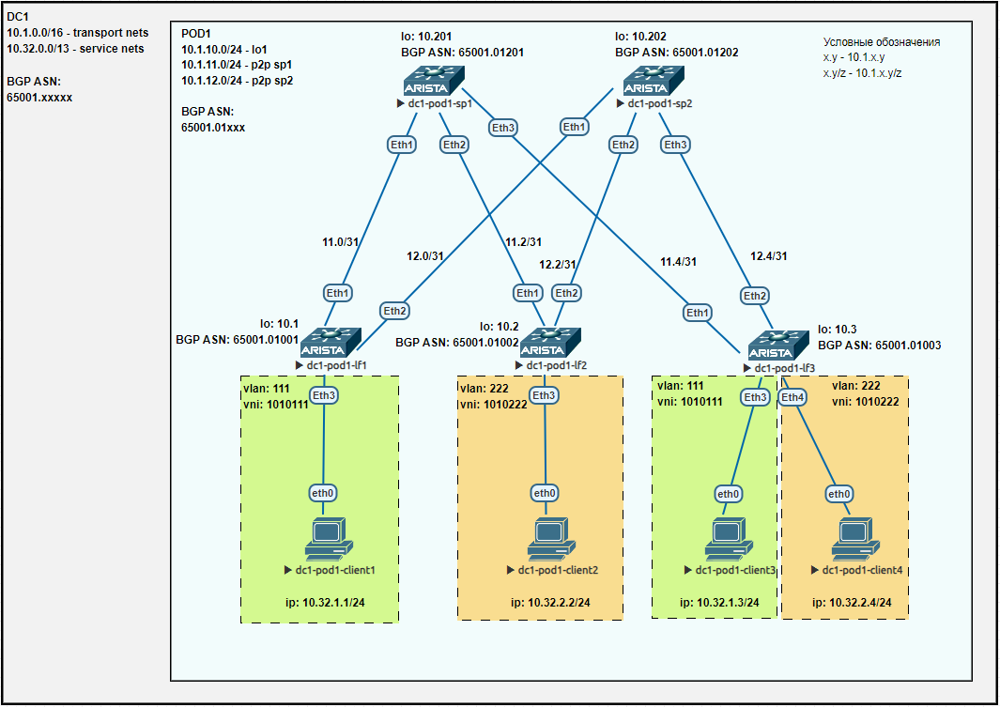

## Лаба4. BGP для Underlay сети

### План работы
1. Настройка BGP peering между Leaf и Spine в AF l2vpn evpn.
2. Настройка связности между клиентами в одном L2 домене.
3. Проверка работы.

#### 1. Настройка BGP peering между Leaf и Spine в AF l2vpn evpn
Схема сети имеет вид:


Помимо IP адресов, необходимых для настройки Underlay сети, в данной лабораторной работе добавим еще IP адреса для интерфейсов Loopback1 коммутаторов Leaf. Данные IP будем в дальнейшем использовать в качестве адресов VTEP:

| hostname     | lo0         | lo1       | p2p sp1      | p2p sp2      |
| ------------ | ----------- | --------- | ------------ | ------------ |
| dc1-pod1-sp1 | 10.1.10.201 | -         | -            | -            |
| dc1-pod1-sp2 | 10.1.10.202 | -         | -            | -            |
| dc1-pod1-lf1 | 10.1.10.1   | 10.1.19.1 | 10.1.11.1/31 | 10.1.12.1/31 |
| dc1-pod1-lf2 | 10.1.10.2   | 10.1.19.2 | 10.1.11.3/31 | 10.1.12.3/31 |
| dc1-pod1-lf3 | 10.1.10.3   | 10.1.19.3 | 10.1.11.5/31 | 10.1.12.5/31 |

Начнем данную лабораторную работу с исправления настройки BGP на спайнах в соответствии с замечанием Романа Помазанова. А именно, настроим динамические bgp соседства. Конфиг на примере spine1:
```
peer-filter PFLTR-LEEF-ASN
   10 match as-range 4259906537-4259906665 result accept
!
router bgp 4259906737
   bgp listen range 10.1.11.0/24 peer-group PGROUP-UNDERLAY peer-filter PFLTR-LEEF-ASN
   neighbor PGROUP-UNDERLAY peer group
   neighbor PGROUP-UNDERLAY bfd
   neighbor PGROUP-UNDERLAY route-map RM-BGP-LEAFS-IN in
   neighbor PGROUP-UNDERLAY route-map RM-BGP-LEAFS-OUT out
   ...
!
```
Проверка:
```
dc1-pod1-sp1(config)#show ip bgp summary | i 10\.1\.11\.
  10.1.11.1 4 4259906537      1313      1310    0    0 18:30:02 Estab   13     13
  10.1.11.3 4 4259906538      3029      3022    0    0    1d18h Estab   6      6
  10.1.11.5 4 4259906539      3020      3023    0    0    1d18h Estab   9      9
```

Далее настроим BGP соседства между коммутаторам spine и leaf в сети Overlay. Из особенностей:  
1) соседства строятся между интерфейсами Loopback0;  
2) учитывая eBGP и замечание выше, требуется выставить значение ebgp-multihop например в значение 3;  
3) коммутаторы spine не должны менять next-hop, поэтому потребуется на Arsita потребуется команда next-hop-unchanged;  
4) на всех коммутаторах потребуется включить address-family evpn;  
5) в качестве адресов VTEP выбраны IP интерфейсов Loopback1, поэтому их также нужно проананосировать в Underlay сеть.

Конфигурация устройств будет приведена ниже.
Проверим установление BGP соседств в address-family evpn.
На spine1:
```
dc1-pod1-sp1(config)#show bgp evpn summary
BGP summary information for VRF default
Router identifier 10.1.10.201, local AS number 4259906737
Neighbor Status Codes: m - Under maintenance
  Neighbor  V AS           MsgRcvd   MsgSent  InQ OutQ  Up/Down State   PfxRcd PfxAcc
  10.1.10.1 4 4259906537       182       190    0    0 02:22:37 Estab   1      1
  10.1.10.2 4 4259906538       194       194    0    0 02:23:01 Estab   3      3
  10.1.10.3 4 4259906539       199       203    0    0 02:24:52 Estab   3      3
```
На leaf3:
```
dc1-pod1-lf3(config)#show bgp evpn summary
BGP summary information for VRF default
Router identifier 10.1.10.3, local AS number 4259906539
Neighbor Status Codes: m - Under maintenance
  Description              Neighbor    V AS           MsgRcvd   MsgSent  InQ OutQ  Up/Down State   PfxRcd PfxAcc
                           10.1.10.201 4 4259906737      3333      3317    0    0 02:27:21 Estab   2      2
                           10.1.10.202 4 4259906738      3284      3283    0    0 02:27:02 Estab   2      2
```

#### 2. Настройка связности между клиентами в одном L2 домене

Зафиксируем шаблоны для основных параметров при настройке EVPN VXLAN.  
Шаблон для L2 VNI будет иметь вид:  
**1{DCN}{VLAN-ID},**  
где  
	&emsp;{DCN} - номер ЦОД (DC Number). Принимает значение от 01 до 15;
	&emsp;{VLAN-ID} - номер VLAN. Принимает значение от 0001 до 4094.

Шаблон для route-distinguisher:  
**{L0}:{VLAN-ID},**  
где  
	&emsp;{L0} - IPv4 адрес интерфейса Loopback0 коммутатора Leaf;
	&emsp;{VLAN-ID} - номер VLAN. Принимает значение от 1 до 4094.

И так как в данной лабораторной работе на уровне Overlay используется также eBGP, то нам приходится решать проблему несовпадения автоматически созданных route-target. Для решения проблемы выбран метод явного указания route-target на каждом Leaf для каждого VNI. Таким образом, для route-target использован следующий шаблон:  
**650{DCN}:{L2VNI},**  
где  
	&emsp;{DCN} - номер ЦОД (DC Number). Принимает значение от 01 до 15;
	&emsp;{L2VNI} - номер L2 VNI. Принимает значение от 1010001 до 1014094.


Например, для leaf3 и vlan111 значения параметров примут вид:  
L2 VNI - 1010111  
RD - 10.1.10.3:111  
RT - 65001:1010111  


Далее приведем конфигурации устройств.  
Настройки spine на примере spine1:
```
dc1-pod1-sp1(config)#show run
! Command: show running-config
! device: dc1-pod1-sp1 (vEOS-lab, EOS-4.29.2F)
!
! boot system flash:/vEOS-lab.swi
!
no aaa root
!
transceiver qsfp default-mode 4x10G
!
service routing protocols model multi-agent
!
hostname dc1-pod1-sp1
!
spanning-tree mode mstp
!
interface Ethernet1
   description lf1|Eth1
   mtu 9214
   no switchport
   ip address 10.1.11.0/31
!
interface Ethernet2
   description lf2|Eth1
   mtu 9214
   no switchport
   ip address 10.1.11.2/31
!
interface Ethernet3
   description lf3|Eth1
   mtu 9214
   no switchport
   ip address 10.1.11.4/31
!
interface Ethernet4
!
interface Ethernet5
!
interface Ethernet6
!
interface Ethernet7
!
interface Ethernet8
!
interface Loopback0
   ip address 10.1.10.201/32
!
interface Management1
!
ip routing
!
ip prefix-list PL-DEFAULT
   seq 10 permit 0.0.0.0/0
!
ip prefix-list PL-LINKNETS
   seq 10 permit 10.1.11.0/24 eq 31
   seq 20 permit 10.1.12.0/24 eq 31
!
ip prefix-list PL-LOOPBACKS
   seq 10 permit 10.1.10.0/24 eq 32
   seq 20 permit 10.1.19.0/24 eq 32
!
route-map RM-BGP-LEAFS-IN permit 10
   match ip address prefix-list PL-LOOPBACKS
!
route-map RM-BGP-LEAFS-IN permit 20
   match ip address prefix-list PL-LINKNETS
!
route-map RM-BGP-LEAFS-OUT permit 10
   match ip address prefix-list PL-LOOPBACKS
!
route-map RM-BGP-LEAFS-OUT permit 20
   match ip address prefix-list PL-LINKNETS
!
route-map RM-BGP-LEAFS-OUT permit 100
   match ip address prefix-list PL-DEFAULT
!
route-map RM-REDISTRIBUTE-DIRECT permit 10
   match ip address prefix-list PL-LOOPBACKS
   match source-protocol connected
!
peer-filter PFLTR-LEEF-ASN
   10 match as-range 4259906537-4259906665 result accept
!
router bgp 4259906737
   router-id 10.1.10.201
   maximum-paths 2
   bgp listen range 10.1.10.0/24 peer-group PGROUP-OVERLAY peer-filter PFLTR-LEEF-ASN
   bgp listen range 10.1.11.0/24 peer-group PGROUP-UNDERLAY peer-filter PFLTR-LEEF-ASN
   neighbor PGROUP-OVERLAY peer group
   neighbor PGROUP-OVERLAY next-hop-unchanged
   neighbor PGROUP-OVERLAY update-source Loopback0
   neighbor PGROUP-OVERLAY ebgp-multihop 3
   neighbor PGROUP-OVERLAY send-community extended
   neighbor PGROUP-OVERLAY maximum-routes 16000
   neighbor PGROUP-UNDERLAY peer group
   neighbor PGROUP-UNDERLAY bfd
   neighbor PGROUP-UNDERLAY route-map RM-BGP-LEAFS-IN in
   neighbor PGROUP-UNDERLAY route-map RM-BGP-LEAFS-OUT out
   redistribute connected route-map RM-REDISTRIBUTE-DIRECT
   !
   address-family evpn
      neighbor PGROUP-OVERLAY activate
   !
!
end
```

Настройки leaf на примере leaf3:
```
dc1-pod1-lf3(config)#show run
! Command: show running-config
! device: dc1-pod1-lf3 (vEOS-lab, EOS-4.29.2F)
!
! boot system flash:/vEOS-lab.swi
!
no aaa root
!
transceiver qsfp default-mode 4x10G
!
service routing protocols model multi-agent
!
hostname dc1-pod1-lf3
!
spanning-tree mode mstp
!
vlan 111
   name VLAN-111-TENANT-1
!
vlan 222
   name VLAN-222-TENANT-2
!
interface Ethernet1
   description sp1|Eth3
   mtu 9214
   no switchport
   ip address 10.1.11.5/31
!
interface Ethernet2
   description sp2|Eth3
   mtu 9214
   no switchport
   ip address 10.1.12.5/31
!
interface Ethernet3
   description client3
   switchport access vlan 111
   spanning-tree portfast
!
interface Ethernet4
   description client4
   switchport access vlan 222
   spanning-tree portfast
!
interface Ethernet5
!
interface Ethernet6
!
interface Ethernet7
!
interface Ethernet8
!
interface Loopback0
   ip address 10.1.10.3/32
!
interface Loopback1
   description VTEP-address
   ip address 10.1.19.3/32
!
interface Management1
!
interface Vxlan1
   vxlan source-interface Loopback1
   vxlan udp-port 4789
   vxlan vlan 111 vni 1010111
   vxlan vlan 222 vni 1010222
   vxlan learn-restrict any
!
ip routing
!
ip prefix-list PL-LINKNETS seq 10 permit 10.1.11.0/24 eq 31
ip prefix-list PL-LINKNETS seq 20 permit 10.1.12.0/24 eq 31
ip prefix-list PL-LOOPBACKS seq 10 permit 10.1.10.0/24 eq 32
ip prefix-list PL-LOOPBACKS seq 20 permit 10.1.19.0/24 eq 32
!
route-map RM-BGP-SPINE-OUT permit 10
   match ip address prefix-list PL-LOOPBACKS
!
route-map RM-BGP-SPINE-OUT permit 20
   match ip address prefix-list PL-LINKNETS
!
route-map RM-REDISTRIBUTE-DIRECT permit 10
   match ip address prefix-list PL-LOOPBACKS
   match source-protocol connected
!
route-map RM-REDISTRIBUTE-DIRECT permit 20
   match ip address prefix-list PL-LINKNETS
   match source-protocol connected
!
router bgp 4259906539
   router-id 10.1.10.3
   maximum-paths 8
   neighbor PGROUP-OVERLAY peer group
   neighbor PGROUP-OVERLAY update-source Loopback0
   neighbor PGROUP-OVERLAY ebgp-multihop 3
   neighbor PGROUP-OVERLAY send-community extended
   neighbor PGROUP-OVERLAY maximum-routes 16000
   neighbor PGROUP-UNDERLAY peer group
   neighbor PGROUP-UNDERLAY bfd
   neighbor PGROUP-UNDERLAY route-map RM-BGP-SPINE-OUT out
   neighbor 10.1.10.201 peer group PGROUP-OVERLAY
   neighbor 10.1.10.201 remote-as 4259906737
   neighbor 10.1.10.202 peer group PGROUP-OVERLAY
   neighbor 10.1.10.202 remote-as 4259906738
   neighbor 10.1.11.4 peer group PGROUP-UNDERLAY
   neighbor 10.1.11.4 remote-as 4259906737
   neighbor 10.1.11.4 description sp1 65001.01201
   neighbor 10.1.12.4 peer group PGROUP-UNDERLAY
   neighbor 10.1.12.4 remote-as 4259906738
   neighbor 10.1.12.4 description sp2 65001.01202
   redistribute connected route-map RM-REDISTRIBUTE-DIRECT
   !
   vlan 111
      rd 10.1.10.3:111
      route-target both 65001:1010111
      redistribute learned
   !
   vlan 222
      rd 10.1.10.3:222
      route-target both 65001:1010222
      redistribute learned
   !
   address-family evpn
      neighbor PGROUP-OVERLAY activate
   !
!
end
```

#### 3. Проверка работы

Проверка работы VXLAN (на примере lf3):
```
dc1-pod1-lf3(config)#show interfaces vxlan 1
Vxlan1 is up, line protocol is up (connected)
  Hardware is Vxlan
  Source interface is Loopback1 and is active with 10.1.19.3
  Listening on UDP port 4789
  Replication/Flood Mode is headend with Flood List Source: EVPN
  Remote MAC learning via EVPN
  VNI mapping to VLANs
  Static VLAN to VNI mapping is
    [111, 1010111]    [222, 1010222]
  Note: All Dynamic VLANs used by VCS are internal VLANs.
        Use 'show vxlan vni' for details.
  Static VRF to VNI mapping is not configured
  Headend replication flood vtep list is:
   111 10.1.19.1
   222 10.1.19.2
  Shared Router MAC is 0000.0000.0000
dc1-pod1-lf3(config)#
dc1-pod1-lf3(config)#show vxlan vtep
Remote VTEPS for Vxlan1:

VTEP            Tunnel Type(s)
--------------- --------------
10.1.19.1       unicast, flood
10.1.19.2       unicast, flood

Total number of remote VTEPS:  2
dc1-pod1-lf3(config)#
dc1-pod1-lf3(config)#show vxlan address-table
          Vxlan Mac Address Table
----------------------------------------------------------------------

VLAN  Mac Address     Type      Prt  VTEP             Moves   Last Move
----  -----------     ----      ---  ----             -----   ---------
 111  0050.7966.6806  EVPN      Vx1  10.1.19.1        1       0:01:05 ago
 222  0050.7966.6807  EVPN      Vx1  10.1.19.2        1       0:01:58 ago
Total Remote Mac Addresses for this criterion: 2
```

Проверка работы BGP EVPN type-2 маршрутов (на примере lf3):
```
dc1-pod1-lf3(config)#show bgp evpn summary
BGP summary information for VRF default
Router identifier 10.1.10.3, local AS number 4259906539
Neighbor Status Codes: m - Under maintenance
  Description              Neighbor    V AS           MsgRcvd   MsgSent  InQ OutQ  Up/Down State   PfxRcd PfxAcc
                           10.1.10.201 4 4259906737      3341      3325    0    0 02:33:51 Estab   4      4
                           10.1.10.202 4 4259906738      3292      3293    0    0 02:33:32 Estab   4      4
dc1-pod1-lf3(config)#
dc1-pod1-lf3(config)#show bgp evpn route-type mac-ip
BGP routing table information for VRF default
Router identifier 10.1.10.3, local AS number 4259906539
Route status codes: * - valid, > - active, S - Stale, E - ECMP head, e - ECMP
                    c - Contributing to ECMP, % - Pending BGP convergence
Origin codes: i - IGP, e - EGP, ? - incomplete
AS Path Attributes: Or-ID - Originator ID, C-LST - Cluster List, LL Nexthop - Link Local Nexthop

          Network                Next Hop              Metric  LocPref Weight  Path
 * >Ec    RD: 10.1.10.1:111 mac-ip 0050.7966.6806
                                 10.1.19.1             -       100     0       4259906737 4259906537 i
 *  ec    RD: 10.1.10.1:111 mac-ip 0050.7966.6806
                                 10.1.19.1             -       100     0       4259906738 4259906537 i
 * >Ec    RD: 10.1.10.2:222 mac-ip 0050.7966.6807
                                 10.1.19.2             -       100     0       4259906737 4259906538 i
 *  ec    RD: 10.1.10.2:222 mac-ip 0050.7966.6807
                                 10.1.19.2             -       100     0       4259906738 4259906538 i
 * >      RD: 10.1.10.3:111 mac-ip 0050.7966.6808
                                 -                     -       -       0       i
 * >      RD: 10.1.10.3:222 mac-ip 0050.7966.6809
                                 -                     -       -       0       i
```

Проверка работы BGP EVPN type-3 маршрутов (на примере lf3):
```
dc1-pod1-lf3(config)#show bgp evpn route-type imet
BGP routing table information for VRF default
Router identifier 10.1.10.3, local AS number 4259906539
Route status codes: * - valid, > - active, S - Stale, E - ECMP head, e - ECMP
                    c - Contributing to ECMP, % - Pending BGP convergence
Origin codes: i - IGP, e - EGP, ? - incomplete
AS Path Attributes: Or-ID - Originator ID, C-LST - Cluster List, LL Nexthop - Link Local Nexthop

          Network                Next Hop              Metric  LocPref Weight  Path
 * >Ec    RD: 10.1.10.1:111 imet 10.1.19.1
                                 10.1.19.1             -       100     0       4259906738 4259906537 i
 *  ec    RD: 10.1.10.1:111 imet 10.1.19.1
                                 10.1.19.1             -       100     0       4259906737 4259906537 i
 * >Ec    RD: 10.1.10.2:222 imet 10.1.19.2
                                 10.1.19.2             -       100     0       4259906738 4259906538 i
 *  ec    RD: 10.1.10.2:222 imet 10.1.19.2
                                 10.1.19.2             -       100     0       4259906737 4259906538 i
 * >      RD: 10.1.10.3:111 imet 10.1.19.3
                                 -                     -       -       0       i
 * >      RD: 10.1.10.3:222 imet 10.1.19.3
                                 -                     -       -       0       i
```

Проверка факта, что на lf1 в таблицу vxlan address-table попадают только MAC адреса устройств из vlan111. А из vlan222 не попадают, т.к. его нет на lf1:
```
dc1-pod1-lf1(config)#show bgp evpn route-type mac-ip
BGP routing table information for VRF default
Router identifier 10.1.10.1, local AS number 4259906537
Route status codes: * - valid, > - active, S - Stale, E - ECMP head, e - ECMP
                    c - Contributing to ECMP, % - Pending BGP convergence
Origin codes: i - IGP, e - EGP, ? - incomplete
AS Path Attributes: Or-ID - Originator ID, C-LST - Cluster List, LL Nexthop - Link Local Nexthop

          Network                Next Hop              Metric  LocPref Weight  Path
 * >      RD: 10.1.10.1:111 mac-ip 0050.7966.6806
                                 -                     -       -       0       i
 * >Ec    RD: 10.1.10.2:222 mac-ip 0050.7966.6807
                                 10.1.19.2             -       100     0       4259906738 4259906538 i
 *  ec    RD: 10.1.10.2:222 mac-ip 0050.7966.6807
                                 10.1.19.2             -       100     0       4259906737 4259906538 i
 * >Ec    RD: 10.1.10.3:111 mac-ip 0050.7966.6808
                                 10.1.19.3             -       100     0       4259906737 4259906539 i
 *  ec    RD: 10.1.10.3:111 mac-ip 0050.7966.6808
                                 10.1.19.3             -       100     0       4259906738 4259906539 i
 * >Ec    RD: 10.1.10.3:222 mac-ip 0050.7966.6809
                                 10.1.19.3             -       100     0       4259906737 4259906539 i
 *  ec    RD: 10.1.10.3:222 mac-ip 0050.7966.6809
                                 10.1.19.3             -       100     0       4259906738 4259906539 i
dc1-pod1-lf1(config)#
dc1-pod1-lf1(config)#
dc1-pod1-lf1(config)#show vxlan vtep
Remote VTEPS for Vxlan1:

VTEP            Tunnel Type(s)
--------------- --------------
10.1.19.3       unicast, flood

Total number of remote VTEPS:  1
dc1-pod1-lf1(config)#
dc1-pod1-lf1(config)#show vxlan address-table
          Vxlan Mac Address Table
----------------------------------------------------------------------

VLAN  Mac Address     Type      Prt  VTEP             Moves   Last Move
----  -----------     ----      ---  ----             -----   ---------
 111  0050.7966.6808  EVPN      Vx1  10.1.19.3        1       0:00:38 ago
Total Remote Mac Addresses for this criterion: 1   -                     1       0       -       i
```

Проверка связности хостов в рамках одного L2 домена:
```
dc1-pod1-client1> ping 10.32.1.3

84 bytes from 10.32.1.3 icmp_seq=1 ttl=64 time=10.907 ms
84 bytes from 10.32.1.3 icmp_seq=2 ttl=64 time=9.932 ms
84 bytes from 10.32.1.3 icmp_seq=3 ttl=64 time=12.459 ms
84 bytes from 10.32.1.3 icmp_seq=4 ttl=64 time=11.345 ms
^C


dc1-pod1-client4> ping 10.32.2.2

84 bytes from 10.32.2.2 icmp_seq=1 ttl=64 time=25.588 ms
84 bytes from 10.32.2.2 icmp_seq=2 ttl=64 time=10.223 ms
84 bytes from 10.32.2.2 icmp_seq=3 ttl=64 time=11.151 ms
^C

```
