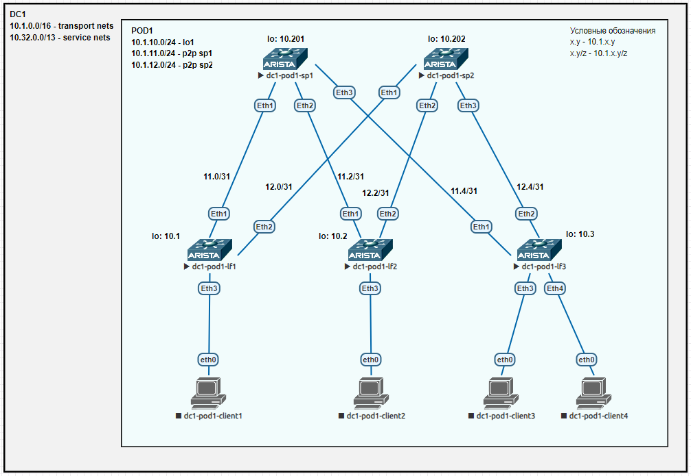

## Лаба1. Распределение адресного пространства для Underlay сети

### План работы
1. Распределение адресного пространства.
2. Сборка топологии CLOS по схеме из задания.

#### 1. Распределение адресного пространства
Выполним распределение адресного пространства исходя и следующих соображений:
- в проекте предусмотреть возможность появления нескольких ЦОД (например, не менее 10);
- каждый ЦОД потенциально может быть с большим количеством коммутаторов, разделенных на несколько подов;
- на каждый ЦОД должно выделяться адресное пространство, маршруты которого легко суммаризируются;
- обеспечить возможность расширения и масштабирования.

Для выполнения задачи выберем подсеть **10.0.0.0/8** и обозначим следующие блоки сетей:  
10.0.0.0/8 - общее адресное пространство;  
	&emsp;10.0.0.0/12 - транспортная сеть;  
		&emsp;&emsp;*10.0.0.0/16 - резерв;*  
		&emsp;&emsp;10.1.0.0/16 - DC1;  
		&emsp;&emsp;10.2.0.0/16 - DC2;  
		&emsp;&emsp;...  
		&emsp;&emsp;10.15.0.0/16 - DC15;  
	&emsp;*10.16.0.0/12 - резерв под транспортную сеть DC16-31 или сервисную сеть DC15;*  
	&emsp;10.32.0.0/13 - сервисная сеть DC1;   
	&emsp;*10.40.0.0/13 - резерв под сервисную сеть DC1 или DC15;*  
	&emsp;10.48.0.0/13 - сервисная сеть DC2;  
	&emsp;*10.56.0.0/13 - резерв под сервисную сеть DC2 или DC16;*  
	&emsp;...  
	&emsp;10.240.0.0/13 - сервисная сеть DC14;  
	&emsp;*10.248.0.0/13 - резерв под сервисную сеть DC14 или DC28.  

Подобное распределение потенциально позволяет настроить либо 15 ЦОДов с сервисными сетями /12, либо 28 ЦОДов с сервисными подсетями /13. Используя указанный выше подход, можно реализовать любой из двух вариантов в процессе эксплуатации.

Далее распределим адресное пространство транспортной (Underlay) сети DC1 **10.1.0.0/16**:  
10.1.0.0/16 - транспортная сеть DC1;  
	&emsp;10.1.0-9.* - резерв под super-spine;  
 	&emsp;10.1.10-19.* - POD1;  
		&emsp;&emsp;10.1.10.0/24 - адреса интерфейсов lo0;  
		&emsp;&emsp;10.1.11.0/24 - адреса p2p интерфейсов spine1;  
		&emsp;&emsp;10.1.12.0/24 - адреса p2p интерфейсов spine2;  
		&emsp;&emsp;10.1.13.0/24 - адреса p2p интерфейсов spine3;  
		&emsp;&emsp;10.1.14.0/24 - адреса p2p интерфейсов spine4;  
		&emsp;&emsp;10.1.15.0/24 - адреса p2p интерфейсов spine5;  
		&emsp;&emsp;10.1.16.0/24 - адреса p2p интерфейсов spine6;  
		&emsp;&emsp;10.1.17.0/24 - адреса p2p интерфейсов spine7;  
		&emsp;&emsp;10.1.18.0/24 - адреса p2p интерфейсов spine8;  
		&emsp;&emsp;10.1.19.0/24 - адреса интерфейсов lo1;  
	&emsp;10.1.20-29.* - POD2;  
	&emsp;10.1.30-39.* - POD3;  
	&emsp;...  
	&emsp;10.1.160-169.* - POD16;  
	&emsp;*10.1.170-199.\* - резерв;*  
	&emsp;10.1.200-216.* - сеть управления (OOB management);  
		&emsp;&emsp;10.1.200.0/24 - адреса mgmt super-spine;  
		&emsp;&emsp;10.1.201.0/24 - адреса mgmt spine и leaf POD1;  
		&emsp;&emsp;10.1.202.0/24 - адреса mgmt spine и leaf POD2;  
		&emsp;&emsp;...  
		&emsp;&emsp;10.1.216.0/24 - адреса mgmt spine и leaf POD16;  
	&emsp;*10.1.217-255.\* - резерв.*  

Предложенное распределение можно свернуть в два шаблона. Первый шаблон для подсетей Underlay:  
**10.{DCN}.{PODN}{ROLE}.0/24,**  
где  
	&emsp;{DCN} - номер ЦОД (DC Number). Принимает значение от 1 до 15;  
	&emsp;{PODN} - номер пода (POD Number). Принимает значение от 1 до 16;  
	&emsp;{ROLE} - роль подсети. Принимает значение от 0 до 9:  
		&emsp;&emsp;0 - lo0;  
		&emsp;&emsp;1..8 - p2p sp1..8;  
		&emsp;&emsp;9 - lo1.  

Второй шаблон для сетей управления (OOB management):  
**10.{DCN}.200+{PODN}.0/24,**  
где  
	&emsp;{DCN} - номер ЦОД (DC Number). Принимает значение от 1 до 15;  
	&emsp;{PODN} - номер пода (POD Number). Принимает значение от 0 до 16.  
  
  
  

#### 2. Сборка топологии CLOS по схеме из задания
Топологию сети будем собирать в EVE-NG.
Полученная схема представлена ниже:



Учитывая выбранный шаблон назначения адресов, будем использовать следующие IP адреса:

| hostname     | lo0         | p2p sp1      | p2p sp2      |
| ------------ | ----------- | ------------ | ------------ |
| dc1-pod1-sp1 | 10.1.10.201 | -            | -            |
| dc1-pod1-sp2 | 10.1.10.202 | -            | -            |
| dc1-pod1-lf1 | 10.1.10.1   | 10.1.11.1/31 | 10.1.12.1/31 |
| dc1-pod1-lf2 | 10.1.10.2   | 10.1.11.3/31 | 10.1.12.3/31 |
| dc1-pod1-lf3 | 10.1.10.3   | 10.1.11.5/31 | 10.1.12.5/31 |

В качестве протокола динамической маршрутизации выбран OSPF. Интерфейсы между всеми коммутаторами назначены в area 0.
Настройки spine на примере sp1:
```
hostname dc1-pod1-sp1
!
spanning-tree mode mstp
!
interface Ethernet1
   description lf1|Eth1
   no switchport
   ip address 10.1.11.0/31
   ip ospf network point-to-point
   ip ospf area 0.0.0.0
!
interface Ethernet2
   description lf2|Eth1
   no switchport
   ip address 10.1.11.2/31
   ip ospf network point-to-point
   ip ospf area 0.0.0.0
!
interface Ethernet3
   description lf3|Eth1
   no switchport
   ip address 10.1.11.4/31
   ip ospf network point-to-point
   ip ospf area 0.0.0.0
!
interface Ethernet4
!
interface Ethernet5
!
interface Ethernet6
!
interface Ethernet7
!
interface Ethernet8
!
interface Loopback0
   ip address 10.1.10.201/32
   ip ospf area 0.0.0.0
!
interface Management1
!
ip routing
!
router ospf 1
   router-id 10.1.10.201
   bfd default
   passive-interface default
   no passive-interface Ethernet1
   no passive-interface Ethernet2
   no passive-interface Ethernet3
   max-lsa 12000
!
end
```

Настройки leaf на примере lf3:
```
hostname dc1-pod1-lf3
!
spanning-tree mode mstp
!
interface Ethernet1
   description sp1|Eth3
   no switchport
   ip address 10.1.11.5/31
   ip ospf network point-to-point
   ip ospf area 0.0.0.0
!
interface Ethernet2
   description sp2|Eth3
   no switchport
   ip address 10.1.12.5/31
   ip ospf network point-to-point
   ip ospf area 0.0.0.0
!
interface Ethernet3
!
interface Ethernet4
!
interface Ethernet5
!
interface Ethernet6
!
interface Ethernet7
!
interface Ethernet8
!
interface Loopback0
   ip address 10.1.10.3/32
   ip ospf area 0.0.0.0
!
interface Management1
!
ip routing
!
router ospf 1
   router-id 10.1.10.3
   bfd default
   passive-interface default
   no passive-interface Ethernet1
   no passive-interface Ethernet2
   max-lsa 12000
!
end
```

Проверка таблицы маршрутизации (на примере lf3):
```
dc1-pod1-lf3#show ip route

VRF: default
Codes: C - connected, S - static, K - kernel,
       O - OSPF, IA - OSPF inter area, E1 - OSPF external type 1,
       E2 - OSPF external type 2, N1 - OSPF NSSA external type 1,
       N2 - OSPF NSSA external type2, B - Other BGP Routes,
       B I - iBGP, B E - eBGP, R - RIP, I L1 - IS-IS level 1,
       I L2 - IS-IS level 2, O3 - OSPFv3, A B - BGP Aggregate,
       A O - OSPF Summary, NG - Nexthop Group Static Route,
       V - VXLAN Control Service, M - Martian,
       DH - DHCP client installed default route,
       DP - Dynamic Policy Route, L - VRF Leaked,
       G  - gRIBI, RC - Route Cache Route

Gateway of last resort is not set

 O        10.1.10.1/32 [110/30] via 10.1.11.4, Ethernet1
                                via 10.1.12.4, Ethernet2
 O        10.1.10.2/32 [110/30] via 10.1.11.4, Ethernet1
                                via 10.1.12.4, Ethernet2
 C        10.1.10.3/32 is directly connected, Loopback0
 O        10.1.10.201/32 [110/20] via 10.1.11.4, Ethernet1
 O        10.1.10.202/32 [110/20] via 10.1.12.4, Ethernet2
 O        10.1.11.0/31 [110/20] via 10.1.11.4, Ethernet1
 O        10.1.11.2/31 [110/20] via 10.1.11.4, Ethernet1
 C        10.1.11.4/31 is directly connected, Ethernet1
 O        10.1.12.0/31 [110/20] via 10.1.12.4, Ethernet2
 O        10.1.12.2/31 [110/20] via 10.1.12.4, Ethernet2
 C        10.1.12.4/31 is directly connected, Ethernet2
```

Проверка связности адресов lo0 коммутаторов leaf (на примере lf3):
```
dc1-pod1-lf3#traceroute 10.1.10.1 source loopback 0
traceroute to 10.1.10.1 (10.1.10.1), 30 hops max, 60 byte packets
 1  10.1.11.4 (10.1.11.4)  8.998 ms  7.343 ms  7.594 ms
 2  10.1.10.1 (10.1.10.1)  18.846 ms  19.224 ms  42.170 ms
dc1-pod1-lf3#
dc1-pod1-lf3#traceroute 10.1.10.2 source loopback 0
traceroute to 10.1.10.2 (10.1.10.2), 30 hops max, 60 byte packets
 1  10.1.11.4 (10.1.11.4)  6.420 ms  6.630 ms  6.741 ms
 2  10.1.10.2 (10.1.10.2)  15.386 ms  14.524 ms  21.179 ms
```
