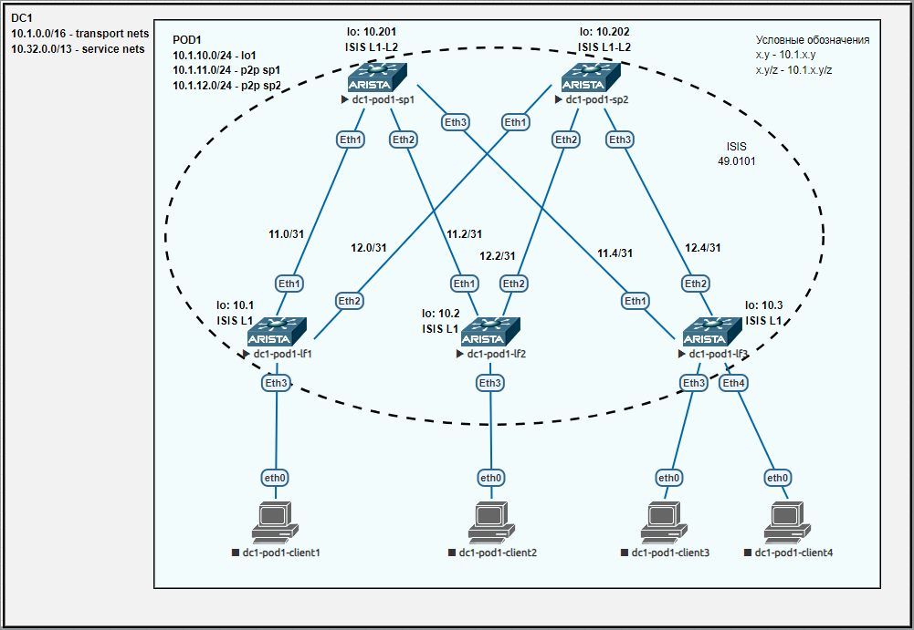

## Лаба3. ISIS для Underlay сети

### План работы
1. Настройка ISIS в Underlay сети.
2. Проверка работы ISIS.

#### 1. Настройка ISIS в Underlay сети
Схема сети имеет вид:


На коммутаторах уровня leaf и spine продолжаем использовать следующие IP адреса:

| hostname     | lo0         | p2p sp1      | p2p sp2      |
| ------------ | ----------- | ------------ | ------------ |
| dc1-pod1-sp1 | 10.1.10.201 | -            | -            |
| dc1-pod1-sp2 | 10.1.10.202 | -            | -            |
| dc1-pod1-lf1 | 10.1.10.1   | 10.1.11.1/31 | 10.1.12.1/31 |
| dc1-pod1-lf2 | 10.1.10.2   | 10.1.11.3/31 | 10.1.12.3/31 |
| dc1-pod1-lf3 | 10.1.10.3   | 10.1.11.5/31 | 10.1.12.5/31 |

В качестве протокола динамической маршрутизации в данной работе выбран ISIS.
Так как мы ожидаем, что Underlay сеть потенциально может включать несколько подов, то каждый под поместим в свою зону. Соответственно, шаблон для номера area будет иметь вид:  
**{DCN}{PODN},**  
где  
	&emsp;{DCN} - номер ЦОД (DC Number). Принимает значение от 01 до 15;  
	&emsp;{PODN} - номер пода (POD Number). Принимает значение от 01 до 16.

А NET (Network Entity Title) будет использоваться шаблон:  
**49.DDPP.LLLL.LLLL.LLLL.00**  
где  
	&emsp;DD - соответствует {DCN} и принимает значение от 01 до 15;  
	&emsp;PP - соответствует {PODN} и принимает значение от 01 до 16;  
	&emsp;LLLL.LLLL.LLLL - ipv4 адрес интерфейса Lo0, переписанный в другом формате и дополненный нулями.  
Например, для текущих 5 коммутаторов NET получится следующим:  
dc1-pod1-sp1 - 49.0101.0100.0101.0201.00  
dc1-pod1-sp2 - 49.0101.0100.0101.0202.00  
dc1-pod1-lf1 - 49.0101.0100.0101.0001.00  
dc1-pod1-lf2 - 49.0101.0100.0101.0002.00  
dc1-pod1-lf3 - 49.0101.0100.0101.0003.00  

Коммутаторы leaf настроим как L1.  
Коммутаторы spine настроим как L1-L2.  
Коммутаторы superspine (когда будут) настроим как L2.  

Далее приведем конфигурации устройств.  
Настройки spine на примере sp1:
```
dc1-pod1-sp1#show run
! Command: show running-config
! device: dc1-pod1-sp1 (vEOS-lab, EOS-4.29.2F)
!
! boot system flash:/vEOS-lab.swi
!
no aaa root
!
transceiver qsfp default-mode 4x10G
!
service routing protocols model ribd
!
hostname dc1-pod1-sp1
!
spanning-tree mode mstp
!
interface Ethernet1
   description lf1|Eth1
   no switchport
   ip address 10.1.11.0/31
   isis enable 1
   isis bfd
   isis circuit-type level-1
   isis network point-to-point
!
interface Ethernet2
   description lf2|Eth1
   no switchport
   ip address 10.1.11.2/31
   isis enable 1
   isis bfd
   isis circuit-type level-1
   isis network point-to-point
!
interface Ethernet3
   description lf3|Eth1
   no switchport
   ip address 10.1.11.4/31
   isis enable 1
   isis bfd
   isis circuit-type level-1
   isis network point-to-point
!
interface Ethernet4
!
interface Ethernet5
!
interface Ethernet6
!
interface Ethernet7
!
interface Ethernet8
!
interface Loopback0
   ip address 10.1.10.201/32
   isis enable 1
   isis circuit-type level-1
   isis passive
!
interface Management1
!
ip routing
!
router isis 1
   net 49.0101.0100.0101.0201.00
   router-id ipv4 10.1.10.201
   !
   address-family ipv4 unicast
!
end
```

Настройки leaf на примере lf3:
```
dc1-pod1-lf3#show run
! Command: show running-config
! device: dc1-pod1-lf3 (vEOS-lab, EOS-4.29.2F)
!
! boot system flash:/vEOS-lab.swi
!
no aaa root
!
transceiver qsfp default-mode 4x10G
!
service routing protocols model ribd
!
hostname dc1-pod1-lf3
!
spanning-tree mode mstp
!
interface Ethernet1
   description sp1|Eth3
   no switchport
   ip address 10.1.11.5/31
   isis enable 1
   isis bfd
   isis network point-to-point
!
interface Ethernet2
   description sp2|Eth3
   no switchport
   ip address 10.1.12.5/31
   isis enable 1
   isis bfd
   isis network point-to-point
!
interface Ethernet3
!
interface Ethernet4
!
interface Ethernet5
!
interface Ethernet6
!
interface Ethernet7
!
interface Ethernet8
!
interface Loopback0
   ip address 10.1.10.3/32
   isis enable 1
   isis passive
!
interface Management1
!
ip routing
!
router isis 1
   net 49.0101.0100.0101.0003.00
   router-id ipv4 10.1.10.3
   is-type level-1
   !
   address-family ipv4 unicast
!
end
```


#### 2. Проверка работы ISIS

Проверка таблицы маршрутизации (на примере lf3):
```
dc1-pod1-lf3#show ip route

VRF: default
Codes: C - connected, S - static, K - kernel,
       O - OSPF, IA - OSPF inter area, E1 - OSPF external type 1,
       E2 - OSPF external type 2, N1 - OSPF NSSA external type 1,
       N2 - OSPF NSSA external type2, B - Other BGP Routes,
       B I - iBGP, B E - eBGP, R - RIP, I L1 - IS-IS level 1,
       I L2 - IS-IS level 2, O3 - OSPFv3, A B - BGP Aggregate,
       A O - OSPF Summary, NG - Nexthop Group Static Route,
       V - VXLAN Control Service, M - Martian,
       DH - DHCP client installed default route,
       DP - Dynamic Policy Route, L - VRF Leaked,
       G  - gRIBI, RC - Route Cache Route

Gateway of last resort is not set

 I L1     10.1.10.1/32 [115/30] via 10.1.11.4, Ethernet1
                                via 10.1.12.4, Ethernet2
 I L1     10.1.10.2/32 [115/30] via 10.1.11.4, Ethernet1
                                via 10.1.12.4, Ethernet2
 C        10.1.10.3/32 is directly connected, Loopback0
 I L1     10.1.10.201/32 [115/20] via 10.1.11.4, Ethernet1
 I L1     10.1.10.202/32 [115/20] via 10.1.12.4, Ethernet2
 I L1     10.1.11.0/31 [115/20] via 10.1.11.4, Ethernet1
 I L1     10.1.11.2/31 [115/20] via 10.1.11.4, Ethernet1
 C        10.1.11.4/31 is directly connected, Ethernet1
 I L1     10.1.12.0/31 [115/20] via 10.1.12.4, Ethernet2
 I L1     10.1.12.2/31 [115/20] via 10.1.12.4, Ethernet2
 C        10.1.12.4/31 is directly connected, Ethernet2
```

Проверка связности адресов lo0 коммутаторов leaf (на примере lf3):
```
dc1-pod1-lf3#traceroute 10.1.10.1 source loopback 0
traceroute to 10.1.10.1 (10.1.10.1), 30 hops max, 60 byte packets
 1  10.1.11.4 (10.1.11.4)  6.976 ms  6.795 ms  6.357 ms
 2  10.1.10.1 (10.1.10.1)  33.514 ms  33.750 ms  34.107 ms
dc1-pod1-lf3#
dc1-pod1-lf3#traceroute 10.1.10.2 source loopback 0
traceroute to 10.1.10.2 (10.1.10.2), 30 hops max, 60 byte packets
 1  10.1.11.4 (10.1.11.4)  7.532 ms  7.446 ms  9.724 ms
 2  10.1.10.2 (10.1.10.2)  19.378 ms  19.410 ms  19.649 ms
```

Проверка ISIS database (на примере lf3):
```
dc1-pod1-lf3#show isis database detail

IS-IS Instance: 1 VRF: default
  IS-IS Level 1 Link State Database
    LSPID                   Seq Num  Cksum  Life Length IS Flags
    dc1-pod1-lf1.00-00           26  63539   786    128 L1 <>
      Remaining lifetime received: 1199 s Modified to: 1200 s
      NLPID: 0xCC(IPv4)
      Hostname: dc1-pod1-lf1
      Area addresses: 49.0101
      Interface address: 10.1.10.1
      Interface address: 10.1.12.1
      Interface address: 10.1.11.1
      IS Neighbor          : dc1-pod1-sp2.00     Metric: 10
      IS Neighbor          : dc1-pod1-sp1.00     Metric: 10
      Reachability         : 10.1.10.1/32 Metric: 10 Type: 1 Up
      Reachability         : 10.1.12.0/31 Metric: 10 Type: 1 Up
      Reachability         : 10.1.11.0/31 Metric: 10 Type: 1 Up
      Router Capabilities: Router Id: 10.1.10.1 Flags: []
        Area leader priority: 250 algorithm: 0
    dc1-pod1-lf2.00-00           29  26548   676    128 L1 <>
      Remaining lifetime received: 1199 s Modified to: 1200 s
      NLPID: 0xCC(IPv4)
      Hostname: dc1-pod1-lf2
      Area addresses: 49.0101
      Interface address: 10.1.10.2
      Interface address: 10.1.12.3
      Interface address: 10.1.11.3
      IS Neighbor          : dc1-pod1-sp2.00     Metric: 10
      IS Neighbor          : dc1-pod1-sp1.00     Metric: 10
      Reachability         : 10.1.10.2/32 Metric: 10 Type: 1 Up
      Reachability         : 10.1.12.2/31 Metric: 10 Type: 1 Up
      Reachability         : 10.1.11.2/31 Metric: 10 Type: 1 Up
      Router Capabilities: Router Id: 10.1.10.2 Flags: []
        Area leader priority: 250 algorithm: 0
    dc1-pod1-lf3.00-00           28  59431   602    128 L1 <>
      LSP generation remaining wait time: 0 ms
      Time remaining until refresh: 302 s
      NLPID: 0xCC(IPv4)
      Hostname: dc1-pod1-lf3
      Area addresses: 49.0101
      Interface address: 10.1.10.3
      Interface address: 10.1.12.5
      Interface address: 10.1.11.5
      IS Neighbor          : dc1-pod1-sp1.00     Metric: 10
      IS Neighbor          : dc1-pod1-sp2.00     Metric: 10
      Reachability         : 10.1.10.3/32 Metric: 10 Type: 1 Up
      Reachability         : 10.1.12.4/31 Metric: 10 Type: 1 Up
      Reachability         : 10.1.11.4/31 Metric: 10 Type: 1 Up
      Router Capabilities: Router Id: 10.1.10.3 Flags: []
        Area leader priority: 250 algorithm: 0
    dc1-pod1-sp1.00-00           27  14083   577    152 L2 <>
      Remaining lifetime received: 1199 s Modified to: 1200 s
      NLPID: 0xCC(IPv4)
      Hostname: dc1-pod1-sp1
      Area addresses: 49.0101
      Interface address: 10.1.10.201
      Interface address: 10.1.11.4
      Interface address: 10.1.11.2
      Interface address: 10.1.11.0
      IS Neighbor          : dc1-pod1-lf3.00     Metric: 10
      IS Neighbor          : dc1-pod1-lf2.00     Metric: 10
      IS Neighbor          : dc1-pod1-lf1.00     Metric: 10
      Reachability         : 10.1.10.201/32 Metric: 10 Type: 1 Up
      Reachability         : 10.1.11.4/31 Metric: 10 Type: 1 Up
      Reachability         : 10.1.11.2/31 Metric: 10 Type: 1 Up
      Reachability         : 10.1.11.0/31 Metric: 10 Type: 1 Up
      Router Capabilities: Router Id: 10.1.10.201 Flags: []
        Area leader priority: 250 algorithm: 0
    dc1-pod1-sp2.00-00           30  32174  1106    152 L2 <>
      Remaining lifetime received: 1199 s Modified to: 1200 s
      NLPID: 0xCC(IPv4)
      Hostname: dc1-pod1-sp2
      Area addresses: 49.0101
      Interface address: 10.1.10.202
      Interface address: 10.1.12.4
      Interface address: 10.1.12.2
      Interface address: 10.1.12.0
      IS Neighbor          : dc1-pod1-lf3.00     Metric: 10
      IS Neighbor          : dc1-pod1-lf2.00     Metric: 10
      IS Neighbor          : dc1-pod1-lf1.00     Metric: 10
      Reachability         : 10.1.10.202/32 Metric: 10 Type: 1 Up
      Reachability         : 10.1.12.4/31 Metric: 10 Type: 1 Up
      Reachability         : 10.1.12.2/31 Metric: 10 Type: 1 Up
      Reachability         : 10.1.12.0/31 Metric: 10 Type: 1 Up
      Router Capabilities: Router Id: 10.1.10.202 Flags: []
        Area leader priority: 250 algorithm: 0
```

Проверка ISIS соседств (на примере sp1):
```
dc1-pod1-sp1# show isis neighbors

Instance  VRF      System Id        Type Interface          SNPA              State Hold time   Circuit Id
1         default  dc1-pod1-lf1     L1   Ethernet1          P2P               UP    27          0D
1         default  dc1-pod1-lf2     L1   Ethernet2          P2P               UP    26          0D
1         default  dc1-pod1-lf3     L1   Ethernet3          P2P               UP    23          0D
```

Проверка BFD (на примере sp1):
```
dc1-pod1-sp1#show bfd peers
VRF name: default
-----------------
DstAddr        MyDisc    YourDisc  Interface/Transport    Type          LastUp
---------- ----------- ----------- -------------------- ------- ---------------
10.1.11.1  3698858452  1534579215        Ethernet1(13)  normal  11/27/24 06:27
10.1.11.3  2825518922   286649670        Ethernet2(14)  normal  11/27/24 06:31
10.1.11.5  2790569663   350190198        Ethernet3(15)  normal  11/27/24 06:32

   LastDown            LastDiag    State
-------------- ------------------- -----
         NA       No Diagnostic       Up
         NA       No Diagnostic       Up
         NA       No Diagnostic       Up
```
