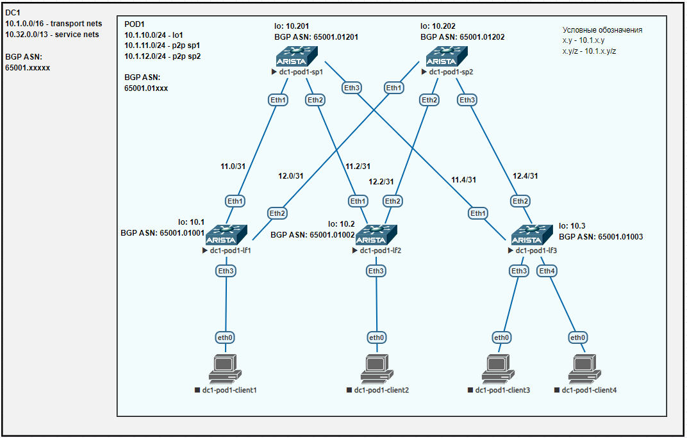

## Лаба4. BGP для Underlay сети

### План работы
1. Настройка BGP в Underlay сети.
2. Проверка работы BGP.

#### 1. Настройка BGP в Underlay сети
Схема сети имеет вид:


На коммутаторах уровня leaf и spine продолжаем использовать следующие IP адреса:

| hostname     | lo0         | p2p sp1      | p2p sp2      |
| ------------ | ----------- | ------------ | ------------ |
| dc1-pod1-sp1 | 10.1.10.201 | -            | -            |
| dc1-pod1-sp2 | 10.1.10.202 | -            | -            |
| dc1-pod1-lf1 | 10.1.10.1   | 10.1.11.1/31 | 10.1.12.1/31 |
| dc1-pod1-lf2 | 10.1.10.2   | 10.1.11.3/31 | 10.1.12.3/31 |
| dc1-pod1-lf3 | 10.1.10.3   | 10.1.11.5/31 | 10.1.12.5/31 |

В качестве протокола динамической маршрутизации в данной работе выбран eBGP. При сравнении iBGP и eBGP выбран последний по трем причинам:
1) не требуется настройка RR;  
2) более наглядные as-path;  
3) eBGP сложнее для дальнейшей настройки сети Overlay, поэтому позволит поймать больше проблем, решая которые придет лучшее понимание работы EVPN.  

Так как мы ожидаем, что Underlay сеть потенциально может включать несколько подов, то для наглядности будем использовать 4-байтный формат ASN. Шаблон для ASN будет иметь вид:  
**650{DCN}.{PODN}{ID},**  
где  
	&emsp;{DCN} - номер ЦОД (DC Number). Принимает значение от 01 до 15;  
	&emsp;{PODN} - номер пода (POD Number). Принимает значение от 01 до 16;  
	&emsp;{ID} - номер пода коммутатора. Принимает значение от 001 до 255;  

Например, для текущих 5 коммутаторов ASN получится следующим:  
dc1-pod1-sp1 - 65001.01201  
dc1-pod1-sp2 - 65001.01202  
dc1-pod1-lf1 - 65001.01001  
dc1-pod1-lf2 - 65001.01002  
dc1-pod1-lf3 - 65001.01003  

Далее приведем конфигурации устройств.  
Настройки spine на примере sp1:
```
dc1-pod1-sp1#show run
! Command: show running-config
! device: dc1-pod1-sp1 (vEOS-lab, EOS-4.29.2F)
!
! boot system flash:/vEOS-lab.swi
!
no aaa root
!
transceiver qsfp default-mode 4x10G
!
service routing protocols model ribd
!
hostname dc1-pod1-sp1
!
spanning-tree mode mstp
!
interface Ethernet1
   description lf1|Eth1
   no switchport
   ip address 10.1.11.0/31
!
interface Ethernet2
   description lf2|Eth1
   no switchport
   ip address 10.1.11.2/31
!
interface Ethernet3
   description lf3|Eth1
   no switchport
   ip address 10.1.11.4/31
!
interface Ethernet4
!
interface Ethernet5
!
interface Ethernet6
!
interface Ethernet7
!
interface Ethernet8
!
interface Loopback0
   ip address 10.1.10.201/32
!
interface Management1
!
ip routing
!
ip prefix-list PL-DEFAULT
   seq 10 permit 0.0.0.0/0
!
ip prefix-list PL-LINKNETS
   seq 10 permit 10.1.11.0/24 eq 31
   seq 20 permit 10.1.12.0/24 eq 31
!
ip prefix-list PL-LOOPBACKS
   seq 10 permit 10.1.10.0/24 eq 32
!
route-map RM-BGP-LEAFS-IN permit 10
   match ip address prefix-list PL-LOOPBACKS
!
route-map RM-BGP-LEAFS-IN permit 20
   match ip address prefix-list PL-LINKNETS
!
route-map RM-BGP-LEAFS-OUT permit 10
   match ip address prefix-list PL-LOOPBACKS
!
route-map RM-BGP-LEAFS-OUT permit 20
   match ip address prefix-list PL-LINKNETS
!
route-map RM-BGP-LEAFS-OUT permit 100
   match ip address prefix-list PL-DEFAULT
!
route-map RM-REDISTRIBUTE-DIRECT permit 10
   match ip address prefix-list PL-LOOPBACKS
   match source-protocol connected
!
router bgp 4259906737
   router-id 10.1.10.201
   maximum-paths 2
   neighbor PGROUP-UNDERLAY peer group
   neighbor PGROUP-UNDERLAY bfd
   neighbor PGROUP-UNDERLAY route-map RM-BGP-LEAFS-IN in
   neighbor PGROUP-UNDERLAY route-map RM-BGP-LEAFS-OUT out
   neighbor 10.1.11.1 peer group PGROUP-UNDERLAY
   neighbor 10.1.11.1 remote-as 4259906537
   neighbor 10.1.11.1 description lf1 65001.01001
   neighbor 10.1.11.3 peer group PGROUP-UNDERLAY
   neighbor 10.1.11.3 remote-as 4259906538
   neighbor 10.1.11.3 description lf2 65001.01002
   neighbor 10.1.11.5 peer group PGROUP-UNDERLAY
   neighbor 10.1.11.5 remote-as 4259906539
   neighbor 10.1.11.5 description lf3 65001.01003
   redistribute connected route-map RM-REDISTRIBUTE-DIRECT
!
end
```

Настройки leaf на примере lf3:
```
dc1-pod1-lf3(config)#show run
! Command: show running-config
! device: dc1-pod1-lf3 (vEOS-lab, EOS-4.29.2F)
!
! boot system flash:/vEOS-lab.swi
!
no aaa root
!
transceiver qsfp default-mode 4x10G
!
service routing protocols model ribd
!
hostname dc1-pod1-lf3
!
spanning-tree mode mstp
!
interface Ethernet1
   description sp1|Eth3
   no switchport
   ip address 10.1.11.5/31
!
interface Ethernet2
   description sp2|Eth3
   no switchport
   ip address 10.1.12.5/31
!
interface Ethernet3
!
interface Ethernet4
!
interface Ethernet5
!
interface Ethernet6
!
interface Ethernet7
!
interface Ethernet8
!
interface Loopback0
   ip address 10.1.10.3/32
!
interface Management1
!
ip routing
!
ip prefix-list PL-LINKNETS seq 10 permit 10.1.11.0/24 eq 31
ip prefix-list PL-LINKNETS seq 20 permit 10.1.12.0/24 eq 31
ip prefix-list PL-LOOPBACKS seq 10 permit 10.1.10.0/24 eq 32
!
route-map RM-BGP-SPINE-OUT permit 10
   match ip address prefix-list PL-LOOPBACKS
!
route-map RM-BGP-SPINE-OUT permit 20
   match ip address prefix-list PL-LINKNETS
!
route-map RM-REDISTRIBUTE-DIRECT permit 10
   match ip address prefix-list PL-LOOPBACKS
   match source-protocol connected
!
route-map RM-REDISTRIBUTE-DIRECT permit 20
   match ip address prefix-list PL-LINKNETS
   match source-protocol connected
!
router bgp 4259906539
   router-id 10.1.10.3
   maximum-paths 8
   neighbor PGROUP-UNDERLAY peer group
   neighbor PGROUP-UNDERLAY bfd
   neighbor PGROUP-UNDERLAY route-map RM-BGP-SPINE-OUT out
   neighbor 10.1.11.4 peer group PGROUP-UNDERLAY
   neighbor 10.1.11.4 remote-as 4259906737
   neighbor 10.1.11.4 description sp1 65001.01201
   neighbor 10.1.12.4 peer group PGROUP-UNDERLAY
   neighbor 10.1.12.4 remote-as 4259906738
   neighbor 10.1.12.4 description sp2 65001.01202
   redistribute connected route-map RM-REDISTRIBUTE-DIRECT
!
end
```


#### 2. Проверка работы BGP

Проверка таблицы маршрутизации (на примере lf3):
```
dc1-pod1-lf3(config)#show ip route

VRF: default
Codes: C - connected, S - static, K - kernel,
       O - OSPF, IA - OSPF inter area, E1 - OSPF external type 1,
       E2 - OSPF external type 2, N1 - OSPF NSSA external type 1,
       N2 - OSPF NSSA external type2, B - Other BGP Routes,
       B I - iBGP, B E - eBGP, R - RIP, I L1 - IS-IS level 1,
       I L2 - IS-IS level 2, O3 - OSPFv3, A B - BGP Aggregate,
       A O - OSPF Summary, NG - Nexthop Group Static Route,
       V - VXLAN Control Service, M - Martian,
       DH - DHCP client installed default route,
       DP - Dynamic Policy Route, L - VRF Leaked,
       G  - gRIBI, RC - Route Cache Route

Gateway of last resort is not set

 B E      10.1.10.1/32 [200/0] via 10.1.11.4, Ethernet1
                               via 10.1.12.4, Ethernet2
 B E      10.1.10.2/32 [200/0] via 10.1.11.4, Ethernet1
                               via 10.1.12.4, Ethernet2
 C        10.1.10.3/32 is directly connected, Loopback0
 B E      10.1.10.201/32 [200/0] via 10.1.11.4, Ethernet1
 B E      10.1.10.202/32 [200/0] via 10.1.12.4, Ethernet2
 B E      10.1.11.0/31 [200/0] via 10.1.12.4, Ethernet2
 B E      10.1.11.2/31 [200/0] via 10.1.12.4, Ethernet2
 C        10.1.11.4/31 is directly connected, Ethernet1
 B E      10.1.12.0/31 [200/0] via 10.1.11.4, Ethernet1
 B E      10.1.12.2/31 [200/0] via 10.1.11.4, Ethernet1
 C        10.1.12.4/31 is directly connected, Ethernet2
```

Проверка связности адресов lo0 коммутаторов leaf (на примере lf3):
```
dc1-pod1-lf3#traceroute 10.1.10.1 source loopback 0
traceroute to 10.1.10.1 (10.1.10.1), 30 hops max, 60 byte packets
 1  10.1.11.4 (10.1.11.4)  6.976 ms  6.795 ms  6.357 ms
 2  10.1.10.1 (10.1.10.1)  33.514 ms  33.750 ms  34.107 ms
dc1-pod1-lf3#
dc1-pod1-lf3#traceroute 10.1.10.2 source loopback 0
traceroute to 10.1.10.2 (10.1.10.2), 30 hops max, 60 byte packets
 1  10.1.11.4 (10.1.11.4)  7.532 ms  7.446 ms  9.724 ms
 2  10.1.10.2 (10.1.10.2)  19.378 ms  19.410 ms  19.649 ms
```

Проверка таблицы BGP (на примере lf3):
```
dc1-pod1-lf3(config)#show ip bgp
BGP routing table information for VRF default
Router identifier 10.1.10.3, local AS number 4259906539
Route status codes: * - valid, > - active, # - not installed, E - ECMP head, e - ECMP
                    S - Stale, c - Contributing to ECMP, b - backup, L - labeled-unicast
Origin codes: i - IGP, e - EGP, ? - incomplete
AS Path Attributes: Or-ID - Originator ID, C-LST - Cluster List, LL Nexthop - Link Local Nexthop

         Network                Next Hop            Metric  LocPref Weight  Path
 * >Ec   10.1.10.1/32           10.1.11.4             0       100     0       4259906737 4259906537 i
 *  ec   10.1.10.1/32           10.1.12.4             0       100     0       4259906738 4259906537 i
 * >Ec   10.1.10.2/32           10.1.11.4             0       100     0       4259906737 4259906538 i
 *  ec   10.1.10.2/32           10.1.12.4             0       100     0       4259906738 4259906538 i
 * >     10.1.10.3/32           -                     0       0       -       i
 * >     10.1.10.201/32         10.1.11.4             0       100     0       4259906737 i
 * >     10.1.10.202/32         10.1.12.4             0       100     0       4259906738 i
 * >     10.1.11.0/31           10.1.12.4             0       100     0       4259906738 4259906537 i
 * >     10.1.11.2/31           10.1.12.4             0       100     0       4259906738 4259906538 i
 * >     10.1.11.4/31           -                     1       0       -       i
 * >     10.1.12.0/31           10.1.11.4             0       100     0       4259906737 4259906537 i
 * >     10.1.12.2/31           10.1.11.4             0       100     0       4259906737 4259906538 i
 * >     10.1.12.4/31           -                     1       0       -       i
```

Проверка BGP соседств (на примере sp1):
```
dc1-pod1-sp1#show ip bgp summary
BGP summary information for VRF default
Router identifier 10.1.10.201, local AS number 4259906737
Neighbor Status Codes: m - Under maintenance
  Description              Neighbor         V  AS           MsgRcvd   MsgSent  InQ OutQ  Up/Down State   PfxRcd PfxAcc
  lf1 65001.01001          10.1.11.1        4  4259906537        32        50    0    0 00:08:00 Estab   6      6
  lf2 65001.01002          10.1.11.3        4  4259906538        32        48    0    0 00:08:27 Estab   6      6
  lf3 65001.01003          10.1.11.5        4  4259906539        31        41    0    0 00:12:53 Estab   6      6
```

Проверка BFD (на примере sp1):
```
dc1-pod1-sp1#show bfd peers
VRF name: default
-----------------
DstAddr        MyDisc    YourDisc  Interface/Transport    Type          LastUp
---------- ----------- ----------- -------------------- ------- ---------------
10.1.11.1    63153331  3182307085        Ethernet1(13)  normal  12/13/24 08:23
10.1.11.3  4138300808  2059841160        Ethernet2(14)  normal  12/13/24 08:23
10.1.11.5  2068932273  3653739058        Ethernet3(15)  normal  12/13/24 08:18

   LastDown            LastDiag    State
-------------- ------------------- -----
         NA       No Diagnostic       Up
         NA       No Diagnostic       Up
         NA       No Diagnostic       Up

```
