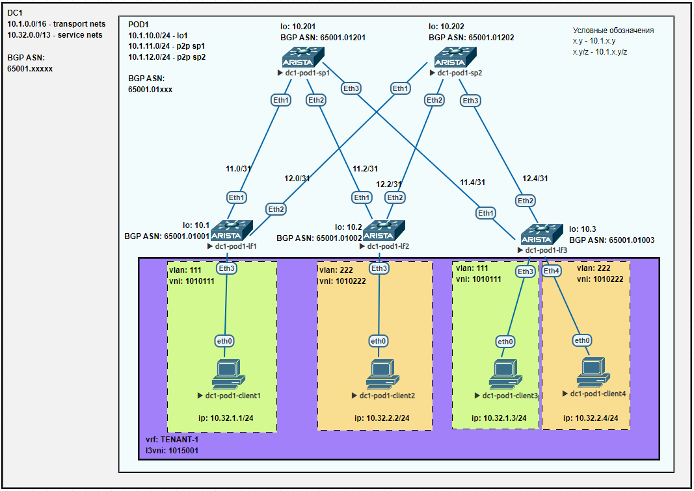

## Лаба6. VxLAN. L3 VNI

### План работы
1. Настройка каждого клиента в своем VNI.
2. Настройка маршрутизации между клиентами.
3. Проверка работы.

#### 1. Настройка каждого клиента в своем VNI
Схема сети имеет вид:


На коммутаторах уровня leaf и spine продолжаем использовать следующие IP адреса:

| hostname     | lo0         | lo1       | p2p sp1      | p2p sp2      |
| ------------ | ----------- | --------- | ------------ | ------------ |
| dc1-pod1-sp1 | 10.1.10.201 | -         | -            | -            |
| dc1-pod1-sp2 | 10.1.10.202 | -         | -            | -            |
| dc1-pod1-lf1 | 10.1.10.1   | 10.1.19.1 | 10.1.11.1/31 | 10.1.12.1/31 |
| dc1-pod1-lf2 | 10.1.10.2   | 10.1.19.2 | 10.1.11.3/31 | 10.1.12.3/31 |
| dc1-pod1-lf3 | 10.1.10.3   | 10.1.19.3 | 10.1.11.5/31 | 10.1.12.5/31 |

Настройка L2VNI для клиентских сетей наследована из лабораторной работы №5 (https://github.com/GeorgAEK/otus-dcnd/tree/main/labs/lab5) и здесь повторно описываться не будет. 

#### 2. Настройка маршрутизации между клиентами

Клиенты будут располагаться в двух VLAN'ах - 111 и 222. При этом оба VLAN'а будут "приземлены" в один vrf TENANT-1.  
Используются следующие IP подсети:  
VLAN 111 - 10.32.1.0/24, gw .254  
VLAN 222 - 10.32.2.0/24, gw .254  
Шлюзы сетей настроены на всех коммутаторах leaf по типу anycast gateway.

Для каждого vrf требуется указать номер L3VNI. Будем использовать шаблон для L3VNI вида:  
**1{DCN}{VRF-ID},**  
где  
	&emsp;{DCN} - номер ЦОД (DC Number). Принимает значение от 01 до 15;  
	&emsp;{VRF-ID} - номер VLAN. Принимает значение от 5001 до 5999.

В данной лабораторной работе для vrf TENANT-1 номер L3VNI примет значение - 1015001.


Далее приведем конфигурации устройств.  
Настройки spine на примере spine1 (аналогичны лабораторной работе №5):
```
dc1-pod1-sp1(config)#show run
! Command: show running-config
! device: dc1-pod1-sp1 (vEOS-lab, EOS-4.29.2F)
!
! boot system flash:/vEOS-lab.swi
!
no aaa root
!
transceiver qsfp default-mode 4x10G
!
service routing protocols model multi-agent
!
hostname dc1-pod1-sp1
!
spanning-tree mode mstp
!
interface Ethernet1
   description lf1|Eth1
   mtu 9214
   no switchport
   ip address 10.1.11.0/31
!
interface Ethernet2
   description lf2|Eth1
   mtu 9214
   no switchport
   ip address 10.1.11.2/31
!
interface Ethernet3
   description lf3|Eth1
   mtu 9214
   no switchport
   ip address 10.1.11.4/31
!
interface Ethernet4
!
interface Ethernet5
!
interface Ethernet6
!
interface Ethernet7
!
interface Ethernet8
!
interface Loopback0
   ip address 10.1.10.201/32
!
interface Management1
!
ip routing
!
ip prefix-list PL-DEFAULT
   seq 10 permit 0.0.0.0/0
!
ip prefix-list PL-LINKNETS
   seq 10 permit 10.1.11.0/24 eq 31
   seq 20 permit 10.1.12.0/24 eq 31
!
ip prefix-list PL-LOOPBACKS
   seq 10 permit 10.1.10.0/24 eq 32
   seq 20 permit 10.1.19.0/24 eq 32
!
route-map RM-BGP-LEAFS-IN permit 10
   match ip address prefix-list PL-LOOPBACKS
!
route-map RM-BGP-LEAFS-IN permit 20
   match ip address prefix-list PL-LINKNETS
!
route-map RM-BGP-LEAFS-OUT permit 10
   match ip address prefix-list PL-LOOPBACKS
!
route-map RM-BGP-LEAFS-OUT permit 20
   match ip address prefix-list PL-LINKNETS
!
route-map RM-BGP-LEAFS-OUT permit 100
   match ip address prefix-list PL-DEFAULT
!
route-map RM-REDISTRIBUTE-DIRECT permit 10
   match ip address prefix-list PL-LOOPBACKS
   match source-protocol connected
!
peer-filter PFLTR-LEEF-ASN
   10 match as-range 4259906537-4259906665 result accept
!
router bgp 4259906737
   router-id 10.1.10.201
   maximum-paths 2
   bgp listen range 10.1.10.0/24 peer-group PGROUP-OVERLAY peer-filter PFLTR-LEEF-ASN
   bgp listen range 10.1.11.0/24 peer-group PGROUP-UNDERLAY peer-filter PFLTR-LEEF-ASN
   neighbor PGROUP-OVERLAY peer group
   neighbor PGROUP-OVERLAY next-hop-unchanged
   neighbor PGROUP-OVERLAY update-source Loopback0
   neighbor PGROUP-OVERLAY ebgp-multihop 3
   neighbor PGROUP-OVERLAY send-community extended
   neighbor PGROUP-OVERLAY maximum-routes 16000
   neighbor PGROUP-UNDERLAY peer group
   neighbor PGROUP-UNDERLAY bfd
   neighbor PGROUP-UNDERLAY route-map RM-BGP-LEAFS-IN in
   neighbor PGROUP-UNDERLAY route-map RM-BGP-LEAFS-OUT out
   redistribute connected route-map RM-REDISTRIBUTE-DIRECT
   !
   address-family evpn
      neighbor PGROUP-OVERLAY activate
   !
!
end
```

Настройки leaf1:
```
dc1-pod1-lf1(config)#show run
! Command: show running-config
! device: dc1-pod1-lf1 (vEOS-lab, EOS-4.29.2F)
!
! boot system flash:/vEOS-lab.swi
!
no aaa root
!
transceiver qsfp default-mode 4x10G
!
service routing protocols model multi-agent
!
hostname dc1-pod1-lf1
!
spanning-tree mode mstp
!
vlan 111
   name VLAN-111
!
vrf instance TENANT-1
!
interface Ethernet1
   description sp1|Eth1
   mtu 9214
   no switchport
   ip address 10.1.11.1/31
!
interface Ethernet2
   description sp2|Eth1
   mtu 9214
   no switchport
   ip address 10.1.12.1/31
!
interface Ethernet3
   description client1
   switchport access vlan 111
   spanning-tree portfast
!
interface Ethernet4
!
interface Ethernet5
!
interface Ethernet6
!
interface Ethernet7
!
interface Ethernet8
!
interface Loopback0
   ip address 10.1.10.1/32
!
interface Loopback1
   description VTEP-address
   ip address 10.1.19.1/32
!
interface Management1
!
interface Vlan111
   description SVI-111
   vrf TENANT-1
   ip address virtual 10.32.1.254/24
!
interface Vxlan1
   vxlan source-interface Loopback1
   vxlan udp-port 4789
   vxlan vlan 111 vni 1010111
   vxlan vrf TENANT-1 vni 1015001
   vxlan learn-restrict any
!
ip routing
ip routing vrf TENANT-1
!
ip prefix-list PL-LINKNETS seq 10 permit 10.1.11.0/24 eq 31
ip prefix-list PL-LINKNETS seq 20 permit 10.1.12.0/24 eq 31
ip prefix-list PL-LOOPBACKS seq 10 permit 10.1.10.0/24 eq 32
ip prefix-list PL-LOOPBACKS seq 20 permit 10.1.19.0/24 eq 32
!
route-map RM-BGP-SPINE-OUT permit 10
   match ip address prefix-list PL-LOOPBACKS
!
route-map RM-BGP-SPINE-OUT permit 20
   match ip address prefix-list PL-LINKNETS
!
route-map RM-REDISTRIBUTE-DIRECT permit 10
   match ip address prefix-list PL-LOOPBACKS
   match source-protocol connected
!
route-map RM-REDISTRIBUTE-DIRECT permit 20
   match ip address prefix-list PL-LINKNETS
   match source-protocol connected
!
router bgp 4259906537
   router-id 10.1.10.1
   maximum-paths 8
   neighbor PGROUP-OVERLAY peer group
   neighbor PGROUP-OVERLAY update-source Loopback0
   neighbor PGROUP-OVERLAY ebgp-multihop 3
   neighbor PGROUP-OVERLAY send-community extended
   neighbor PGROUP-OVERLAY maximum-routes 16000
   neighbor PGROUP-UNDERLAY peer group
   neighbor PGROUP-UNDERLAY bfd
   neighbor PGROUP-UNDERLAY route-map RM-BGP-SPINE-OUT out
   neighbor 10.1.10.201 peer group PGROUP-OVERLAY
   neighbor 10.1.10.201 remote-as 4259906737
   neighbor 10.1.10.202 peer group PGROUP-OVERLAY
   neighbor 10.1.10.202 remote-as 4259906738
   neighbor 10.1.11.0 peer group PGROUP-UNDERLAY
   neighbor 10.1.11.0 remote-as 4259906737
   neighbor 10.1.11.0 description sp1 65001.01201
   neighbor 10.1.12.0 peer group PGROUP-UNDERLAY
   neighbor 10.1.12.0 remote-as 4259906738
   neighbor 10.1.12.0 description sp2 65001.01202
   redistribute connected route-map RM-REDISTRIBUTE-DIRECT
   !
   vlan 111
      rd 10.1.10.1:111
      route-target both 65001:1010111
      redistribute learned
   !
   address-family evpn
      neighbor PGROUP-OVERLAY activate
   !
   vrf TENANT-1
      rd 10.1.10.1:5001
      route-target import evpn 65001:1015001
      route-target export evpn 65001:1015001
      redistribute connected
!
end
```

Настройки leaf2:
```
dc1-pod1-lf2(config)#show run
! Command: show running-config
! device: dc1-pod1-lf2 (vEOS-lab, EOS-4.29.2F)
!
! boot system flash:/vEOS-lab.swi
!
no aaa root
!
transceiver qsfp default-mode 4x10G
!
service routing protocols model multi-agent
!
hostname dc1-pod1-lf2
!
spanning-tree mode mstp
!
vlan 222
   name VLAN-222
!
vrf instance TENANT-1
!
interface Ethernet1
   description sp1|Eth2
   mtu 9214
   no switchport
   ip address 10.1.11.3/31
!
interface Ethernet2
   description sp2|Eth2
   mtu 9214
   no switchport
   ip address 10.1.12.3/31
!
interface Ethernet3
   description client2
   switchport access vlan 222
   spanning-tree portfast
!
interface Ethernet4
!
interface Ethernet5
!
interface Ethernet6
!
interface Ethernet7
!
interface Ethernet8
!
interface Loopback0
   ip address 10.1.10.2/32
!
interface Loopback1
   description VTEP-address
   ip address 10.1.19.2/32
!
interface Management1
!
interface Vlan222
   description SVI-222
   vrf TENANT-1
   ip address virtual 10.32.2.254/24
!
interface Vxlan1
   vxlan source-interface Loopback1
   vxlan udp-port 4789
   vxlan vlan 222 vni 1010222
   vxlan vrf TENANT-1 vni 1015001
   vxlan learn-restrict any
!
ip routing
ip routing vrf TENANT-1
!
ip prefix-list PL-LINKNETS seq 10 permit 10.1.11.0/24 eq 31
ip prefix-list PL-LINKNETS seq 20 permit 10.1.12.0/24 eq 31
ip prefix-list PL-LOOPBACKS seq 10 permit 10.1.10.0/24 eq 32
ip prefix-list PL-LOOPBACKS seq 20 permit 10.1.19.0/24 eq 32
!
route-map RM-BGP-SPINE-OUT permit 10
   match ip address prefix-list PL-LOOPBACKS
!
route-map RM-BGP-SPINE-OUT permit 20
   match ip address prefix-list PL-LINKNETS
!
route-map RM-REDISTRIBUTE-DIRECT permit 10
   match ip address prefix-list PL-LOOPBACKS
   match source-protocol connected
!
route-map RM-REDISTRIBUTE-DIRECT permit 20
   match ip address prefix-list PL-LINKNETS
   match source-protocol connected
!
router bgp 4259906538
   router-id 10.1.10.2
   maximum-paths 8
   neighbor PGROUP-OVERLAY peer group
   neighbor PGROUP-OVERLAY update-source Loopback0
   neighbor PGROUP-OVERLAY ebgp-multihop 3
   neighbor PGROUP-OVERLAY send-community extended
   neighbor PGROUP-OVERLAY maximum-routes 16000
   neighbor PGROUP-UNDERLAY peer group
   neighbor PGROUP-UNDERLAY bfd
   neighbor PGROUP-UNDERLAY route-map RM-BGP-SPINE-OUT out
   neighbor 10.1.10.201 peer group PGROUP-OVERLAY
   neighbor 10.1.10.201 remote-as 4259906737
   neighbor 10.1.10.202 peer group PGROUP-OVERLAY
   neighbor 10.1.10.202 remote-as 4259906738
   neighbor 10.1.11.2 peer group PGROUP-UNDERLAY
   neighbor 10.1.11.2 remote-as 4259906737
   neighbor 10.1.11.2 description sp1 65001.01201
   neighbor 10.1.12.2 peer group PGROUP-UNDERLAY
   neighbor 10.1.12.2 remote-as 4259906738
   neighbor 10.1.12.2 description sp2 65001.01202
   redistribute connected route-map RM-REDISTRIBUTE-DIRECT
   !
   vlan 222
      rd 10.1.10.2:222
      route-target both 65001:1010222
      redistribute learned
   !
   address-family evpn
      neighbor PGROUP-OVERLAY activate
   !
   vrf TENANT-1
      rd 10.1.10.2:5001
      route-target import evpn 65001:1015001
      route-target export evpn 65001:1015001
      redistribute connected
!
end
```

Настройки leaf3:
```
dc1-pod1-lf3#show run
! Command: show running-config
! device: dc1-pod1-lf3 (vEOS-lab, EOS-4.29.2F)
!
! boot system flash:/vEOS-lab.swi
!
no aaa root
!
transceiver qsfp default-mode 4x10G
!
service routing protocols model multi-agent
!
hostname dc1-pod1-lf3
!
spanning-tree mode mstp
!
vlan 111
   name VLAN-111
!
vlan 222
   name VLAN-222
!
vrf instance TENANT-1
!
interface Ethernet1
   description sp1|Eth3
   mtu 9214
   no switchport
   ip address 10.1.11.5/31
!
interface Ethernet2
   description sp2|Eth3
   mtu 9214
   no switchport
   ip address 10.1.12.5/31
!
interface Ethernet3
   description client3
   switchport access vlan 111
   spanning-tree portfast
!
interface Ethernet4
   description client4
   switchport access vlan 222
   spanning-tree portfast
!
interface Ethernet5
!
interface Ethernet6
!
interface Ethernet7
!
interface Ethernet8
!
interface Loopback0
   ip address 10.1.10.3/32
!
interface Loopback1
   description VTEP-address
   ip address 10.1.19.3/32
!
interface Management1
!
interface Vlan111
   description SVI-111
   vrf TENANT-1
   ip address virtual 10.32.1.254/24
!
interface Vlan222
   description SVI-222
   vrf TENANT-1
   ip address virtual 10.32.2.254/24
!
interface Vxlan1
   vxlan source-interface Loopback1
   vxlan udp-port 4789
   vxlan vlan 111 vni 1010111
   vxlan vlan 222 vni 1010222
   vxlan vrf TENANT-1 vni 1015001
   vxlan learn-restrict any
!
ip routing
ip routing vrf TENANT-1
!
ip prefix-list PL-LINKNETS seq 10 permit 10.1.11.0/24 eq 31
ip prefix-list PL-LINKNETS seq 20 permit 10.1.12.0/24 eq 31
ip prefix-list PL-LOOPBACKS seq 10 permit 10.1.10.0/24 eq 32
ip prefix-list PL-LOOPBACKS seq 20 permit 10.1.19.0/24 eq 32
!
route-map RM-BGP-SPINE-OUT permit 10
   match ip address prefix-list PL-LOOPBACKS
!
route-map RM-BGP-SPINE-OUT permit 20
   match ip address prefix-list PL-LINKNETS
!
route-map RM-REDISTRIBUTE-DIRECT permit 10
   match ip address prefix-list PL-LOOPBACKS
   match source-protocol connected
!
route-map RM-REDISTRIBUTE-DIRECT permit 20
   match ip address prefix-list PL-LINKNETS
   match source-protocol connected
!
router bgp 4259906539
   router-id 10.1.10.3
   maximum-paths 8
   neighbor PGROUP-OVERLAY peer group
   neighbor PGROUP-OVERLAY update-source Loopback0
   neighbor PGROUP-OVERLAY ebgp-multihop 3
   neighbor PGROUP-OVERLAY send-community extended
   neighbor PGROUP-OVERLAY maximum-routes 16000
   neighbor PGROUP-UNDERLAY peer group
   neighbor PGROUP-UNDERLAY bfd
   neighbor PGROUP-UNDERLAY route-map RM-BGP-SPINE-OUT out
   neighbor 10.1.10.201 peer group PGROUP-OVERLAY
   neighbor 10.1.10.201 remote-as 4259906737
   neighbor 10.1.10.202 peer group PGROUP-OVERLAY
   neighbor 10.1.10.202 remote-as 4259906738
   neighbor 10.1.11.4 peer group PGROUP-UNDERLAY
   neighbor 10.1.11.4 remote-as 4259906737
   neighbor 10.1.11.4 description sp1 65001.01201
   neighbor 10.1.12.4 peer group PGROUP-UNDERLAY
   neighbor 10.1.12.4 remote-as 4259906738
   neighbor 10.1.12.4 description sp2 65001.01202
   redistribute connected route-map RM-REDISTRIBUTE-DIRECT
   !
   vlan 111
      rd 10.1.10.3:111
      route-target both 65001:1010111
      redistribute learned
   !
   vlan 222
      rd 10.1.10.3:222
      route-target both 65001:1010222
      redistribute learned
   !
   address-family evpn
      neighbor PGROUP-OVERLAY activate
   !
   vrf TENANT-1
      rd 10.1.10.3:5001
      route-target import evpn 65001:1015001
      route-target export evpn 65001:1015001
      redistribute connected
!
end
```

#### 3. Проверка работы

Проверка работы VXLAN (на примере lf1):
```
dc1-pod1-lf1(config)#show vxlan vtep
Remote VTEPS for Vxlan1:

VTEP            Tunnel Type(s)
--------------- --------------
10.1.19.2       unicast
10.1.19.3       unicast, flood

Total number of remote VTEPS:  2
dc1-pod1-lf1(config)#
dc1-pod1-lf1(config)#
dc1-pod1-lf1(config)#show bgp evpn route-type ip-prefix ipv4
BGP routing table information for VRF default
Router identifier 10.1.10.1, local AS number 4259906537
Route status codes: * - valid, > - active, S - Stale, E - ECMP head, e - ECMP
                    c - Contributing to ECMP, % - Pending BGP convergence
Origin codes: i - IGP, e - EGP, ? - incomplete
AS Path Attributes: Or-ID - Originator ID, C-LST - Cluster List, LL Nexthop - Link Local Nexthop

          Network                Next Hop              Metric  LocPref Weight  Path
 * >      RD: 10.1.10.1:5001 ip-prefix 10.32.1.0/24
                                 -                     -       -       0       i
 * >Ec    RD: 10.1.10.3:5001 ip-prefix 10.32.1.0/24
                                 10.1.19.3             -       100     0       4259906738 4259906539 i
 *  ec    RD: 10.1.10.3:5001 ip-prefix 10.32.1.0/24
                                 10.1.19.3             -       100     0       4259906737 4259906539 i
 * >Ec    RD: 10.1.10.2:5001 ip-prefix 10.32.2.0/24
                                 10.1.19.2             -       100     0       4259906737 4259906538 i
 *  ec    RD: 10.1.10.2:5001 ip-prefix 10.32.2.0/24
                                 10.1.19.2             -       100     0       4259906738 4259906538 i
 * >Ec    RD: 10.1.10.3:5001 ip-prefix 10.32.2.0/24
                                 10.1.19.3             -       100     0       4259906738 4259906539 i
 *  ec    RD: 10.1.10.3:5001 ip-prefix 10.32.2.0/24
                                 10.1.19.3             -       100     0       4259906737 4259906539 i
dc1-pod1-lf1(config)#
dc1-pod1-lf1(config)#
dc1-pod1-lf1(config)#show ip route vrf TENANT-1

VRF: TENANT-1
Codes: C - connected, S - static, K - kernel,
       O - OSPF, IA - OSPF inter area, E1 - OSPF external type 1,
       E2 - OSPF external type 2, N1 - OSPF NSSA external type 1,
       N2 - OSPF NSSA external type2, B - Other BGP Routes,
       B I - iBGP, B E - eBGP, R - RIP, I L1 - IS-IS level 1,
       I L2 - IS-IS level 2, O3 - OSPFv3, A B - BGP Aggregate,
       A O - OSPF Summary, NG - Nexthop Group Static Route,
       V - VXLAN Control Service, M - Martian,
       DH - DHCP client installed default route,
       DP - Dynamic Policy Route, L - VRF Leaked,
       G  - gRIBI, RC - Route Cache Route

Gateway of last resort is not set

 B E      10.32.1.3/32 [200/0] via VTEP 10.1.19.3 VNI 1015001 router-mac 50:00:00:15:f4:e8 local-interface Vxlan1
 C        10.32.1.0/24 is directly connected, Vlan111
 B E      10.32.2.2/32 [200/0] via VTEP 10.1.19.2 VNI 1015001 router-mac 50:00:00:03:37:66 local-interface Vxlan1
 B E      10.32.2.4/32 [200/0] via VTEP 10.1.19.3 VNI 1015001 router-mac 50:00:00:15:f4:e8 local-interface Vxlan1
 B E      10.32.2.0/24 [200/0] via VTEP 10.1.19.3 VNI 1015001 router-mac 50:00:00:15:f4:e8 local-interface Vxlan1
                               via VTEP 10.1.19.2 VNI 1015001 router-mac 50:00:00:03:37:66 local-interface Vxlan1

dc1-pod1-lf1(config)#
dc1-pod1-lf1(config)#
dc1-pod1-lf1(config)#show vxlan address-table
          Vxlan Mac Address Table
----------------------------------------------------------------------

VLAN  Mac Address     Type      Prt  VTEP             Moves   Last Move
----  -----------     ----      ---  ----             -----   ---------
 111  0050.7966.6808  EVPN      Vx1  10.1.19.3        1       0:03:03 ago
4094  5000.0003.3766  EVPN      Vx1  10.1.19.2        1       1:11:18 ago
4094  5000.0015.f4e8  EVPN      Vx1  10.1.19.3        1       23:49:27 ago
Total Remote Mac Addresses for this criterion: 3
dc1-pod1-lf1(config)#
```


Проверка связности всех хостов между собой (с dc1-pod1-client4):
```
VPCS> ping 10.32.1.1

84 bytes from 10.32.1.1 icmp_seq=1 ttl=63 time=130.371 ms
84 bytes from 10.32.1.1 icmp_seq=2 ttl=63 time=18.224 ms
^C
VPCS> ping 10.32.2.2

84 bytes from 10.32.2.2 icmp_seq=1 ttl=64 time=30.457 ms
84 bytes from 10.32.2.2 icmp_seq=2 ttl=64 time=15.722 ms
84 bytes from 10.32.2.2 icmp_seq=3 ttl=64 time=11.772 ms
^C
VPCS> ping 10.32.1.3

84 bytes from 10.32.1.3 icmp_seq=1 ttl=63 time=20.547 ms
84 bytes from 10.32.1.3 icmp_seq=2 ttl=63 time=5.195 ms
^C
VPCS> ping 10.32.2.4

10.32.2.4 icmp_seq=1 ttl=64 time=0.001 ms
10.32.2.4 icmp_seq=2 ttl=64 time=0.001 ms
10.32.2.4 icmp_seq=3 ttl=64 time=0.001 ms
10.32.2.4 icmp_seq=4 ttl=64 time=0.001 ms
10.32.2.4 icmp_seq=5 ttl=64 time=0.001 ms

VPCS>
```
