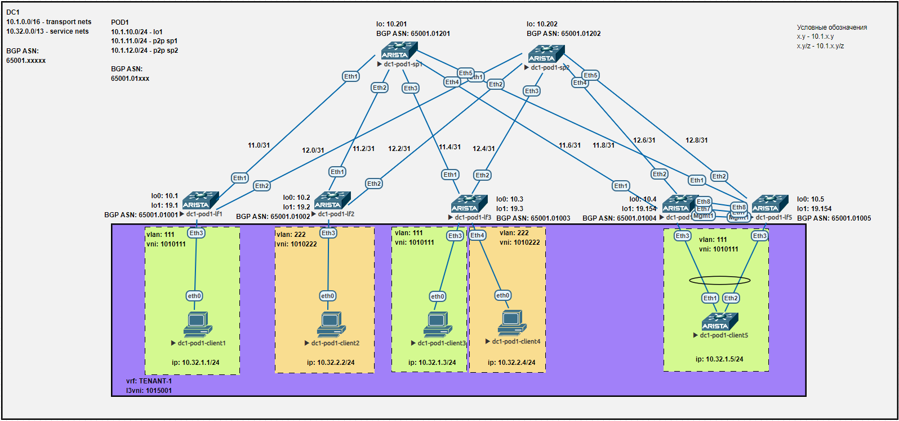

## Лаба7. VXLAN. Multihoming

### План работы
1. Подключение клиента двумя линками к различным Leaf.
2. Настройка агрегированного канала со стороны клиента.
3. Настройка multihoming для работы в Overlay сети.
4. Проверка работы.

#### 1. Подключение клиента двумя линками к различным Leaf
Схема сети имеет вид:


На коммутаторах уровня leaf и spine используем следующие IP адреса:

| hostname     | lo0         | lo1         | p2p sp1      | p2p sp2      |
| ------------ | ----------- | ----------- | ------------ | ------------ |
| dc1-pod1-sp1 | 10.1.10.201 | -           | -            | -            |
| dc1-pod1-sp2 | 10.1.10.202 | -           | -            | -            |
| dc1-pod1-lf1 | 10.1.10.1   | 10.1.19.1   | 10.1.11.1/31 | 10.1.12.1/31 |
| dc1-pod1-lf2 | 10.1.10.2   | 10.1.19.2   | 10.1.11.3/31 | 10.1.12.3/31 |
| dc1-pod1-lf3 | 10.1.10.3   | 10.1.19.3   | 10.1.11.5/31 | 10.1.12.5/31 |
| dc1-pod1-lf4 | 10.1.10.4   | 10.1.19.154 | 10.1.11.7/31 | 10.1.12.7/31 |
| dc1-pod1-lf5 | 10.1.10.5   | 10.1.19.154 | 10.1.11.9/31 | 10.1.12.9/31 |

В качестве клиентского устройства, подключенного двумя линками с разных коммутаторов Leaf, используем обычный коммутатор аналогичной модели. Для его подключения добавим на схему два новых коммутатора Leaf: dc1-pod1-lf4 и dc1-pod1-lf5.

#### 2. Настройка агрегированного канала со стороны клиента

Со стороны клиентского устройства настроим обычный агрегированный канал с использованием LACP, также сразу создадим vlan 111 и назначим в этом vlan'е ip адрес 10.32.1.5.  
Полная конфигурация клиентского устройства:
```
dc1-pod1-client5#show run
! Command: show running-config
! device: dc1-pod1-client5 (vEOS-lab, EOS-4.29.2F)
!
! boot system flash:/vEOS-lab.swi
!
no aaa root
!
transceiver qsfp default-mode 4x10G
!
service routing protocols model ribd
!
hostname dc1-pod1-client5
!
spanning-tree mode mstp
!
vlan 111
   name VLAN-111
!
interface Port-Channel1
   switchport access vlan 111
!
interface Ethernet1
   description lf4|Eth3
   channel-group 1 mode active
!
interface Ethernet2
   description lf5|Eth3
   channel-group 1 mode active
!
interface Ethernet3
!
interface Ethernet4
!
interface Ethernet5
!
interface Ethernet6
!
interface Ethernet7
!
interface Ethernet8
!
interface Management1
!
interface Vlan111
   ip address 10.32.1.5/24
!
ip routing
!
ip route 0.0.0.0/0 10.32.1.254
!
end
```

#### 3. Настройка multihoming для работы в Overlay сети
Для данной лабораторной работы выбран вариант настройки multihoming с использованием MLAG, т.к. с ESI LAG есть уверенный опыт работы и хочется посмотреть альтернативный вариант. Других оправданий для выбора MLAG найти не получается. Для реальных сценариев однозначно интереснее использовать ESI LAG.  
На коммутаторах Arista настройка сценария Multihoming + MLAG получается довольно удобной и по сути все сводится к настройке одинакового IP адреса на интерфейсе Loopback1, который используется для VTEP.

Конфигурация dc1-pod1-lf4:
```
dc1-pod1-lf4(config)#show run
! Command: show running-config
! device: dc1-pod1-lf4 (vEOS-lab, EOS-4.29.2F)
!
! boot system flash:/vEOS-lab.swi
!
no aaa root
!
transceiver qsfp default-mode 4x10G
!
service routing protocols model multi-agent
!
hostname dc1-pod1-lf4
!
spanning-tree mode mstp
no spanning-tree vlan-id 4000-4001
!
vlan 111
   name VLAN-111
!
vlan 4000
   name MLAG-PEER
   trunk group TG-MLAG-PEER
!
vlan 4001
   name MLAG-BGP
   trunk group TG-MLAG-PEER
!
vrf instance MGMT
!
vrf instance TENANT-1
!
interface Port-Channel3
   switchport access vlan 111
   mlag 3
!
interface Port-Channel100
   description MLAG-ICL
   switchport mode trunk
   switchport trunk group TG-MLAG-PEER
   spanning-tree link-type point-to-point
!
interface Ethernet1
   description sp1|Eth4
   mtu 9214
   no switchport
   ip address 10.1.11.7/31
!
interface Ethernet2
   description sp2|Eth4
   mtu 9214
   no switchport
   ip address 10.1.12.7/31
!
interface Ethernet3
   description client5|Eth1
   channel-group 3 mode active
!
interface Ethernet4
!
interface Ethernet5
!
interface Ethernet6
!
interface Ethernet7
   description lf5|Eth7
   channel-group 100 mode active
!
interface Ethernet8
   description lf5|Eth8
   channel-group 100 mode active
!
interface Loopback0
   ip address 10.1.10.4/32
!
interface Loopback1
   description VTEP-address
   ip address 10.1.19.154/32
!
interface Management1
   vrf MGMT
   ip address 10.1.201.4/24
!
interface Vlan111
   description SVI-111
   vrf TENANT-1
   ip address virtual 10.32.1.254/24
!
interface Vlan4000
   no autostate
   ip address 192.168.201.4/31
!
interface Vlan4001
   description MLAG-BGP
   mtu 9214
   ip address 172.16.201.4/31
!
interface Vxlan1
   vxlan source-interface Loopback1
   vxlan udp-port 4789
   vxlan vlan 111 vni 1010111
   vxlan vlan 222 vni 1010222
   vxlan vrf TENANT-1 vni 1015001
   vxlan learn-restrict any
!
ip virtual-router mac-address cc:cc:ee:ee:ff:ff
!
ip routing
ip routing vrf MGMT
ip routing vrf TENANT-1
!
ip prefix-list PL-LINKNETS seq 10 permit 10.1.11.0/24 eq 31
ip prefix-list PL-LINKNETS seq 20 permit 10.1.12.0/24 eq 31
ip prefix-list PL-LOOPBACKS seq 10 permit 10.1.10.0/24 eq 32
ip prefix-list PL-LOOPBACKS seq 20 permit 10.1.19.0/24 eq 32
!
mlag configuration
   domain-id LF4-5
   local-interface Vlan4000
   peer-address 192.168.201.5
   peer-address heartbeat 10.1.201.5 vrf MGMT
   peer-link Port-Channel100
   dual-primary detection delay 10 action errdisable all-interfaces
!
route-map RM-BGP-MLAG-PEER-IN permit 10
   set as-path prepend auto repeat 8
!
route-map RM-BGP-SPINE-OUT permit 10
   match ip address prefix-list PL-LOOPBACKS
!
route-map RM-BGP-SPINE-OUT permit 20
   match ip address prefix-list PL-LINKNETS
!
route-map RM-REDISTRIBUTE-DIRECT permit 10
   match ip address prefix-list PL-LOOPBACKS
   match source-protocol connected
!
route-map RM-REDISTRIBUTE-DIRECT permit 20
   match ip address prefix-list PL-LINKNETS
   match source-protocol connected
!
router bgp 4259906540
   router-id 10.1.10.4
   maximum-paths 8
   neighbor PGROUP-OVERLAY peer group
   neighbor PGROUP-OVERLAY update-source Loopback0
   neighbor PGROUP-OVERLAY ebgp-multihop 3
   neighbor PGROUP-OVERLAY send-community extended
   neighbor PGROUP-OVERLAY maximum-routes 16000
   neighbor PGROUP-UNDERLAY peer group
   neighbor PGROUP-UNDERLAY bfd
   neighbor PGROUP-UNDERLAY route-map RM-BGP-SPINE-OUT out
   neighbor 10.1.10.201 peer group PGROUP-OVERLAY
   neighbor 10.1.10.201 remote-as 4259906737
   neighbor 10.1.10.202 peer group PGROUP-OVERLAY
   neighbor 10.1.10.202 remote-as 4259906738
   neighbor 10.1.11.6 peer group PGROUP-UNDERLAY
   neighbor 10.1.11.6 remote-as 4259906737
   neighbor 10.1.11.6 description sp1 65001.01201
   neighbor 10.1.12.6 peer group PGROUP-UNDERLAY
   neighbor 10.1.12.6 remote-as 4259906738
   neighbor 10.1.12.6 description sp2 65001.01202
   neighbor 172.16.201.5 remote-as 4259906541
   neighbor 172.16.201.5 bfd
   neighbor 172.16.201.5 description lf5 65001.01005
   neighbor 172.16.201.5 route-map RM-BGP-MLAG-PEER-IN in
   redistribute connected route-map RM-REDISTRIBUTE-DIRECT
   !
   vlan 111
      rd 10.1.10.4:111
      route-target both 65001:1010111
      redistribute learned
   !
   address-family evpn
      neighbor PGROUP-OVERLAY activate
   !
   vrf TENANT-1
      rd 10.1.10.4:5001
      route-target import evpn 65001:1015001
      route-target export evpn 65001:1015001
!
end
```

Конфигурация dc1-pod1-lf5:
```
dc1-pod1-lf5(config)#show run
! Command: show running-config
! device: dc1-pod1-lf5 (vEOS-lab, EOS-4.29.2F)
!
! boot system flash:/vEOS-lab.swi
!
no aaa root
!
transceiver qsfp default-mode 4x10G
!
service routing protocols model multi-agent
!
hostname dc1-pod1-lf5
!
spanning-tree mode mstp
no spanning-tree vlan-id 4000-4001
!
vlan 111
   name VLAN-111
!
vlan 4000
   name MLAG-PEER
   trunk group TG-MLAG-PEER
!
vlan 4001
   name MLAG-BGP
   trunk group TG-MLAG-PEER
!
vrf instance MGMT
!
vrf instance TENANT-1
!
interface Port-Channel3
   switchport access vlan 111
   mlag 3
!
interface Port-Channel100
   description MLAG-ICL
   switchport mode trunk
   switchport trunk group TG-MLAG-PEER
   spanning-tree link-type point-to-point
!
interface Ethernet1
   description sp1|Eth5
   mtu 9214
   no switchport
   ip address 10.1.11.9/31
!
interface Ethernet2
   description sp2|Eth5
   mtu 9214
   no switchport
   ip address 10.1.12.9/31
!
interface Ethernet3
   description client5|Eth2
   channel-group 3 mode active
!
interface Ethernet4
!
interface Ethernet5
!
interface Ethernet6
!
interface Ethernet7
   description lf4|Eth7
   channel-group 100 mode active
!
interface Ethernet8
   description lf4|Eth8
   channel-group 100 mode active
!
interface Loopback0
   ip address 10.1.10.5/32
!
interface Loopback1
   description VTEP-address
   ip address 10.1.19.154/32
!
interface Management1
   vrf MGMT
   ip address 10.1.201.5/24
!
interface Vlan111
   description SVI-111
   vrf TENANT-1
   ip address virtual 10.32.1.254/24
!
interface Vlan4000
   no autostate
   ip address 192.168.201.5/31
!
interface Vlan4001
   description MLAG-BGP
   mtu 9214
   ip address 172.16.201.5/31
!
interface Vxlan1
   vxlan source-interface Loopback1
   vxlan udp-port 4789
   vxlan vlan 111 vni 1010111
   vxlan vlan 222 vni 1010222
   vxlan vrf TENANT-1 vni 1015001
   vxlan learn-restrict any
!
ip virtual-router mac-address cc:cc:ee:ee:ff:ff
!
ip routing
ip routing vrf MGMT
ip routing vrf TENANT-1
!
ip prefix-list PL-LINKNETS seq 10 permit 10.1.11.0/24 eq 31
ip prefix-list PL-LINKNETS seq 20 permit 10.1.12.0/24 eq 31
ip prefix-list PL-LOOPBACKS seq 10 permit 10.1.10.0/24 eq 32
ip prefix-list PL-LOOPBACKS seq 20 permit 10.1.19.0/24 eq 32
!
mlag configuration
   domain-id LF4-5
   local-interface Vlan4000
   peer-address 192.168.201.4
   peer-address heartbeat 10.1.201.4 vrf MGMT
   peer-link Port-Channel100
   dual-primary detection delay 10 action errdisable all-interfaces
!
route-map RM-BGP-MLAG-PEER-IN permit 10
   set as-path prepend auto repeat 8
!
route-map RM-BGP-SPINE-OUT permit 10
   match ip address prefix-list PL-LOOPBACKS
!
route-map RM-BGP-SPINE-OUT permit 20
   match ip address prefix-list PL-LINKNETS
!
route-map RM-REDISTRIBUTE-DIRECT permit 10
   match ip address prefix-list PL-LOOPBACKS
   match source-protocol connected
!
route-map RM-REDISTRIBUTE-DIRECT permit 20
   match ip address prefix-list PL-LINKNETS
   match source-protocol connected
!
router bgp 4259906541
   router-id 10.1.10.5
   maximum-paths 8
   neighbor PGROUP-OVERLAY peer group
   neighbor PGROUP-OVERLAY update-source Loopback0
   neighbor PGROUP-OVERLAY ebgp-multihop 3
   neighbor PGROUP-OVERLAY send-community extended
   neighbor PGROUP-OVERLAY maximum-routes 16000
   neighbor PGROUP-UNDERLAY peer group
   neighbor PGROUP-UNDERLAY bfd
   neighbor PGROUP-UNDERLAY route-map RM-BGP-SPINE-OUT out
   neighbor 10.1.10.201 peer group PGROUP-OVERLAY
   neighbor 10.1.10.201 remote-as 4259906737
   neighbor 10.1.10.202 peer group PGROUP-OVERLAY
   neighbor 10.1.10.202 remote-as 4259906738
   neighbor 10.1.11.8 peer group PGROUP-UNDERLAY
   neighbor 10.1.11.8 remote-as 4259906737
   neighbor 10.1.11.8 description sp1 65001.01201
   neighbor 10.1.12.8 peer group PGROUP-UNDERLAY
   neighbor 10.1.12.8 remote-as 4259906738
   neighbor 10.1.12.8 description sp2 65001.01202
   neighbor 172.16.201.4 remote-as 4259906540
   neighbor 172.16.201.4 bfd
   neighbor 172.16.201.4 description lf4 65001.01004
   neighbor 172.16.201.4 route-map RM-BGP-MLAG-PEER-IN in
   redistribute connected route-map RM-REDISTRIBUTE-DIRECT
   !
   vlan 111
      rd 10.1.10.5:111
      route-target both 65001:1010111
      redistribute learned
   !
   address-family evpn
      neighbor PGROUP-OVERLAY activate
   !
   vrf TENANT-1
      rd 10.1.10.5:5001
      route-target import evpn 65001:1015001
      route-target export evpn 65001:1015001
!
end
```

#### 4. Проверка работы

Проверка работы VXLAN (на примере lf3):
```
dc1-pod1-lf3#show vxlan vtep
Remote VTEPS for Vxlan1:

VTEP              Tunnel Type(s)
----------------- --------------
10.1.19.1         unicast, flood
10.1.19.2         unicast, flood
10.1.19.154       unicast, flood

Total number of remote VTEPS:  3
dc1-pod1-lf3#
dc1-pod1-lf3#
dc1-pod1-lf3#show ip route vrf TENANT-1

VRF: TENANT-1
Codes: C - connected, S - static, K - kernel,
       O - OSPF, IA - OSPF inter area, E1 - OSPF external type 1,
       E2 - OSPF external type 2, N1 - OSPF NSSA external type 1,
       N2 - OSPF NSSA external type2, B - Other BGP Routes,
       B I - iBGP, B E - eBGP, R - RIP, I L1 - IS-IS level 1,
       I L2 - IS-IS level 2, O3 - OSPFv3, A B - BGP Aggregate,
       A O - OSPF Summary, NG - Nexthop Group Static Route,
       V - VXLAN Control Service, M - Martian,
       DH - DHCP client installed default route,
       DP - Dynamic Policy Route, L - VRF Leaked,
       G  - gRIBI, RC - Route Cache Route

Gateway of last resort is not set

 B E      10.32.1.1/32 [200/0] via VTEP 10.1.19.1 VNI 1015001 router-mac 50:00:00:d5:5d:c0 local-interface Vxlan1
 B E      10.32.1.5/32 [200/0] via VTEP 10.1.19.154 VNI 1015001 router-mac 50:00:00:af:d3:f6 local-interface Vxlan1
                               via VTEP 10.1.19.154 VNI 1015001 router-mac 50:00:00:88:fe:27 local-interface Vxlan1
 C        10.32.1.0/24 is directly connected, Vlan111
 B E      10.32.2.2/32 [200/0] via VTEP 10.1.19.2 VNI 1015001 router-mac 50:00:00:03:37:66 local-interface Vxlan1
 C        10.32.2.0/24 is directly connected, Vlan222

dc1-pod1-lf3#
dc1-pod1-lf3#
dc1-pod1-lf3#show vxlan address-table
          Vxlan Mac Address Table
----------------------------------------------------------------------

VLAN  Mac Address     Type      Prt  VTEP             Moves   Last Move
----  -----------     ----      ---  ----             -----   ---------
 111  0050.7966.6806  EVPN      Vx1  10.1.19.1        1       0:02:36 ago
 111  5000.0045.abdf  EVPN      Vx1  10.1.19.154      1       0:02:36 ago
 222  0050.7966.6807  EVPN      Vx1  10.1.19.2        1       0:02:26 ago
4094  5000.0003.3766  EVPN      Vx1  10.1.19.2        1       3 days, 23:28:32 ago
4094  5000.0088.fe27  EVPN      Vx1  10.1.19.154      1       0:02:36 ago
4094  5000.00af.d3f6  EVPN      Vx1  10.1.19.154      1       0:02:36 ago
4094  5000.00d5.5dc0  EVPN      Vx1  10.1.19.1        1       13 days, 5:44:02 ago
Total Remote Mac Addresses for this criterion: 7
dc1-pod1-lf3#
```

Из вывода команд видно, что MLAG-пара коммутаторов имеет единый IP адрес VTEP 10.1.19.154 и на уровне Underlay сети этот IP балансируется сразу за обоими коммутаторами. Это видно из таблицы маршрутизации коммутаторов Spine:
```
dc1-pod1-sp1(config)#show ip route 10.1.19.154

VRF: default
Codes: C - connected, S - static, K - kernel,
       O - OSPF, IA - OSPF inter area, E1 - OSPF external type 1,
       E2 - OSPF external type 2, N1 - OSPF NSSA external type 1,
       N2 - OSPF NSSA external type2, B - Other BGP Routes,
       B I - iBGP, B E - eBGP, R - RIP, I L1 - IS-IS level 1,
       I L2 - IS-IS level 2, O3 - OSPFv3, A B - BGP Aggregate,
       A O - OSPF Summary, NG - Nexthop Group Static Route,
       V - VXLAN Control Service, M - Martian,
       DH - DHCP client installed default route,
       DP - Dynamic Policy Route, L - VRF Leaked,
       G  - gRIBI, RC - Route Cache Route

 B E      10.1.19.154/32 [200/0] via 10.1.11.7, Ethernet4
                                 via 10.1.11.9, Ethernet5

dc1-pod1-sp1(config)#

#################################################################
#################################################################

dc1-pod1-sp2(config)#show ip route 10.1.19.154

VRF: default
Codes: C - connected, S - static, K - kernel,
       O - OSPF, IA - OSPF inter area, E1 - OSPF external type 1,
       E2 - OSPF external type 2, N1 - OSPF NSSA external type 1,
       N2 - OSPF NSSA external type2, B - Other BGP Routes,
       B I - iBGP, B E - eBGP, R - RIP, I L1 - IS-IS level 1,
       I L2 - IS-IS level 2, O3 - OSPFv3, A B - BGP Aggregate,
       A O - OSPF Summary, NG - Nexthop Group Static Route,
       V - VXLAN Control Service, M - Martian,
       DH - DHCP client installed default route,
       DP - Dynamic Policy Route, L - VRF Leaked,
       G  - gRIBI, RC - Route Cache Route

 B E      10.1.19.154/32 [200/0] via 10.1.12.7, Ethernet4
                                 via 10.1.12.9, Ethernet5

dc1-pod1-sp2(config)#

```

Проверка связности всех клиентов между собой (с dc1-pod1-client5):
```
dc1-pod1-client5#ping 10.32.1.1
PING 10.32.1.1 (10.32.1.1) 72(100) bytes of data.
80 bytes from 10.32.1.1: icmp_seq=1 ttl=64 time=201 ms
80 bytes from 10.32.1.1: icmp_seq=2 ttl=64 time=188 ms
80 bytes from 10.32.1.1: icmp_seq=3 ttl=64 time=198 ms
80 bytes from 10.32.1.1: icmp_seq=4 ttl=64 time=191 ms
80 bytes from 10.32.1.1: icmp_seq=5 ttl=64 time=223 ms

--- 10.32.1.1 ping statistics ---
5 packets transmitted, 5 received, 0% packet loss, time 46ms
rtt min/avg/max/mdev = 188.361/200.800/223.906/12.491 ms, pipe 5, ipg/ewma 11.655/201.790 ms
dc1-pod1-client5#
dc1-pod1-client5#ping 10.32.1.3
PING 10.32.1.3 (10.32.1.3) 72(100) bytes of data.
80 bytes from 10.32.1.3: icmp_seq=1 ttl=64 time=49.1 ms
80 bytes from 10.32.1.3: icmp_seq=2 ttl=64 time=59.6 ms
80 bytes from 10.32.1.3: icmp_seq=3 ttl=64 time=53.0 ms
80 bytes from 10.32.1.3: icmp_seq=4 ttl=64 time=102 ms
80 bytes from 10.32.1.3: icmp_seq=5 ttl=64 time=95.7 ms

--- 10.32.1.3 ping statistics ---
5 packets transmitted, 5 received, 0% packet loss, time 44ms
rtt min/avg/max/mdev = 49.147/72.085/102.887/22.596 ms, pipe 5, ipg/ewma 11.019/62.098 ms
dc1-pod1-client5#
dc1-pod1-client5#
dc1-pod1-client5#
dc1-pod1-client5#ping 10.32.2.2
PING 10.32.2.2 (10.32.2.2) 72(100) bytes of data.
80 bytes from 10.32.2.2: icmp_seq=1 ttl=62 time=152 ms
80 bytes from 10.32.2.2: icmp_seq=2 ttl=62 time=150 ms
80 bytes from 10.32.2.2: icmp_seq=3 ttl=62 time=144 ms
80 bytes from 10.32.2.2: icmp_seq=4 ttl=62 time=137 ms
80 bytes from 10.32.2.2: icmp_seq=5 ttl=62 time=129 ms

--- 10.32.2.2 ping statistics ---
5 packets transmitted, 5 received, 0% packet loss, time 43ms
rtt min/avg/max/mdev = 129.483/142.954/152.500/8.529 ms, pipe 5, ipg/ewma 10.895/147.077 ms
dc1-pod1-client5#
dc1-pod1-client5#ping 10.32.2.4
PING 10.32.2.4 (10.32.2.4) 72(100) bytes of data.
80 bytes from 10.32.2.4: icmp_seq=1 ttl=62 time=73.9 ms
80 bytes from 10.32.2.4: icmp_seq=2 ttl=62 time=64.0 ms
80 bytes from 10.32.2.4: icmp_seq=3 ttl=62 time=56.3 ms
80 bytes from 10.32.2.4: icmp_seq=4 ttl=62 time=48.7 ms
80 bytes from 10.32.2.4: icmp_seq=5 ttl=62 time=40.8 ms

--- 10.32.2.4 ping statistics ---
5 packets transmitted, 5 received, 0% packet loss, time 43ms
rtt min/avg/max/mdev = 40.885/56.801/73.939/11.525 ms, pipe 5, ipg/ewma 10.792/64.544 ms
dc1-pod1-client5#
```

Проверка на отказоустойчивость также проходит успешно. Потеря одного из линков в агрегированном канале не приводит к прерыванию связности. При проверке пингом с интервалом в 1 секунду не теряется ни одного пакета.
