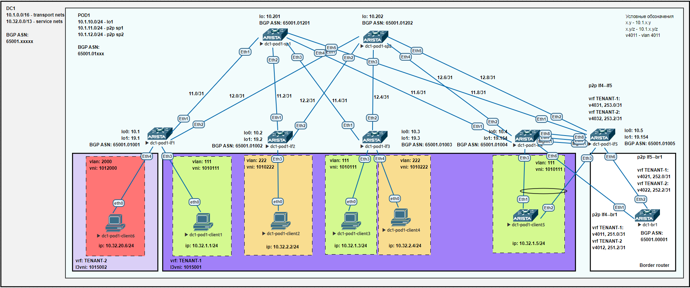

## Лаба8. VxLAN. Routing

### План работы
1. Подключение двух "клиентов" в разных VRF в рамках одной фабрики.
2. Настройка маршрутизации между клиентами через внешнее устройство.
3. Проверка работы.

#### 1. Подключение двух "клиентов" в разных VRF в рамках одной фабрики
Схема сети имеет вид:


На коммутаторах уровня leaf и spine используем следующие IP адреса:

| hostname     | lo0         | lo1         | p2p sp1      | p2p sp2      |
| ------------ | ----------- | ----------- | ------------ | ------------ |
| dc1-pod1-sp1 | 10.1.10.201 | -           | -            | -            |
| dc1-pod1-sp2 | 10.1.10.202 | -           | -            | -            |
| dc1-pod1-lf1 | 10.1.10.1   | 10.1.19.1   | 10.1.11.1/31 | 10.1.12.1/31 |
| dc1-pod1-lf2 | 10.1.10.2   | 10.1.19.2   | 10.1.11.3/31 | 10.1.12.3/31 |
| dc1-pod1-lf3 | 10.1.10.3   | 10.1.19.3   | 10.1.11.5/31 | 10.1.12.5/31 |
| dc1-pod1-lf4 | 10.1.10.4   | 10.1.19.154 | 10.1.11.7/31 | 10.1.12.7/31 |
| dc1-pod1-lf5 | 10.1.10.5   | 10.1.19.154 | 10.1.11.9/31 | 10.1.12.9/31 |

Для выполнения условия данной лабораторной работы добавим на схему нового клиента client6 и подключим его в новый vrf TENANT-2, используя коммутатор lf1. Для подключения клиента используются следующие настройки:  
  &emsp;vlan-id: 2000  
  &emsp;l2vni: 1012000  
  &emsp;ip: 10.32.20.6/24 (gw .254)  
  &emsp;vrf: TENANT-2  
  &emsp;l3vni: 1015002  
  &emsp;route-tafget: 65001:1015002  
Таким образом, конфигурация коммутатора lf1 принимает вид:
```
dc1-pod1-lf1#show run
! Command: show running-config
! device: dc1-pod1-lf1 (vEOS-lab, EOS-4.29.2F)
!
! boot system flash:/vEOS-lab.swi
!
no aaa root
!
transceiver qsfp default-mode 4x10G
!
service routing protocols model multi-agent
!
hostname dc1-pod1-lf1
!
spanning-tree mode mstp
!
vlan 111
   name VLAN-111
!
vlan 2000
   name VLAN-2000
!
vrf instance TENANT-1
!
vrf instance TENANT-2
!
interface Ethernet1
   description sp1|Eth1
   mtu 9214
   no switchport
   ip address 10.1.11.1/31
!
interface Ethernet2
   description sp2|Eth1
   mtu 9214
   no switchport
   ip address 10.1.12.1/31
!
interface Ethernet3
   description client1
   switchport access vlan 111
   spanning-tree portfast
!
interface Ethernet4
   description client6
   switchport access vlan 2000
   spanning-tree portfast
!
interface Ethernet5
!
interface Ethernet6
!
interface Ethernet7
!
interface Ethernet8
!
interface Loopback0
   ip address 10.1.10.1/32
!
interface Loopback1
   description VTEP-address
   ip address 10.1.19.1/32
!
interface Management1
!
interface Vlan111
   description SVI-111
   vrf TENANT-1
   ip address virtual 10.32.1.254/24
!
interface Vlan2000
   description SVI-2000
   vrf TENANT-2
   ip address virtual 10.32.20.254/24
!
interface Vxlan1
   vxlan source-interface Loopback1
   vxlan udp-port 4789
   vxlan vlan 111 vni 1010111
   vxlan vlan 2000 vni 1012000
   vxlan vrf TENANT-1 vni 1015001
   vxlan vrf TENANT-2 vni 1015002
   vxlan learn-restrict any
!
ip routing
ip routing vrf TENANT-1
ip routing vrf TENANT-2
!
ip prefix-list PL-LINKNETS seq 10 permit 10.1.11.0/24 eq 31
ip prefix-list PL-LINKNETS seq 20 permit 10.1.12.0/24 eq 31
ip prefix-list PL-LOOPBACKS seq 10 permit 10.1.10.0/24 eq 32
ip prefix-list PL-LOOPBACKS seq 20 permit 10.1.19.0/24 eq 32
!
route-map RM-BGP-SPINE-OUT permit 10
   match ip address prefix-list PL-LOOPBACKS
!
route-map RM-BGP-SPINE-OUT permit 20
   match ip address prefix-list PL-LINKNETS
!
route-map RM-REDISTRIBUTE-DIRECT permit 10
   match ip address prefix-list PL-LOOPBACKS
   match source-protocol connected
!
route-map RM-REDISTRIBUTE-DIRECT permit 20
   match ip address prefix-list PL-LINKNETS
   match source-protocol connected
!
router bgp 4259906537
   router-id 10.1.10.1
   maximum-paths 8
   neighbor PGROUP-OVERLAY peer group
   neighbor PGROUP-OVERLAY update-source Loopback0
   neighbor PGROUP-OVERLAY ebgp-multihop 3
   neighbor PGROUP-OVERLAY send-community extended
   neighbor PGROUP-OVERLAY maximum-routes 16000
   neighbor PGROUP-UNDERLAY peer group
   neighbor PGROUP-UNDERLAY bfd
   neighbor PGROUP-UNDERLAY route-map RM-BGP-SPINE-OUT out
   neighbor 10.1.10.201 peer group PGROUP-OVERLAY
   neighbor 10.1.10.201 remote-as 4259906737
   neighbor 10.1.10.202 peer group PGROUP-OVERLAY
   neighbor 10.1.10.202 remote-as 4259906738
   neighbor 10.1.11.0 peer group PGROUP-UNDERLAY
   neighbor 10.1.11.0 remote-as 4259906737
   neighbor 10.1.11.0 description sp1 65001.01201
   neighbor 10.1.12.0 peer group PGROUP-UNDERLAY
   neighbor 10.1.12.0 remote-as 4259906738
   neighbor 10.1.12.0 description sp2 65001.01202
   redistribute connected route-map RM-REDISTRIBUTE-DIRECT
   !
   vlan 111
      rd 10.1.10.1:111
      route-target both 65001:1010111
      redistribute learned
   !
   vlan 2000
      rd 10.1.10.1:2000
      route-target both 65001:1012000
      redistribute learned
   !
   address-family evpn
      neighbor PGROUP-OVERLAY activate
   !
   vrf TENANT-1
      rd 10.1.10.1:5001
      route-target import evpn 65001:1015001
      route-target export evpn 65001:1015001
      redistribute connected
   !
   vrf TENANT-2
      rd 10.1.10.1:5002
      route-target import evpn 65001:1015002
      route-target export evpn 65001:1015002
      redistribute connected
!
end
```

#### 2. Настройка маршрутизации между клиентами через внешнее устройство

В качестве внешнего устройства будем использовать "пограничный маршрутизатор" dc1-br1. Для большего приближения к реальной ситуации подключим данный "маршрутизатор" к отказоустойчивой паре lf4-lf5.  
Создадим на паре коммутаторов lf4-lf5 новый vrf TENANT-2 с аналогичными route-target, что и на коммутаторе lf1. В обоих vrf настроим стыки с "пограничным маршрутизатором" и между участниками отказоустойчивой парой. Для стыков использованы следующие настройки:  
  &emsp;vrf TENANT-1:  
    &emsp;&emsp;vlan 4011, 10.1.251.0/31 - p2p lf4--br1;  
    &emsp;&emsp;vlan 4021, 10.1.252.0/31 - p2p lf5--br1;  
    &emsp;&emsp;vlan 4031, 10.1.253.0/31 - p2p lf4--lf5.  
  &emsp;vrf TENANT-2:  
    &emsp;&emsp;vlan 4012, 10.1.251.2/31 - p2p lf4--br1;  
    &emsp;&emsp;vlan 4022, 10.1.252.2/31 - p2p lf5--br1;  
    &emsp;&emsp;vlan 4032, 10.1.253.2/31 - p2p lf4--lf5.  

Со стороны "пограничного маршрутизатора" в фабрику будем анонсировать помимо дефолтного маршрута еще и специфичные маршруты каждого из vrf. Чтобы пара коммутаторов lf4-lf5 приняла специфичные маршруты, разрешим прием префиксов по BGP с as-path, содержащим номер локальной AS, с помощью команды *allowas-in*. 

Итоговая конфигурация коммутатора lf4:
```
dc1-pod1-lf4(config)#show run
! Command: show running-config
! device: dc1-pod1-lf4 (vEOS-lab, EOS-4.29.2F)
!
! boot system flash:/vEOS-lab.swi
!
no aaa root
!
transceiver qsfp default-mode 4x10G
!
service routing protocols model multi-agent
!
hostname dc1-pod1-lf4
!
spanning-tree mode mstp
no spanning-tree vlan-id 4000-4001,4011-4012
!
vlan 111
   name VLAN-111
!
vlan 4000
   name MLAG-PEER
   trunk group TG-MLAG-PEER
!
vlan 4001
   name MLAG-BGP
   trunk group TG-MLAG-PEER
!
vlan 4011
   name P2P-BR1-TENANT-1
   trunk group TG-BR1
!
vlan 4012
   name P2P-BR1-TENANT-2
   trunk group TG-BR1
!
vlan 4031
   name P2P-MLAG-PEER-TENANT-1
   trunk group TG-MLAG-PEER
!
vlan 4032
   name P2P-MLAG-PEER-TENANT-2
   trunk group TG-MLAG-PEER
!
vrf instance MGMT
!
vrf instance TENANT-1
!
vrf instance TENANT-2
!
interface Port-Channel3
   switchport access vlan 111
   mlag 3
!
interface Port-Channel100
   description MLAG-ICL
   switchport mode trunk
   switchport trunk group TG-MLAG-PEER
   spanning-tree link-type point-to-point
!
interface Ethernet1
   description sp1|Eth4
   mtu 9214
   no switchport
   ip address 10.1.11.7/31
!
interface Ethernet2
   description sp2|Eth4
   mtu 9214
   no switchport
   ip address 10.1.12.7/31
!
interface Ethernet3
   description client5|Eth1
   channel-group 3 mode active
!
interface Ethernet4
!
interface Ethernet5
!
interface Ethernet6
   description dc1-br1|Eth1
   switchport mode trunk
   switchport trunk group TG-BR1
   spanning-tree link-type point-to-point
!
interface Ethernet7
   description lf5|Eth7
   channel-group 100 mode active
!
interface Ethernet8
   description lf5|Eth8
   channel-group 100 mode active
!
interface Loopback0
   ip address 10.1.10.4/32
!
interface Loopback1
   description VTEP-address
   ip address 10.1.19.154/32
!
interface Management1
   vrf MGMT
   ip address 10.1.201.4/24
!
interface Vlan111
   description SVI-111
   vrf TENANT-1
   ip address virtual 10.32.1.254/24
!
interface Vlan4000
   no autostate
   ip address 192.168.201.4/31
!
interface Vlan4001
   description MLAG-BGP
   mtu 9214
   ip address 172.16.201.4/31
!
interface Vlan4011
   description P2P-BR1-TENANT-1
   vrf TENANT-1
   ip address 10.1.251.0/31
!
interface Vlan4012
   description P2P-BR1-TENANT-2
   vrf TENANT-2
   ip address 10.1.251.2/31
!
interface Vlan4031
   description P2P-MLAG-PEER-TENANT-1
   vrf TENANT-1
   ip address 10.1.253.0/31
!
interface Vlan4032
   description P2P-MLAG-PEER-TENANT-2
   vrf TENANT-2
   ip address 10.1.253.2/31
!
interface Vxlan1
   vxlan source-interface Loopback1
   vxlan udp-port 4789
   vxlan vlan 111 vni 1010111
   vxlan vlan 222 vni 1010222
   vxlan vrf TENANT-1 vni 1015001
   vxlan vrf TENANT-2 vni 1015002
   vxlan learn-restrict any
!
ip virtual-router mac-address cc:cc:ee:ee:ff:ff
!
ip routing
ip routing vrf MGMT
ip routing vrf TENANT-1
ip routing vrf TENANT-2
!
ip prefix-list PL-DEFAULT seq 10 permit 0.0.0.0/0
ip prefix-list PL-LINKNETS seq 10 permit 10.1.11.0/24 eq 31
ip prefix-list PL-LINKNETS seq 20 permit 10.1.12.0/24 eq 31
ip prefix-list PL-LOOPBACKS seq 10 permit 10.1.10.0/24 eq 32
ip prefix-list PL-LOOPBACKS seq 20 permit 10.1.19.0/24 eq 32
ip prefix-list PL-SERVICE-NETS seq 10 permit 10.32.0.0/13 le 29
!
mlag configuration
   domain-id LF4-5
   local-interface Vlan4000
   peer-address 192.168.201.5
   peer-address heartbeat 10.1.201.5 vrf MGMT
   peer-link Port-Channel100
   dual-primary detection delay 10 action errdisable all-interfaces
!
route-map RM-BGP-BR1-IN permit 10
   match ip address prefix-list PL-SERVICE-NETS
!
route-map RM-BGP-BR1-IN permit 20
   match ip address prefix-list PL-DEFAULT
!
route-map RM-BGP-BR1-OUT permit 10
   match ip address prefix-list PL-SERVICE-NETS
!
route-map RM-BGP-MLAG-PEER-IN permit 10
   set as-path prepend auto repeat 8
!
route-map RM-BGP-SPINE-OUT permit 10
   match ip address prefix-list PL-LOOPBACKS
!
route-map RM-BGP-SPINE-OUT permit 20
   match ip address prefix-list PL-LINKNETS
!
route-map RM-REDISTRIBUTE-DIRECT permit 10
   match ip address prefix-list PL-LOOPBACKS
   match source-protocol connected
!
route-map RM-REDISTRIBUTE-DIRECT permit 20
   match ip address prefix-list PL-LINKNETS
   match source-protocol connected
!
router bgp 4259906540
   router-id 10.1.10.4
   maximum-paths 8
   neighbor PGROUP-BR1 peer group
   neighbor PGROUP-BR1 remote-as 4259905537
   neighbor PGROUP-BR1 bfd
   neighbor PGROUP-BR1 description br1 65001.00001
   neighbor PGROUP-BR1 allowas-in 3
   neighbor PGROUP-BR1 route-map RM-BGP-BR1-IN in
   neighbor PGROUP-BR1 route-map RM-BGP-BR1-OUT out
   neighbor PGROUP-MLAG-PEER peer group
   neighbor PGROUP-MLAG-PEER remote-as 4259906541
   neighbor PGROUP-MLAG-PEER bfd
   neighbor PGROUP-MLAG-PEER description lf5 65001.01005
   neighbor PGROUP-MLAG-PEER route-map RM-BGP-MLAG-PEER-IN in
   neighbor PGROUP-OVERLAY peer group
   neighbor PGROUP-OVERLAY update-source Loopback0
   neighbor PGROUP-OVERLAY ebgp-multihop 3
   neighbor PGROUP-OVERLAY send-community extended
   neighbor PGROUP-OVERLAY maximum-routes 16000
   neighbor PGROUP-UNDERLAY peer group
   neighbor PGROUP-UNDERLAY bfd
   neighbor PGROUP-UNDERLAY route-map RM-BGP-SPINE-OUT out
   neighbor 10.1.10.201 peer group PGROUP-OVERLAY
   neighbor 10.1.10.201 remote-as 4259906737
   neighbor 10.1.10.202 peer group PGROUP-OVERLAY
   neighbor 10.1.10.202 remote-as 4259906738
   neighbor 10.1.11.6 peer group PGROUP-UNDERLAY
   neighbor 10.1.11.6 remote-as 4259906737
   neighbor 10.1.11.6 description sp1 65001.01201
   neighbor 10.1.12.6 peer group PGROUP-UNDERLAY
   neighbor 10.1.12.6 remote-as 4259906738
   neighbor 10.1.12.6 description sp2 65001.01202
   neighbor 172.16.201.5 peer group PGROUP-MLAG-PEER
   neighbor 172.16.201.5 remote-as 4259906541
   neighbor 172.16.201.5 bfd
   neighbor 172.16.201.5 description lf5 65001.01005
   neighbor 172.16.201.5 route-map RM-BGP-MLAG-PEER-IN in
   redistribute connected route-map RM-REDISTRIBUTE-DIRECT
   !
   vlan 111
      rd 10.1.10.4:111
      route-target both 65001:1010111
      redistribute learned
   !
   address-family evpn
      neighbor PGROUP-OVERLAY activate
   !
   vrf TENANT-1
      rd 10.1.10.4:5001
      route-target import evpn 65001:1015001
      route-target export evpn 65001:1015001
      neighbor 10.1.251.1 peer group PGROUP-BR1
      neighbor 10.1.253.1 peer group PGROUP-MLAG-PEER
      redistribute connected
   !
   vrf TENANT-2
      rd 10.1.10.4:5002
      route-target import evpn 65001:1015002
      route-target export evpn 65001:1015002
      neighbor 10.1.251.3 peer group PGROUP-BR1
      neighbor 10.1.253.3 peer group PGROUP-MLAG-PEER
      redistribute connected
!
end
```

Итоговая конфигурация коммутатора lf5:
```
dc1-pod1-lf5(config)#show run
! Command: show running-config
! device: dc1-pod1-lf5 (vEOS-lab, EOS-4.29.2F)
!
! boot system flash:/vEOS-lab.swi
!
no aaa root
!
transceiver qsfp default-mode 4x10G
!
service routing protocols model multi-agent
!
hostname dc1-pod1-lf5
!
spanning-tree mode mstp
no spanning-tree vlan-id 4000-4001,4021-4022
!
vlan 111
   name VLAN-111
!
vlan 4000
   name MLAG-PEER
   trunk group TG-MLAG-PEER
!
vlan 4001
   name MLAG-BGP
   trunk group TG-MLAG-PEER
!
vlan 4021
   name P2P-BR1-TENANT-1
   trunk group TG-BR1
!
vlan 4022
   name P2P-BR1-TENANT-2
   trunk group TG-BR1
!
vlan 4031
   name P2P-MLAG-PEER-TENANT-1
   trunk group TG-MLAG-PEER
!
vlan 4032
   name P2P-MLAG-PEER-TENANT-2
   trunk group TG-MLAG-PEER
!
vrf instance MGMT
!
vrf instance TENANT-1
!
vrf instance TENANT-2
!
interface Port-Channel3
   switchport access vlan 111
   mlag 3
!
interface Port-Channel100
   description MLAG-ICL
   switchport mode trunk
   switchport trunk group TG-MLAG-PEER
   spanning-tree link-type point-to-point
!
interface Ethernet1
   description sp1|Eth5
   mtu 9214
   no switchport
   ip address 10.1.11.9/31
!
interface Ethernet2
   description sp2|Eth5
   mtu 9214
   no switchport
   ip address 10.1.12.9/31
!
interface Ethernet3
   description client5|Eth2
   channel-group 3 mode active
!
interface Ethernet4
!
interface Ethernet5
!
interface Ethernet6
   description dc1-br1|Eth2
   switchport mode trunk
   switchport trunk group TG-BR1
   spanning-tree link-type point-to-point
!
interface Ethernet7
   description lf4|Eth7
   channel-group 100 mode active
!
interface Ethernet8
   description lf4|Eth8
   channel-group 100 mode active
!
interface Loopback0
   ip address 10.1.10.5/32
!
interface Loopback1
   description VTEP-address
   ip address 10.1.19.154/32
!
interface Management1
   vrf MGMT
   ip address 10.1.201.5/24
!
interface Vlan111
   description SVI-111
   vrf TENANT-1
   ip address virtual 10.32.1.254/24
!
interface Vlan4000
   no autostate
   ip address 192.168.201.5/31
!
interface Vlan4001
   description MLAG-BGP
   mtu 9214
   ip address 172.16.201.5/31
!
interface Vlan4021
   description P2P-BR1-TENANT-1
   vrf TENANT-1
   ip address 10.1.252.0/31
!
interface Vlan4022
   description P2P-BR1-TENANT-2
   vrf TENANT-2
   ip address 10.1.252.2/31
!
interface Vlan4031
   description P2P-MLAG-PEER-TENANT-1
   vrf TENANT-1
   ip address 10.1.253.1/31
!
interface Vlan4032
   description P2P-MLAG-PEER-TENANT-2
   vrf TENANT-2
   ip address 10.1.253.3/31
!
interface Vxlan1
   vxlan source-interface Loopback1
   vxlan udp-port 4789
   vxlan vlan 111 vni 1010111
   vxlan vlan 222 vni 1010222
   vxlan vrf TENANT-1 vni 1015001
   vxlan vrf TENANT-2 vni 1015002
   vxlan learn-restrict any
!
ip virtual-router mac-address cc:cc:ee:ee:ff:ff
!
ip routing
ip routing vrf MGMT
ip routing vrf TENANT-1
ip routing vrf TENANT-2
!
ip prefix-list PL-DEFAULT seq 10 permit 0.0.0.0/0
ip prefix-list PL-LINKNETS seq 10 permit 10.1.11.0/24 eq 31
ip prefix-list PL-LINKNETS seq 20 permit 10.1.12.0/24 eq 31
ip prefix-list PL-LOOPBACKS seq 10 permit 10.1.10.0/24 eq 32
ip prefix-list PL-LOOPBACKS seq 20 permit 10.1.19.0/24 eq 32
ip prefix-list PL-SERVICE-NETS seq 10 permit 10.32.0.0/13 le 29
!
mlag configuration
   domain-id LF4-5
   local-interface Vlan4000
   peer-address 192.168.201.4
   peer-address heartbeat 10.1.201.4 vrf MGMT
   peer-link Port-Channel100
   dual-primary detection delay 10 action errdisable all-interfaces
!
route-map RM-BGP-BR1-IN permit 10
   match ip address prefix-list PL-SERVICE-NETS
!
route-map RM-BGP-BR1-IN permit 20
   match ip address prefix-list PL-DEFAULT
!
route-map RM-BGP-BR1-OUT permit 10
   match ip address prefix-list PL-SERVICE-NETS
!
route-map RM-BGP-MLAG-PEER-IN permit 10
   set as-path prepend auto repeat 8
!
route-map RM-BGP-SPINE-OUT permit 10
   match ip address prefix-list PL-LOOPBACKS
!
route-map RM-BGP-SPINE-OUT permit 20
   match ip address prefix-list PL-LINKNETS
!
route-map RM-REDISTRIBUTE-DIRECT permit 10
   match ip address prefix-list PL-LOOPBACKS
   match source-protocol connected
!
route-map RM-REDISTRIBUTE-DIRECT permit 20
   match ip address prefix-list PL-LINKNETS
   match source-protocol connected
!
router bgp 4259906541
   router-id 10.1.10.5
   maximum-paths 8
   neighbor PGROUP-BR1 peer group
   neighbor PGROUP-BR1 remote-as 4259905537
   neighbor PGROUP-BR1 bfd
   neighbor PGROUP-BR1 description br1 65001.00001
   neighbor PGROUP-BR1 route-map RM-BGP-BR1-IN in
   neighbor PGROUP-BR1 route-map RM-BGP-BR1-OUT out
   neighbor PGROUP-MLAG-PEER peer group
   neighbor PGROUP-MLAG-PEER remote-as 4259906540
   neighbor PGROUP-MLAG-PEER bfd
   neighbor PGROUP-MLAG-PEER description lf4 65001.01004
   neighbor PGROUP-MLAG-PEER route-map RM-BGP-MLAG-PEER-IN in
   neighbor PGROUP-OVERLAY peer group
   neighbor PGROUP-OVERLAY update-source Loopback0
   neighbor PGROUP-OVERLAY ebgp-multihop 3
   neighbor PGROUP-OVERLAY send-community extended
   neighbor PGROUP-OVERLAY maximum-routes 16000
   neighbor PGROUP-UNDERLAY peer group
   neighbor PGROUP-UNDERLAY bfd
   neighbor PGROUP-UNDERLAY route-map RM-BGP-SPINE-OUT out
   neighbor 10.1.10.201 peer group PGROUP-OVERLAY
   neighbor 10.1.10.201 remote-as 4259906737
   neighbor 10.1.10.202 peer group PGROUP-OVERLAY
   neighbor 10.1.10.202 remote-as 4259906738
   neighbor 10.1.11.8 peer group PGROUP-UNDERLAY
   neighbor 10.1.11.8 remote-as 4259906737
   neighbor 10.1.11.8 description sp1 65001.01201
   neighbor 10.1.12.8 peer group PGROUP-UNDERLAY
   neighbor 10.1.12.8 remote-as 4259906738
   neighbor 10.1.12.8 description sp2 65001.01202
   neighbor 172.16.201.4 peer group PGROUP-MLAG-PEER
   neighbor 172.16.201.4 remote-as 4259906540
   neighbor 172.16.201.4 bfd
   neighbor 172.16.201.4 description lf4 65001.01004
   neighbor 172.16.201.4 route-map RM-BGP-MLAG-PEER-IN in
   redistribute connected route-map RM-REDISTRIBUTE-DIRECT
   !
   vlan 111
      rd 10.1.10.5:111
      route-target both 65001:1010111
      redistribute learned
   !
   address-family evpn
      neighbor PGROUP-OVERLAY activate
   !
   vrf TENANT-1
      rd 10.1.10.5:5001
      route-target import evpn 65001:1015001
      route-target export evpn 65001:1015001
      neighbor 10.1.252.1 peer group PGROUP-BR1
      neighbor 10.1.253.0 peer group PGROUP-MLAG-PEER
      redistribute connected
   !
   vrf TENANT-2
      rd 10.1.10.5:5002
      route-target import evpn 65001:1015002
      route-target export evpn 65001:1015002
      neighbor 10.1.252.3 peer group PGROUP-BR1
      neighbor 10.1.253.2 peer group PGROUP-MLAG-PEER
      redistribute connected
!
end
```

Итоговая конфигурация "пограничного маршрутизатора":
```
dc1-br1(config)#show run
! Command: show running-config
! device: dc1-br1 (vEOS-lab, EOS-4.29.2F)
!
! boot system flash:/vEOS-lab.swi
!
no aaa root
!
transceiver qsfp default-mode 4x10G
!
service routing protocols model ribd
!
hostname dc1-br1
!
spanning-tree mode mstp
!
vlan 4011
   name P2P-LF4-TENANT-1
   trunk group TG-POD1-LF4
!
vlan 4012
   name P2P-LF4-TENANT-2
   trunk group TG-POD1-LF4
!
vlan 4021
   name P2P-LF5-TENANT-1
   trunk group TG-POD1-LF5
!
vlan 4022
   name P2P-LF5-TENANT-2
   trunk group TG-POD1-LF5
!
interface Ethernet1
   description dc1-pod1-lf4|Eth6
   switchport mode trunk
   switchport trunk group TG-POD1-LF4
   spanning-tree link-type point-to-point
   spanning-tree bpdufilter enable
!
interface Ethernet2
   description dc1-pod1-lf5|Eth6
   switchport mode trunk
   switchport trunk group TG-POD1-LF5
   spanning-tree link-type point-to-point
   spanning-tree bpdufilter enable
!
interface Ethernet3
!
interface Ethernet4
!
interface Ethernet5
!
interface Ethernet6
!
interface Ethernet7
!
interface Ethernet8
!
interface Loopback0
   ip address 10.1.0.251/32
!
interface Management1
!
interface Vlan4011
   description P2P-LF4-TENANT-1
   ip address 10.1.251.1/31
!
interface Vlan4012
   description P2P-LF4-TENANT-2
   ip address 10.1.251.3/31
!
interface Vlan4021
   description P2P-LF5-TENANT-1
   ip address 10.1.252.1/31
!
interface Vlan4022
   description P2P-LF5-TENANT-2
   ip address 10.1.252.3/31
!
ip routing
!
ip prefix-list PL-DEFAULT seq 10 permit 0.0.0.0/0
ip prefix-list PL-SERVICE-NETS seq 10 permit 10.32.0.0/13 le 29
!
route-map RM-BGP-POD1-LF4-5-IN permit 10
   match ip address prefix-list PL-SERVICE-NETS
!
route-map RM-BGP-POD1-LF4-5-OUT permit 10
   match ip address prefix-list PL-SERVICE-NETS
!
route-map RM-BGP-POD1-LF4-5-OUT permit 20
   match ip address prefix-list PL-DEFAULT
!
router bgp 4259905537
   router-id 10.1.0.251
   maximum-paths 8
   neighbor PGROUP-POD1-LF4-5 peer group
   neighbor PGROUP-POD1-LF4-5 bfd
   neighbor PGROUP-POD1-LF4-5 route-map RM-BGP-POD1-LF4-5-IN in
   neighbor PGROUP-POD1-LF4-5 route-map RM-BGP-POD1-LF4-5-OUT out
   neighbor PGROUP-POD1-LF4-5 default-originate always
   neighbor 10.1.251.0 peer group PGROUP-POD1-LF4-5
   neighbor 10.1.251.0 remote-as 4259906540
   neighbor 10.1.251.0 description dc1-pod1-lf4 TENANT-1
   neighbor 10.1.251.2 peer group PGROUP-POD1-LF4-5
   neighbor 10.1.251.2 remote-as 4259906540
   neighbor 10.1.251.2 description dc1-pod1-lf4 TENANT-2
   neighbor 10.1.252.0 peer group PGROUP-POD1-LF4-5
   neighbor 10.1.252.0 remote-as 4259906541
   neighbor 10.1.252.0 description dc1-pod1-lf5 TENANT-1
   neighbor 10.1.252.2 peer group PGROUP-POD1-LF4-5
   neighbor 10.1.252.2 remote-as 4259906541
   neighbor 10.1.252.2 description dc1-pod1-lf5 TENANT-2
!
end
```

#### 3. Проверка работы

Проверка работы маршрутизации (на примере lf4):
```
dc1-pod1-lf4(config)#show ip bgp summary vrf TENANT-1
BGP summary information for VRF TENANT-1
Router identifier 10.32.1.254, local AS number 4259906540
Neighbor Status Codes: m - Under maintenance
  Description              Neighbor   V AS           MsgRcvd   MsgSent  InQ OutQ  Up/Down State   PfxRcd PfxAcc
  br1 65001.00001          10.1.251.1 4 4259905537      1656      1872    0    0 04:00:18 Estab   2      2
  lf5 65001.01005          10.1.253.1 4 4259906541      2111      2156    0    0 03:58:00 Estab   8      8
dc1-pod1-lf4(config)#
dc1-pod1-lf4(config)#
dc1-pod1-lf4(config)#show ip bgp summary vrf TENANT-2
BGP summary information for VRF TENANT-2
Router identifier 10.1.252.0, local AS number 4259906540
Neighbor Status Codes: m - Under maintenance
  Description              Neighbor   V AS           MsgRcvd   MsgSent  InQ OutQ  Up/Down State   PfxRcd PfxAcc
  br1 65001.00001          10.1.251.3 4 4259905537      1647      1844    0    0 04:00:22 Estab   3      3
  lf5 65001.01005          10.1.253.3 4 4259906541      2072      2131    0    0 03:58:03 Estab   5      5
dc1-pod1-lf4(config)#
dc1-pod1-lf4(config)#
dc1-pod1-lf4(config)#
dc1-pod1-lf4(config)#
dc1-pod1-lf4(config)#show ip route vrf TENANT-1

VRF: TENANT-1
Codes: C - connected, S - static, K - kernel,
       O - OSPF, IA - OSPF inter area, E1 - OSPF external type 1,
       E2 - OSPF external type 2, N1 - OSPF NSSA external type 1,
       N2 - OSPF NSSA external type2, B - Other BGP Routes,
       B I - iBGP, B E - eBGP, R - RIP, I L1 - IS-IS level 1,
       I L2 - IS-IS level 2, O3 - OSPFv3, A B - BGP Aggregate,
       A O - OSPF Summary, NG - Nexthop Group Static Route,
       V - VXLAN Control Service, M - Martian,
       DH - DHCP client installed default route,
       DP - Dynamic Policy Route, L - VRF Leaked,
       G  - gRIBI, RC - Route Cache Route

Gateway of last resort:
 B E      0.0.0.0/0 [200/0] via 10.1.251.1, Vlan4011

 C        10.1.251.0/31 is directly connected, Vlan4011
 B E      10.1.252.0/31 [200/0] via 10.1.253.1, Vlan4031
 C        10.1.253.0/31 is directly connected, Vlan4031
 B E      10.32.1.1/32 [200/0] via VTEP 10.1.19.1 VNI 1015001 router-mac 50:00:00:d5:5d:c0 local-interface Vxlan1
 B E      10.32.1.3/32 [200/0] via VTEP 10.1.19.3 VNI 1015001 router-mac 50:00:00:15:f4:e8 local-interface Vxlan1
 C        10.32.1.0/24 is directly connected, Vlan111
 B E      10.32.2.4/32 [200/0] via VTEP 10.1.19.3 VNI 1015001 router-mac 50:00:00:15:f4:e8 local-interface Vxlan1
 B E      10.32.2.0/24 [200/0] via VTEP 10.1.19.2 VNI 1015001 router-mac 50:00:00:03:37:66 local-interface Vxlan1
                               via VTEP 10.1.19.3 VNI 1015001 router-mac 50:00:00:15:f4:e8 local-interface Vxlan1
 B E      10.32.20.0/24 [200/0] via 10.1.251.1, Vlan4011

dc1-pod1-lf4(config)#
dc1-pod1-lf4(config)#
dc1-pod1-lf4(config)#show ip route vrf TENANT-2

VRF: TENANT-2
Codes: C - connected, S - static, K - kernel,
       O - OSPF, IA - OSPF inter area, E1 - OSPF external type 1,
       E2 - OSPF external type 2, N1 - OSPF NSSA external type 1,
       N2 - OSPF NSSA external type2, B - Other BGP Routes,
       B I - iBGP, B E - eBGP, R - RIP, I L1 - IS-IS level 1,
       I L2 - IS-IS level 2, O3 - OSPFv3, A B - BGP Aggregate,
       A O - OSPF Summary, NG - Nexthop Group Static Route,
       V - VXLAN Control Service, M - Martian,
       DH - DHCP client installed default route,
       DP - Dynamic Policy Route, L - VRF Leaked,
       G  - gRIBI, RC - Route Cache Route

Gateway of last resort:
 B E      0.0.0.0/0 [200/0] via 10.1.251.3, Vlan4012

 C        10.1.251.2/31 is directly connected, Vlan4012
 B E      10.1.252.2/31 [200/0] via 10.1.253.3, Vlan4032
 C        10.1.253.2/31 is directly connected, Vlan4032
 B E      10.32.1.0/24 [200/0] via 10.1.251.3, Vlan4012
 B E      10.32.2.0/24 [200/0] via 10.1.251.3, Vlan4012
 B E      10.32.20.6/32 [200/0] via VTEP 10.1.19.1 VNI 1015002 router-mac 50:00:00:d5:5d:c0 local-interface Vxlan1
 B E      10.32.20.0/24 [200/0] via VTEP 10.1.19.1 VNI 1015002 router-mac 50:00:00:d5:5d:c0 local-interface Vxlan1

dc1-pod1-lf4(config)#
```

Из вывода команд видно, что в таблицах маршрутизации обоих vrf присутствуют дефолтные маршруты и специфичные маршруты другого vrf. При этом ожидаемо next-hop'ы указывают на "пограничный маршрутизатор".

Вывод таблицы маршрутизации "пограничного маршрутизатора":
```
dc1-br1(config)#show ip route

VRF: default
Codes: C - connected, S - static, K - kernel,
       O - OSPF, IA - OSPF inter area, E1 - OSPF external type 1,
       E2 - OSPF external type 2, N1 - OSPF NSSA external type 1,
       N2 - OSPF NSSA external type2, B - Other BGP Routes,
       B I - iBGP, B E - eBGP, R - RIP, I L1 - IS-IS level 1,
       I L2 - IS-IS level 2, O3 - OSPFv3, A B - BGP Aggregate,
       A O - OSPF Summary, NG - Nexthop Group Static Route,
       V - VXLAN Control Service, M - Martian,
       DH - DHCP client installed default route,
       DP - Dynamic Policy Route, L - VRF Leaked,
       G  - gRIBI, RC - Route Cache Route

Gateway of last resort is not set

 C        10.1.0.251/32 is directly connected, Loopback0
 C        10.1.251.0/31 is directly connected, Vlan4011
 C        10.1.251.2/31 is directly connected, Vlan4012
 C        10.1.252.0/31 is directly connected, Vlan4021
 C        10.1.252.2/31 is directly connected, Vlan4022
 B E      10.32.1.0/24 [200/0] via 10.1.251.0, Vlan4011
                               via 10.1.252.0, Vlan4021
 B E      10.32.2.0/24 [200/0] via 10.1.251.0, Vlan4011
                               via 10.1.252.0, Vlan4021
 B E      10.32.20.0/24 [200/0] via 10.1.251.2, Vlan4012
                                via 10.1.252.2, Vlan4022

dc1-br1(config)#
```

Проверка связности всех клиентов между собой (с dc1-pod1-client6):
```
dc1-pod1-client6> ping 10.32.1.1

84 bytes from 10.32.1.1 icmp_seq=1 ttl=60 time=256.802 ms
84 bytes from 10.32.1.1 icmp_seq=2 ttl=60 time=50.604 ms
84 bytes from 10.32.1.1 icmp_seq=3 ttl=60 time=48.570 ms
84 bytes from 10.32.1.1 icmp_seq=4 ttl=60 time=34.619 ms
84 bytes from 10.32.1.1 icmp_seq=5 ttl=60 time=28.025 ms

dc1-pod1-client6> ping 10.32.2.2

84 bytes from 10.32.2.2 icmp_seq=1 ttl=59 time=172.149 ms
84 bytes from 10.32.2.2 icmp_seq=2 ttl=59 time=32.447 ms
84 bytes from 10.32.2.2 icmp_seq=3 ttl=59 time=44.962 ms
84 bytes from 10.32.2.2 icmp_seq=4 ttl=59 time=40.630 ms
84 bytes from 10.32.2.2 icmp_seq=5 ttl=59 time=37.560 ms

dc1-pod1-client6> ping 10.32.1.3

84 bytes from 10.32.1.3 icmp_seq=1 ttl=60 time=166.293 ms
84 bytes from 10.32.1.3 icmp_seq=2 ttl=60 time=32.373 ms
84 bytes from 10.32.1.3 icmp_seq=3 ttl=60 time=44.131 ms
84 bytes from 10.32.1.3 icmp_seq=4 ttl=60 time=55.582 ms
84 bytes from 10.32.1.3 icmp_seq=5 ttl=60 time=30.194 ms

dc1-pod1-client6> ping 10.32.2.4

84 bytes from 10.32.2.4 icmp_seq=1 ttl=59 time=122.704 ms
84 bytes from 10.32.2.4 icmp_seq=2 ttl=59 time=47.344 ms
84 bytes from 10.32.2.4 icmp_seq=3 ttl=59 time=50.629 ms
84 bytes from 10.32.2.4 icmp_seq=4 ttl=59 time=36.008 ms
84 bytes from 10.32.2.4 icmp_seq=5 ttl=59 time=33.157 ms

dc1-pod1-client6> ping 10.32.1.5

84 bytes from 10.32.1.5 icmp_seq=1 ttl=60 time=79.322 ms
84 bytes from 10.32.1.5 icmp_seq=2 ttl=60 time=37.179 ms
84 bytes from 10.32.1.5 icmp_seq=3 ttl=60 time=36.981 ms
84 bytes from 10.32.1.5 icmp_seq=4 ttl=60 time=28.326 ms
84 bytes from 10.32.1.5 icmp_seq=5 ttl=60 time=24.026 ms

```

На хосте dc1-pod1-client6 нет команды для трассировки, поэтому трассировку выполним с хоста dc1-pod1-client5 в сторону dc1-pod1-client6.
```
dc1-pod1-client5#traceroute 10.32.20.6
traceroute to 10.32.20.6 (10.32.20.6), 30 hops max, 60 byte packets
 1  _gateway (10.32.1.254)  39.597 ms  39.615 ms  40.426 ms
 2  10.1.251.1 (10.1.251.1)  56.092 ms  58.625 ms  69.846 ms
 3  10.1.251.2 (10.1.251.2)  92.793 ms  101.809 ms  110.730 ms
 4  10.32.20.254 (10.32.20.254)  206.482 ms  213.826 ms  226.249 ms
 5  10.32.20.6 (10.32.20.6)  239.387 ms  246.439 ms  247.974 ms
dc1-pod1-client5#
```
Из трассировки видно, что пакет прошел через "родной" vrf TENANT-1, попал на "пограничный маршрутизатор" 10.1.251.1, затем вернулся обратно на lf4 в vrf TENANT-2 и достиг целевого хоста dc1-pod1-client6 с ip 10.32.20.6.
