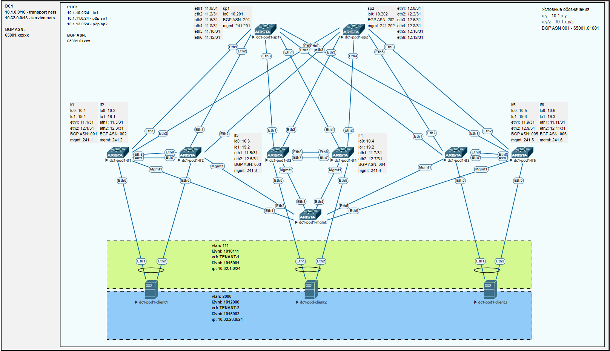
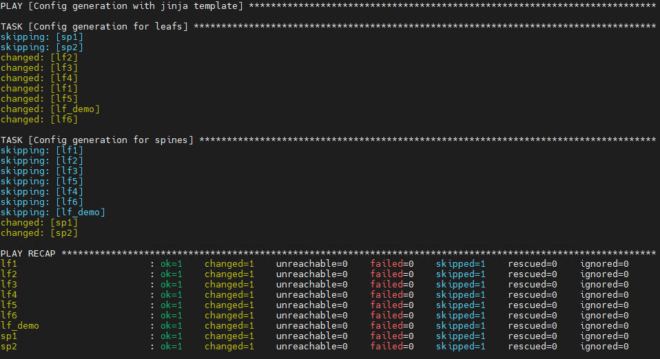

## Проектная работа. Элементы автоматизации при построении сетевой фабрики на основе VxLAN EVPN

### План работы
1. Постановка задачи
2. Выбранные подходы к выполнению
3. Пример формирования конфигурационных файлов
4. Проверка работоспособности сетевой фабрики
5. Альтернативные варианты
6. Заключение

#### 1. Постановка задачи
Автоматизация процесса формирования конфигурационных файлов для построения сетевых фабрик на основе VxLAN EVPN. При выполнении необходимо учесть следующие требования:
- Количество ЦОДов - до 12 шт;
- Количество подов в каждом ЦОДе - до 8 шт;
- Количество коммутаторов leaf в каждой фабрике - до 128 шт;
- Количество коммутаторов spine в каждой фабрике - до 8 шт;
- Минимальное указание исходных переменных для формирования файла конфигурации.

#### 2. Выбранные подходы к выполнению
Для максимальной автоматизации процесса формирования конфигурационного файла все его элементы должны подчиняться зафиксированным шаблонам. Поэтому данный пункт проектной работы будет в основном посвящен выбору шаблонов для используемых настроек коммутаторов фабрики VxLAN EVPN.
Итогом выполнения работы должна стать работающая сетевая фабрика на основе VxLAN EVPN, схема которой представлена ниже.  


В первую очередь определимся с адресным IP планом, подходящим для выполнения задач из п.1. В проекте будем использовать подсеть **10.0.0.0/8**. Обозначим следующие блоки сетей:  
10.0.0.0/8 - общее адресное пространство;  
	&emsp;10.0.0.0/12 - транспортная сеть;  
		&emsp;&emsp;*10.0.0.0/16 - резерв;*  
		&emsp;&emsp;10.1.0.0/16 - DC1;  
		&emsp;&emsp;10.2.0.0/16 - DC2;  
		&emsp;&emsp;...  
		&emsp;&emsp;10.15.0.0/16 - DC15;  
	&emsp;*10.16.0.0/12 - резерв под транспортную сеть DC16-31 или сервисную сеть DC15;*  
	&emsp;10.32.0.0/13 - сервисная сеть DC1;  
	&emsp;*10.40.0.0/13 - резерв под сервисную сеть DC1 или DC15;*  
	&emsp;10.48.0.0/13 - сервисная сеть DC2;  
	&emsp;*10.56.0.0/13 - резерв под сервисную сеть DC2 или DC16;*  
	&emsp;...  
	&emsp;10.240.0.0/13 - сервисная сеть DC14; 
	&emsp;*10.248.0.0/13 - резерв под сервисную сеть DC14 или DC28.

Подобное распределение потенциально позволяет настроить либо 15 ЦОДов с сервисными сетями /12, либо 28 ЦОДов с сервисными подсетями /13. Используя указанный выше подход, можно реализовать любой из двух вариантов в процессе эксплуатации.

Подсетей для построения сетей Underlay и Overlay соответствуют шаблону:  
**10.{DCN}.{PODN}{ROLE}.0/24,**  
где  
	&emsp;{DCN} - номер ЦОД (DC Number). Принимает значение от 1 до 15;  
	&emsp;{PODN} - номер пода (POD Number). Принимает значение от 1 до 16;  
	&emsp;{ROLE} - роль подсети. Принимает значение от 0 до 9:  
		&emsp;&emsp;0 - lo0;  
		&emsp;&emsp;1..8 - p2p sp1..8;  
		&emsp;&emsp;9 - lo1.

Также зафиксируем шаблон для сетей управления (OOB management):  
**10.{DCN}.200+{PODN}.0/24,**  
где  
	&emsp;{DCN} - номер ЦОД (DC Number). Принимает значение от 1 до 15;  
	&emsp;{PODN} - номер пода (POD Number). Принимает значение от 0 до 16.

Таким образом, используемые в проектной работе устройства будут иметь следующие адреса. 

| hostname     | mgmt         | lo0         | lo1       | p2p sp1       | p2p sp2       |
| ------------ | ------------ | ----------- | --------- | ------------- | ------------- |
| dc1-pod1-sp1 | 10.1.241.201 | 10.1.10.201 | -         | -             | -             |
| dc1-pod1-sp2 | 10.1.241.202 | 10.1.10.202 | -         | -             | -             |
| dc1-pod1-lf1 | 10.1.241.1   | 10.1.10.1   | 10.1.19.1 | 10.1.11.1/31  | 10.1.12.1/31  |
| dc1-pod1-lf2 | 10.1.241.2   | 10.1.10.2   | 10.1.19.1 | 10.1.11.3/31  | 10.1.12.3/31  |
| dc1-pod1-lf3 | 10.1.241.3   | 10.1.10.3   | 10.1.19.2 | 10.1.11.5/31  | 10.1.12.5/31  |
| dc1-pod1-lf4 | 10.1.241.4   | 10.1.10.4   | 10.1.19.2 | 10.1.11.7/31  | 10.1.12.7/31  |
| dc1-pod1-lf5 | 10.1.241.5   | 10.1.10.5   | 10.1.19.3 | 10.1.11.9/31  | 10.1.12.9/31  |
| dc1-pod1-lf6 | 10.1.241.6   | 10.1.10.6   | 10.1.19.3 | 10.1.11.11/31 | 10.1.12.11/31 |

В качестве протокола динамической маршрутизации будет использовать eBGP - и на уровне Underlay и на уровне Overlay. Учитывая, что сеть одного ЦОД потенциально может состоять из несколько подов, то для наглядности будем использовать 4-байтный формат ASN. Шаблон для ASN будет иметь вид:  
**650{DCN}.{PODN}{ID},**  
где  
	&emsp;{DCN} - номер ЦОД (DC Number). Принимает значение от 01 до 15;  
	&emsp;{PODN} - номер пода (POD Number). Принимает значение от 01 до 16;  
	&emsp;{ID} - номер пода коммутатора. Принимает значение от 001 до 255;  

Например, для текущих коммутаторов ASN получится следующим:  
dc1-pod1-sp1 - 65001.01201  
dc1-pod1-sp2 - 65001.01202  
dc1-pod1-lf1 - 65001.01001  
dc1-pod1-lf2 - 65001.01002  
dc1-pod1-lf3 - 65001.01003  
dc1-pod1-lf4 - 65001.01004  
dc1-pod1-lf5 - 65001.01005  
dc1-pod1-lf6 - 65001.01006  

Настройка VxLAN EVPN предусматривает использование следующих шаблонов.  
L2VNI будет иметь вид:  
**1{DCN}{VLAN-ID},**  
где  
	&emsp;{DCN} - номер ЦОД (DC Number). Принимает значение от 01 до 15;  
	&emsp;{VLAN-ID} - номер VLAN. Принимает значение от 0001 до 4094.

Route-distinguisher:  
**{L0}:{VLAN-ID},**  
где  
	&emsp;{L0} - IPv4 адрес интерфейса Loopback0 коммутатора Leaf;  
	&emsp;{VLAN-ID} - номер VLAN. Принимает значение от 1 до 4094.

Route-target для L2VPN:  
**650{DCN}:{L2VNI},**  
где  
	&emsp;{DCN} - номер ЦОД (DC Number). Принимает значение от 01 до 15;  
	&emsp;{L2VNI} - номер L2 VNI. Принимает значение от 1{DCN}0001 до 1{DCN}4094.

L3VNI:  
**1{DCN}{VRF-ID},**  
где  
	&emsp;{DCN} - номер ЦОД (DC Number). Принимает значение от 01 до 15;  
	&emsp;{VRF-ID} - идентификатор VRF. Принимает значение от 5001 до 5999.

Route-target для VRF:  
**650{DCN}:{VRF-ID},**  
где  
	&emsp;{DCN} - номер ЦОД (DC Number). Принимает значение от 01 до 15;  
	&emsp;{VRF-ID} - идентификатор VRF. Принимает значение от 5001 до 5999.

В качестве технологии, решающей задачу Multihoming'а, использован MLAG.  
Для демонстрации работы сетевой фабрики дополнительно зададим следующие требования:  
- должны быть созданы два vlan'а (подсети) - vlan111 (10.32.1.0/24) и vlan2000 (10.32.20.0/24);
- шлюзы подсетей должны быть настроены на коммутаторах leaf по принципу anycast gateway;
- подсети должны быть разнесены по разным vrf - vrf TENANT-1 и vrf TENANT-2;
- между vrf'ами не должно быть маршрутизации.


#### 3. Пример формирования конфигурационных файлов
Для автоматизации процесса создания конфигурационных файлов будут использованы шаблоны в формате Jinja (.j2). Шаблоны будут двух видов - для коммутаторов уровня leaf и коммутаторов уровня spine. Для работы с ними будет использовать Ansible.
Структура рабочей директории Ansible:
```
[user@server otus_dcnd]$ tree
.
├── ansible.cfg
├── configs
│   ├── pattern_config_lf1.txt
│   └── pattern_config_sp1.txt
├── GENERATE_CONFIG.yml
├── group_vars
│   ├── all.yml
│   ├── device_roles_leaf.yml
│   └── device_roles_spine.yml
├── host_vars
│   ├── lf1.yml
│   ├── lf2.yml
│   ├── lf3.yml
│   ├── lf4.yml
│   ├── lf5.yml
│   ├── lf6.yml
│   ├── lf_demo.yml
│   ├── sp1.yml
│   └── sp2.yml
├── inventory_manual.ini
└── templates
    ├── TEMPLATE_CONFIG_LF.j2
    └── TEMPLATE_CONFIG_SP.j2
```

Jinja файл для коммутаторов spine TEMPLATE_CONFIG_SP.j2:
```
no aaa root
!
transceiver qsfp default-mode 4x10G
!
service routing protocols model multi-agent
!
hostname dc{{ tmplt_dc }}-pod{{ tmplt_pod }}-sp{{ tmplt_sp }}
!
spanning-tree mode mstp
!
{# Цикл по leaf'ам. Номер leaf'а соответствует номеру интерфейса #}

interface Ethernet{{ leaf }}
   description lf{{ leaf }}|Eth{{ tmplt_sp }}
   mtu 9214
   no switchport
   ip address 10.{{ tmplt_dc }}.{{ tmplt_pod }}{{ tmplt_sp }}.{{ leaf * 2 - 2 }}/31
!

interface Loopback0
   description Overlay-routing-address
   ip address 10.{{ tmplt_dc }}.{{ tmplt_pod }}0.20{{ tmplt_sp }}/32
!
interface Management1
!
ip routing
!
ip prefix-list PL-DEFAULT
   seq 10 permit 0.0.0.0/0
!
ip prefix-list PL-LOOPBACKS
   seq 10 permit 10.{{ tmplt_dc }}.{{ tmplt_pod }}0.0/24 eq 32
   seq 20 permit 10.{{ tmplt_dc }}.{{ tmplt_pod }}9.0/24 eq 32
!
route-map RM-BGP-LEAFS-IN permit 10
   match ip address prefix-list PL-LOOPBACKS
!
route-map RM-BGP-LEAFS-OUT permit 10
   match ip address prefix-list PL-LOOPBACKS
!
route-map RM-BGP-LEAFS-OUT permit 100
   match ip address prefix-list PL-DEFAULT
!
route-map RM-REDISTRIBUTE-DIRECT permit 10
   match ip address prefix-list PL-LOOPBACKS
   match source-protocol connected
!
{# Вычиляем свой BGP ASN в формате xxxxx.xxxxx (<asn_begin>.<asn_end>) #}


router bgp {{ asn_begin }}.{{ asn_end }}
   router-id 10.{{ tmplt_dc }}.{{ tmplt_pod }}0.20{{ tmplt_sp }}
   maximum-paths 2
   neighbor PGROUP-OVERLAY peer group
   neighbor PGROUP-OVERLAY next-hop-unchanged
   neighbor PGROUP-OVERLAY update-source Loopback0
   neighbor PGROUP-OVERLAY ebgp-multihop 3
   neighbor PGROUP-OVERLAY send-community extended
   neighbor PGROUP-OVERLAY maximum-routes 16000
   neighbor PGROUP-UNDERLAY peer group
   neighbor PGROUP-UNDERLAY bfd
   neighbor PGROUP-UNDERLAY route-map RM-BGP-LEAFS-IN in
   neighbor PGROUP-UNDERLAY route-map RM-BGP-LEAFS-OUT out
{# Цикл leaf'ам #}

{# Вычиляем BGP ASN leaf'а в формате xxxxx.xxxxx (<asn_begin>.<asn_end>) #}







   neighbor 10.{{ tmplt_dc }}.{{ tmplt_pod }}0.{{ leaf }} peer group PGROUP-OVERLAY
   neighbor 10.{{ tmplt_dc }}.{{ tmplt_pod }}0.{{ leaf }} remote-as {{ asn_begin }}.{{ asn_end }}
   neighbor 10.{{ tmplt_dc }}.{{ tmplt_pod }}0.{{ leaf }} description lf{{ leaf }}-ovrl {{ asn_begin }}.{{ asn_end }}
   neighbor 10.{{ tmplt_dc }}.{{ tmplt_pod }}{{ tmplt_sp }}.{{ leaf * 2 - 1 }} peer group PGROUP-UNDERLAY
   neighbor 10.{{ tmplt_dc }}.{{ tmplt_pod }}{{ tmplt_sp }}.{{ leaf * 2 - 1 }} remote-as {{ asn_begin }}.{{ asn_end }}
   neighbor 10.{{ tmplt_dc }}.{{ tmplt_pod }}{{ tmplt_sp }}.{{ leaf * 2 - 1 }} description lf{{ leaf }}-undr {{ asn_begin }}.{{ asn_end }}

   redistribute connected route-map RM-REDISTRIBUTE-DIRECT
   !
   address-family evpn
      neighbor PGROUP-OVERLAY activate
!
end

```

Jinja файл для коммутаторов leaf TEMPLATE_CONFIG_LF.j2:
```
no aaa root
!
transceiver qsfp default-mode 4x10G
!
service routing protocols model multi-agent
!
hostname dc{{ tmplt_dc }}-pod{{ tmplt_pod }}-lf{{ tmplt_lf }}
!
spanning-tree mode mstp
no spanning-tree vlan-id 4000
!
{# Цикл по пользовательским vlan'ам #}

vlan {{ v.id }}
   name {{ v.description }}
!

vlan 4000
   name MLAG-PEER
   trunk group TG-MLAG-PEER
!
vrf instance MGMT
!
{# Цикл по пользовательским vrf'ам #}

vrf instance {{ vrf.name }}
!

{# Цикл по downlink MLAG Port-Channel интерфейсам (в каждом MLAG Port-Channel один физический интерфейс с тем же номером) #}

interface Port-Channel{{ pc.num }}
   description {{ pc.neighbor }}|MLAG
   switchport mode trunk
   mlag {{ pc.num }}
!

interface Port-Channel100
   description MLAG-ICL
   switchport mode trunk
   switchport trunk group TG-MLAG-PEER
   spanning-tree link-type point-to-point
!
{# Цикл по физическим uplink интерфейсам #}

interface {{ eth.name }}
   description sp{{ eth.num }}|Eth{{ tmplt_lf }}
   mtu 9214
   no switchport
   ip address 10.{{ tmplt_dc }}.{{ tmplt_pod }}{{ eth.num }}.{{ tmplt_lf * 2 - 1 }}/31
!

{# Цикл по физическим downlink интерфейсам, входящим в MLAG Port-Channel #}

interface {{ eth.name }}
   description {{ eth.neighbor }}
   channel-group {{ eth.num }} mode active
!

{# Вычиляем номер соседнего lf, с которым образуется MLAG-пара #}









interface Ethernet7
   description lf{{ peer_lf_num }}|Eth7
   channel-group 100 mode active
!
interface Ethernet8
   description lf{{ peer_lf_num }}|Eth8
   channel-group 100 mode active
!
interface Loopback0
   description Overlay-routing-address
   ip address 10.{{ tmplt_dc }}.{{ tmplt_pod }}0.{{ tmplt_lf }}/32
!
interface Loopback1
   description VTEP-address
   ip address 10.{{ tmplt_dc }}.{{ tmplt_pod }}9.{{ Lo1_last_octet }}/32
!
interface Management1
   vrf MGMT
   ip address 10.{{ tmplt_dc }}.20{{ tmplt_pod }}.{{ tmplt_lf }}/24
!
{# Цикл по пользовательским vlan'ам #}

interface Vlan{{ v.id }}
   description SVI-{{ v.id }}
   vrf {{ v.vrf }}
   ip address virtual {{ v.ip }}
!

interface Vlan4000
   description MLAG-PEER-P2P
   no autostate
   ip address 192.168.20{{ tmplt_pod }}.{{ tmplt_lf }}/24
!
interface Vxlan1
   vxlan source-interface Loopback1
   vxlan udp-port 4789

{# Цикл по пользовательским vlan'ам #}

{# Вычисляем L2VNI #}









   vxlan vlan {{ v.id }} vni {{ vni_begin }}{{ l2vni_end }}

{# Цикл по пользовательским vrf'ам #}

{# Вычисляем L3VNI #}

   vxlan vrf {{ vrf.name }} vni {{ vni_begin }}{{ l3vni_end }}

   vxlan learn-restrict any
!
ip virtual-router mac-address cc:cc:ee:ee:ff:ff
!
ip routing
ip routing vrf MGMT
{# Цикл по пользовательским vrf'ам #}

ip routing vrf {{ vrf.name }}

!
{# Цикл по uplink интерфейсам, которые совпадают с количеством spine #}

ip prefix-list PL-LINKNETS seq {{ sp.num }}0 permit 10.{{ tmplt_dc }}.{{ tmplt_pod }}{{ sp.num }}.0/24 eq 31

ip prefix-list PL-LOOPBACKS seq 10 permit 10.{{ tmplt_dc }}.{{ tmplt_pod }}0.0/24 eq 32
ip prefix-list PL-LOOPBACKS seq 20 permit 10.{{ tmplt_dc }}.{{ tmplt_pod }}9.0/24 eq 32
!
mlag configuration
   domain-id {{ mlag_domain }}
   local-interface Vlan4000
   peer-address 192.168.20{{ tmplt_pod }}.{{ peer_lf_num }}
   peer-address heartbeat 10.{{ tmplt_dc }}.20{{ tmplt_pod }}.{{ peer_lf_num }} vrf MGMT
   peer-link Port-Channel100
   dual-primary detection delay 10 action errdisable all-interfaces
!
route-map RM-BGP-SPINE-OUT permit 10
   match ip address prefix-list PL-LOOPBACKS
!
route-map RM-BGP-SPINE-OUT permit 20
   match ip address prefix-list PL-LINKNETS
!
route-map RM-REDISTRIBUTE-DIRECT permit 10
   match ip address prefix-list PL-LOOPBACKS
   match source-protocol connected
!
route-map RM-REDISTRIBUTE-DIRECT permit 20
   match ip address prefix-list PL-LINKNETS
   match source-protocol connected
!
{# Вычиляем свой BGP ASN в формате xxxxx.xxxxx (<asn_begin>.<asn_end>) #}








router bgp {{ asn_begin }}.{{ asn_end }}
   router-id 10.{{ tmplt_dc }}.{{ tmplt_pod }}0.{{ tmplt_lf }}
   maximum-paths 8
   neighbor PGROUP-OVERLAY peer group
   neighbor PGROUP-OVERLAY update-source Loopback0
   neighbor PGROUP-OVERLAY ebgp-multihop 3
   neighbor PGROUP-OVERLAY send-community extended
   neighbor PGROUP-OVERLAY maximum-routes 16000
   neighbor PGROUP-UNDERLAY peer group
   neighbor PGROUP-UNDERLAY bfd
   neighbor PGROUP-UNDERLAY route-map RM-BGP-SPINE-OUT out
{# Цикл по uplink интерфейсам, которые совпадают с количеством spine #}

   neighbor 10.{{ tmplt_dc }}.{{ tmplt_pod }}0.20{{ sp.num }} peer group PGROUP-OVERLAY
   neighbor 10.{{ tmplt_dc }}.{{ tmplt_pod }}0.20{{ sp.num }} remote-as {{ asn_begin }}.0{{ tmplt_pod }}20{{ sp.num }}
neighbor 10.{{ tmplt_dc }}.{{ tmplt_pod }}0.20{{ sp.num }} description sp{{ sp.num }}-ovrl {{ asn_begin }}.0{{ tmplt_pod }}20{{ sp.num }}
   neighbor 10.{{ tmplt_dc }}.{{ tmplt_pod }}{{ sp.num }}.{{ tmplt_lf * 2 - 2 }} peer group PGROUP-UNDERLAY
   neighbor 10.{{ tmplt_dc }}.{{ tmplt_pod }}{{ sp.num }}.{{ tmplt_lf * 2 - 2 }} remote-as {{ asn_begin }}.0{{ tmplt_pod }}20{{ sp.num }}
   neighbor 10.{{ tmplt_dc }}.{{ tmplt_pod }}{{ sp.num }}.{{ tmplt_lf * 2 - 2 }} description sp{{ sp.num }}-undr {{ asn_begin }}.0{{ tmplt_pod }}20{{ sp.num }}

   redistribute connected route-map RM-REDISTRIBUTE-DIRECT
   !
{# Цикл по пользовательским vlan'ам #}

{# Вычисляем L2VNI #}









   vlan {{ v.id }}
      rd 10.{{ tmplt_dc }}.{{ tmplt_pod }}0.{{ tmplt_lf }}:{{ v.id }}
      route-target both {{ asn_begin }}:{{ vni_begin }}{{ l2vni_end }}
      redistribute learned
   !

   address-family evpn
      neighbor PGROUP-OVERLAY activate
   !
{# Цикл по пользовательским vrf'ам #}

{# Вычисляем L3VNI #}

   vrf {{ vrf.name }}
      rd 10.{{ tmplt_dc }}.{{ tmplt_pod }}0.{{ tmplt_lf }}:{{ l3vni_end }}
      route-target import evpn {{ asn_begin }}:{{ vni_begin }}{{ l3vni_end }}
      route-target export evpn {{ asn_begin }}:{{ vni_begin }}{{ l3vni_end }}
      redistribute connected
   !

!
end

```

Переменные, единые для всех устройств одной роли (группы), записаны в файле с переменными группы. Например, для коммутаторов spine это выглядит так:
```
[user@server otus_dcnd]$ cat group_vars/device_roles_spine.yml
---

tmplt_leafs:
  - 1
  - 2
  - 3
  - 4
  - 5
  - 6
```

А переменные, специфичные для конкретных устройств, - в файле с переменными хостов. Например, для коммутатора sp1:
```
[user@server otus_dcnd]$ cat host_vars/sp2.yml
---

tmplt_dc: 1
tmplt_pod: 1
tmplt_sp: 2
```

Инвентаризационный файл включает в себя список устройств, для которых мы хотим сформировать файлы конфигурации, а также их принадлежность к группам (их роли).
```
[user@server otus_dcnd]$ cat inventory_manual.ini
[device_roles_spine]
sp1 ansible_host=10.1.241.201
sp2 ansible_host=10.1.241.202

[device_roles_leaf]
lf1 ansible_host=10.1.241.1
lf2 ansible_host=10.1.241.2
lf3 ansible_host=10.1.241.3
lf4 ansible_host=10.1.241.4
lf5 ansible_host=10.1.241.5
lf6 ansible_host=10.1.241.6
lf_demo ansible_host=10.5.243.24

[device_roles_all:children]
device_roles_spine
device_roles_leaf
```

Написан простейший сценарий (playbook) GENERATE_CONFIG.yml для формирования конфигурационных файлов. Его запуск происходит командой:
```
[user@server otus_dcnd]$ ansible-playbook GENERATE_CONFIG.yml
```
При этом вывод имеет вид:



Результатом его выполнения станут файлы, создавшиеся в директории configs.
```
[user@server otus_dcnd]$ tree configs/
configs/
├── generated_lf1.txt
├── generated_lf2.txt
├── generated_lf3.txt
├── generated_lf4.txt
├── generated_lf5.txt
├── generated_lf6.txt
├── generated_lf_demo.txt
├── generated_sp1.txt
├── generated_sp2.txt
├── pattern_config_lf1.txt
└── pattern_config_sp1.txt
```

Сформированные файлы:  


Далее эти файлы "заливаются" на соответствующие коммутаторы. В данной работе для этого использовалась команда:
```
#configure replace terminal:
```
Итоговые файлы конфигурации устройств после "заливки" вышеуказанных файлов:  


#### 4. Проверка работоспособности сетевой фабрики
В первую очередь выполним проверку на уровне Underlay. Ниже представлен вывод команд с коммутатора sp1.
```
dc1-pod1-sp1#show ip bgp summary
BGP summary information for VRF default
Router identifier 10.1.10.201, local AS number 4259906737
Neighbor Status Codes: m - Under maintenance
  Description              Neighbor   V AS           MsgRcvd   MsgSent  InQ OutQ  Up/Down State   PfxRcd PfxAcc
  lf1-ovrl 65001.01001     10.1.10.1  4 4259906537     19349     28626    0    0 19:24:53 Estab   15     15
  lf2-ovrl 65001.01002     10.1.10.2  4 4259906538     22141     29346    0    0 01:15:04 Estab   15     15
  lf3-ovrl 65001.01003     10.1.10.3  4 4259906539     20856     29824    0    0    2d17h Estab   15     15
  lf4-ovrl 65001.01004     10.1.10.4  4 4259906540     22215     29588    0    0 02:09:17 Estab   15     15
  lf5-ovrl 65001.01005     10.1.10.5  4 4259906541     10090     23147    0    0    2d17h Estab   15     15
  lf6-ovrl 65001.01006     10.1.10.6  4 4259906542     21546     29873    0    0 02:01:50 Estab   15     15
  lf1-undr 65001.01001     10.1.11.1  4 4259906537     13304      9924    0    0 00:01:38 Estab   15     3
  lf2-undr 65001.01002     10.1.11.3  4 4259906538     13073     10094    0    0 00:01:39 Estab   15     3
  lf3-undr 65001.01003     10.1.11.5  4 4259906539     12812      9732    0    0 00:01:39 Estab   15     3
  lf4-undr 65001.01004     10.1.11.7  4 4259906540     13985     10062    0    0 00:01:39 Estab   15     3
  lf5-undr 65001.01005     10.1.11.9  4 4259906541     11148      9226    0    0 00:01:39 Estab   15     3
  lf6-undr 65001.01006     10.1.11.11 4 4259906542     13935      9530    0    0 00:01:39 Estab   15     3
dc1-pod1-sp1#
dc1-pod1-sp1#
dc1-pod1-sp1#show bfd peers
VRF name: default
-----------------
DstAddr        MyDisc    YourDisc  Interface/Transport    Type          LastUp
---------- ----------- ----------- -------------------- ------- ---------------
10.1.11.1   662130338  4075077055        Ethernet1(14)  normal  01/30/25 06:40
10.1.11.3  1242231834  2470441430        Ethernet2(15)  normal  01/30/25 06:40
10.1.11.5  3859522738  2233152308        Ethernet3(16)  normal  01/30/25 06:40
10.1.11.7  2157867241  2381113536        Ethernet4(17)  normal  01/30/25 06:40
10.1.11.9   758808821  3999373235        Ethernet5(18)  normal  01/30/25 06:40
10.1.11.11 4038181900    28881910        Ethernet6(19)  normal  01/30/25 06:40

         LastDown            LastDiag    State
-------------------- ------------------- -----
   01/30/25 06:40       No Diagnostic       Up
   01/30/25 06:40       No Diagnostic       Up
   01/30/25 06:40       No Diagnostic       Up
   01/30/25 06:40       No Diagnostic       Up
   01/30/25 06:40       No Diagnostic       Up
   01/30/25 06:40       No Diagnostic       Up

dc1-pod1-sp1#
dc1-pod1-sp1#
dc1-pod1-sp1#show ip route 10.1.10.0/24 longer-prefixes

VRF: default
Codes: C - connected, S - static, K - kernel,
       O - OSPF, IA - OSPF inter area, E1 - OSPF external type 1,
       E2 - OSPF external type 2, N1 - OSPF NSSA external type 1,
       N2 - OSPF NSSA external type2, B - Other BGP Routes,
       B I - iBGP, B E - eBGP, R - RIP, I L1 - IS-IS level 1,
       I L2 - IS-IS level 2, O3 - OSPFv3, A B - BGP Aggregate,
       A O - OSPF Summary, NG - Nexthop Group Static Route,
       V - VXLAN Control Service, M - Martian,
       DH - DHCP client installed default route,
       DP - Dynamic Policy Route, L - VRF Leaked,
       G  - gRIBI, RC - Route Cache Route

 B E      10.1.10.1/32 [200/0] via 10.1.11.1, Ethernet1
 B E      10.1.10.2/32 [200/0] via 10.1.11.3, Ethernet2
 B E      10.1.10.3/32 [200/0] via 10.1.11.5, Ethernet3
 B E      10.1.10.4/32 [200/0] via 10.1.11.7, Ethernet4
 B E      10.1.10.5/32 [200/0] via 10.1.11.9, Ethernet5
 B E      10.1.10.6/32 [200/0] via 10.1.11.11, Ethernet6
 C        10.1.10.201/32 is directly connected, Loopback0
 B E      10.1.10.202/32 [200/0] via 10.1.11.1, Ethernet1
                                 via 10.1.11.3, Ethernet2
                                 via 10.1.11.5, Ethernet3
                                 via 10.1.11.7, Ethernet4
                                 via 10.1.11.9, Ethernet5
                                 via 10.1.11.11, Ethernet6

dc1-pod1-sp1#
dc1-pod1-sp1#
dc1-pod1-sp1#show ip route 10.1.19.0/24 longer-prefixes

VRF: default
Codes: C - connected, S - static, K - kernel,
       O - OSPF, IA - OSPF inter area, E1 - OSPF external type 1,
       E2 - OSPF external type 2, N1 - OSPF NSSA external type 1,
       N2 - OSPF NSSA external type2, B - Other BGP Routes,
       B I - iBGP, B E - eBGP, R - RIP, I L1 - IS-IS level 1,
       I L2 - IS-IS level 2, O3 - OSPFv3, A B - BGP Aggregate,
       A O - OSPF Summary, NG - Nexthop Group Static Route,
       V - VXLAN Control Service, M - Martian,
       DH - DHCP client installed default route,
       DP - Dynamic Policy Route, L - VRF Leaked,
       G  - gRIBI, RC - Route Cache Route

 B E      10.1.19.1/32 [200/0] via 10.1.11.1, Ethernet1
                               via 10.1.11.3, Ethernet2
 B E      10.1.19.2/32 [200/0] via 10.1.11.5, Ethernet3
                               via 10.1.11.7, Ethernet4
 B E      10.1.19.3/32 [200/0] via 10.1.11.9, Ethernet5
                               via 10.1.11.11, Ethernet6

dc1-pod1-sp1#
```
Вывод команд подтверждает, что eBGP соседства успешно установились, BFD работает, маршруты лупбеков Lo0 (10.1.10.x/32) и Lo1 (10.1.19.x/32) распространились по сетевой фабрике.

Далее проверяем работу Overlay сети на базе VxLAN EVPN. Для примера возьмем lf1.
```
dc1-pod1-lf1#show interfaces vxlan 1
Vxlan1 is up, line protocol is up (connected)
  Hardware is Vxlan
  Source interface is Loopback1 and is active with 10.1.19.1
  Listening on UDP port 4789
  Replication/Flood Mode is headend with Flood List Source: EVPN
  Remote MAC learning via EVPN
  VNI mapping to VLANs
  Static VLAN to VNI mapping is
    [111, 1010111]    [2000, 1012000]
  Dynamic VLAN to VNI mapping for 'evpn' is
    [4093, 1015002]   [4094, 1015001]
  Note: All Dynamic VLANs used by VCS are internal VLANs.
        Use 'show vxlan vni' for details.
  Static VRF to VNI mapping is
   [TENANT-1, 1015001]
   [TENANT-2, 1015002]
  Headend replication flood vtep list is:
   111 10.1.19.3       10.1.19.2
  2000 10.1.19.3       10.1.19.2
  MLAG Shared Router MAC is 0000.0000.0000
dc1-pod1-lf1#
dc1-pod1-lf1#
dc1-pod1-lf1#show vxlan address-table
          Vxlan Mac Address Table
----------------------------------------------------------------------

VLAN  Mac Address     Type      Prt  VTEP             Moves   Last Move
----  -----------     ----      ---  ----             -----   ---------
 111  5000.001b.5e8d  EVPN      Vx1  10.1.19.2        1       0:01:46 ago
 111  5000.006b.2e70  EVPN      Vx1  10.1.19.3        1       0:01:43 ago
2000  5000.001b.5e8d  EVPN      Vx1  10.1.19.2        1       0:01:35 ago
2000  5000.006b.2e70  EVPN      Vx1  10.1.19.3        1       0:01:33 ago
4093  5000.0015.f4e8  EVPN      Vx1  10.1.19.2        1       22:15:34 ago
4093  5000.0072.8b31  EVPN      Vx1  10.1.19.3        1       6:28:04 ago
4093  5000.00af.d3f6  EVPN      Vx1  10.1.19.2        1       1:41:19 ago
4094  5000.0015.f4e8  EVPN      Vx1  10.1.19.2        1       1:41:19 ago
4094  5000.0072.8b31  EVPN      Vx1  10.1.19.3        1       1:41:19 ago
4094  5000.00af.d3f6  EVPN      Vx1  10.1.19.2        1       1:41:19 ago
Total Remote Mac Addresses for this criterion: 10
dc1-pod1-lf1#
dc1-pod1-lf1#
dc1-pod1-lf1#show bgp evpn route-type mac-ip
BGP routing table information for VRF default
Router identifier 10.1.10.1, local AS number 4259906537
Route status codes: * - valid, > - active, S - Stale, E - ECMP head, e - ECMP
                    c - Contributing to ECMP, % - Pending BGP convergence
Origin codes: i - IGP, e - EGP, ? - incomplete
AS Path Attributes: Or-ID - Originator ID, C-LST - Cluster List, LL Nexthop - Link Local Nexthop

          Network                Next Hop              Metric  LocPref Weight  Path
 * >Ec    RD: 10.1.10.3:111 mac-ip 5000.001b.5e8d
                                 10.1.19.2             -       100     0       4259906738 4259906539 i
 *  ec    RD: 10.1.10.3:111 mac-ip 5000.001b.5e8d
                                 10.1.19.2             -       100     0       4259906737 4259906539 i
 * >Ec    RD: 10.1.10.3:2000 mac-ip 5000.001b.5e8d
                                 10.1.19.2             -       100     0       4259906738 4259906539 i
 *  ec    RD: 10.1.10.3:2000 mac-ip 5000.001b.5e8d
                                 10.1.19.2             -       100     0       4259906737 4259906539 i
 * >Ec    RD: 10.1.10.4:111 mac-ip 5000.001b.5e8d
                                 10.1.19.2             -       100     0       4259906738 4259906540 i
 *  ec    RD: 10.1.10.4:111 mac-ip 5000.001b.5e8d
                                 10.1.19.2             -       100     0       4259906737 4259906540 i
 * >Ec    RD: 10.1.10.4:2000 mac-ip 5000.001b.5e8d
                                 10.1.19.2             -       100     0       4259906738 4259906540 i
 *  ec    RD: 10.1.10.4:2000 mac-ip 5000.001b.5e8d
                                 10.1.19.2             -       100     0       4259906737 4259906540 i
 * >Ec    RD: 10.1.10.3:111 mac-ip 5000.001b.5e8d 10.32.1.2
                                 10.1.19.2             -       100     0       4259906738 4259906539 i
 *  ec    RD: 10.1.10.3:111 mac-ip 5000.001b.5e8d 10.32.1.2
                                 10.1.19.2             -       100     0       4259906737 4259906539 i
 * >Ec    RD: 10.1.10.4:111 mac-ip 5000.001b.5e8d 10.32.1.2
                                 10.1.19.2             -       100     0       4259906738 4259906540 i
 *  ec    RD: 10.1.10.4:111 mac-ip 5000.001b.5e8d 10.32.1.2
                                 10.1.19.2             -       100     0       4259906737 4259906540 i
 * >Ec    RD: 10.1.10.3:2000 mac-ip 5000.001b.5e8d 10.32.20.2
                                 10.1.19.2             -       100     0       4259906738 4259906539 i
 *  ec    RD: 10.1.10.3:2000 mac-ip 5000.001b.5e8d 10.32.20.2
                                 10.1.19.2             -       100     0       4259906737 4259906539 i
 * >Ec    RD: 10.1.10.4:2000 mac-ip 5000.001b.5e8d 10.32.20.2
                                 10.1.19.2             -       100     0       4259906738 4259906540 i
 *  ec    RD: 10.1.10.4:2000 mac-ip 5000.001b.5e8d 10.32.20.2
                                 10.1.19.2             -       100     0       4259906737 4259906540 i
 * >      RD: 10.1.10.1:111 mac-ip 5000.0045.abdf
                                 -                     -       -       0       i
 * >      RD: 10.1.10.1:2000 mac-ip 5000.0045.abdf
                                 -                     -       -       0       i
          RD: 10.1.10.2:111 mac-ip 5000.0045.abdf
                                 10.1.19.1             -       100     0       4259906738 4259906538 i
          RD: 10.1.10.2:111 mac-ip 5000.0045.abdf
                                 10.1.19.1             -       100     0       4259906737 4259906538 i
          RD: 10.1.10.2:2000 mac-ip 5000.0045.abdf
                                 10.1.19.1             -       100     0       4259906738 4259906538 i
          RD: 10.1.10.2:2000 mac-ip 5000.0045.abdf
                                 10.1.19.1             -       100     0       4259906737 4259906538 i
 * >      RD: 10.1.10.1:111 mac-ip 5000.0045.abdf 10.32.1.1
                                 -                     -       -       0       i
          RD: 10.1.10.2:111 mac-ip 5000.0045.abdf 10.32.1.1
                                 10.1.19.1             -       100     0       4259906738 4259906538 i
          RD: 10.1.10.2:111 mac-ip 5000.0045.abdf 10.32.1.1
                                 10.1.19.1             -       100     0       4259906737 4259906538 i
 * >      RD: 10.1.10.1:2000 mac-ip 5000.0045.abdf 10.32.20.1
                                 -                     -       -       0       i
          RD: 10.1.10.2:2000 mac-ip 5000.0045.abdf 10.32.20.1
                                 10.1.19.1             -       100     0       4259906738 4259906538 i
          RD: 10.1.10.2:2000 mac-ip 5000.0045.abdf 10.32.20.1
                                 10.1.19.1             -       100     0       4259906737 4259906538 i
 * >Ec    RD: 10.1.10.6:111 mac-ip 5000.006b.2e70
                                 10.1.19.3             -       100     0       4259906738 4259906542 i
 *  ec    RD: 10.1.10.6:111 mac-ip 5000.006b.2e70
                                 10.1.19.3             -       100     0       4259906737 4259906542 i
 * >Ec    RD: 10.1.10.6:2000 mac-ip 5000.006b.2e70
                                 10.1.19.3             -       100     0       4259906738 4259906542 i
 *  ec    RD: 10.1.10.6:2000 mac-ip 5000.006b.2e70
                                 10.1.19.3             -       100     0       4259906737 4259906542 i
 * >Ec    RD: 10.1.10.6:111 mac-ip 5000.006b.2e70 10.32.1.3
                                 10.1.19.3             -       100     0       4259906738 4259906542 i
 *  ec    RD: 10.1.10.6:111 mac-ip 5000.006b.2e70 10.32.1.3
                                 10.1.19.3             -       100     0       4259906737 4259906542 i
 * >Ec    RD: 10.1.10.6:2000 mac-ip 5000.006b.2e70 10.32.20.3
                                 10.1.19.3             -       100     0       4259906738 4259906542 i
 *  ec    RD: 10.1.10.6:2000 mac-ip 5000.006b.2e70 10.32.20.3
                                 10.1.19.3             -       100     0       4259906737 4259906542 i
dc1-pod1-lf1#
dc1-pod1-lf1#
dc1-pod1-lf1#show bgp evpn route-type imet
BGP routing table information for VRF default
Router identifier 10.1.10.1, local AS number 4259906537
Route status codes: * - valid, > - active, S - Stale, E - ECMP head, e - ECMP
                    c - Contributing to ECMP, % - Pending BGP convergence
Origin codes: i - IGP, e - EGP, ? - incomplete
AS Path Attributes: Or-ID - Originator ID, C-LST - Cluster List, LL Nexthop - Link Local Nexthop

          Network                Next Hop              Metric  LocPref Weight  Path
 * >      RD: 10.1.10.1:111 imet 10.1.19.1
                                 -                     -       -       0       i
 * >      RD: 10.1.10.1:2000 imet 10.1.19.1
                                 -                     -       -       0       i
          RD: 10.1.10.2:111 imet 10.1.19.1
                                 10.1.19.1             -       100     0       4259906738 4259906538 i
          RD: 10.1.10.2:111 imet 10.1.19.1
                                 10.1.19.1             -       100     0       4259906737 4259906538 i
          RD: 10.1.10.2:2000 imet 10.1.19.1
                                 10.1.19.1             -       100     0       4259906738 4259906538 i
          RD: 10.1.10.2:2000 imet 10.1.19.1
                                 10.1.19.1             -       100     0       4259906737 4259906538 i
 * >Ec    RD: 10.1.10.3:111 imet 10.1.19.2
                                 10.1.19.2             -       100     0       4259906738 4259906539 i
 *  ec    RD: 10.1.10.3:111 imet 10.1.19.2
                                 10.1.19.2             -       100     0       4259906737 4259906539 i
 * >Ec    RD: 10.1.10.3:2000 imet 10.1.19.2
                                 10.1.19.2             -       100     0       4259906738 4259906539 i
 *  ec    RD: 10.1.10.3:2000 imet 10.1.19.2
                                 10.1.19.2             -       100     0       4259906737 4259906539 i
 * >Ec    RD: 10.1.10.4:111 imet 10.1.19.2
                                 10.1.19.2             -       100     0       4259906738 4259906540 i
 *  ec    RD: 10.1.10.4:111 imet 10.1.19.2
                                 10.1.19.2             -       100     0       4259906737 4259906540 i
 * >Ec    RD: 10.1.10.4:2000 imet 10.1.19.2
                                 10.1.19.2             -       100     0       4259906738 4259906540 i
 *  ec    RD: 10.1.10.4:2000 imet 10.1.19.2
                                 10.1.19.2             -       100     0       4259906737 4259906540 i
 * >Ec    RD: 10.1.10.6:111 imet 10.1.19.3
                                 10.1.19.3             -       100     0       4259906738 4259906542 i
 *  ec    RD: 10.1.10.6:111 imet 10.1.19.3
                                 10.1.19.3             -       100     0       4259906737 4259906542 i
 * >Ec    RD: 10.1.10.6:2000 imet 10.1.19.3
                                 10.1.19.3             -       100     0       4259906738 4259906542 i
 *  ec    RD: 10.1.10.6:2000 imet 10.1.19.3
                                 10.1.19.3             -       100     0       4259906737 4259906542 i
dc1-pod1-lf1#
dc1-pod1-lf1#
dc1-pod1-lf1#show ip route

VRF: default
Codes: C - connected, S - static, K - kernel,
       O - OSPF, IA - OSPF inter area, E1 - OSPF external type 1,
       E2 - OSPF external type 2, N1 - OSPF NSSA external type 1,
       N2 - OSPF NSSA external type2, B - Other BGP Routes,
       B I - iBGP, B E - eBGP, R - RIP, I L1 - IS-IS level 1,
       I L2 - IS-IS level 2, O3 - OSPFv3, A B - BGP Aggregate,
       A O - OSPF Summary, NG - Nexthop Group Static Route,
       V - VXLAN Control Service, M - Martian,
       DH - DHCP client installed default route,
       DP - Dynamic Policy Route, L - VRF Leaked,
       G  - gRIBI, RC - Route Cache Route

Gateway of last resort is not set

 C        10.1.10.1/32 is directly connected, Loopback0
 B E      10.1.10.2/32 [200/0] via 10.1.11.0, Ethernet1
                               via 10.1.12.0, Ethernet2
 B E      10.1.10.3/32 [200/0] via 10.1.11.0, Ethernet1
                               via 10.1.12.0, Ethernet2
 B E      10.1.10.4/32 [200/0] via 10.1.11.0, Ethernet1
                               via 10.1.12.0, Ethernet2
 B E      10.1.10.5/32 [200/0] via 10.1.11.0, Ethernet1
                               via 10.1.12.0, Ethernet2
 B E      10.1.10.6/32 [200/0] via 10.1.11.0, Ethernet1
                               via 10.1.12.0, Ethernet2
 B E      10.1.10.201/32 [200/0] via 10.1.11.0, Ethernet1
 B E      10.1.10.202/32 [200/0] via 10.1.12.0, Ethernet2
 C        10.1.11.0/31 is directly connected, Ethernet1
 B E      10.1.11.2/31 [200/0] via 10.1.11.0, Ethernet1
                               via 10.1.12.0, Ethernet2
 B E      10.1.11.4/31 [200/0] via 10.1.11.0, Ethernet1
                               via 10.1.12.0, Ethernet2
 B E      10.1.11.6/31 [200/0] via 10.1.11.0, Ethernet1
                               via 10.1.12.0, Ethernet2
 B E      10.1.11.8/31 [200/0] via 10.1.11.0, Ethernet1
                               via 10.1.12.0, Ethernet2
 B E      10.1.11.10/31 [200/0] via 10.1.11.0, Ethernet1
                                via 10.1.12.0, Ethernet2
 C        10.1.12.0/31 is directly connected, Ethernet2
 B E      10.1.12.2/31 [200/0] via 10.1.11.0, Ethernet1
                               via 10.1.12.0, Ethernet2
 B E      10.1.12.4/31 [200/0] via 10.1.11.0, Ethernet1
                               via 10.1.12.0, Ethernet2
 B E      10.1.12.6/31 [200/0] via 10.1.11.0, Ethernet1
                               via 10.1.12.0, Ethernet2
 B E      10.1.12.8/31 [200/0] via 10.1.11.0, Ethernet1
                               via 10.1.12.0, Ethernet2
 B E      10.1.12.10/31 [200/0] via 10.1.11.0, Ethernet1
                                via 10.1.12.0, Ethernet2
 C        10.1.19.1/32 is directly connected, Loopback1
 B E      10.1.19.2/32 [200/0] via 10.1.11.0, Ethernet1
                               via 10.1.12.0, Ethernet2
 B E      10.1.19.3/32 [200/0] via 10.1.11.0, Ethernet1
                               via 10.1.12.0, Ethernet2
 C        192.168.201.0/24 is directly connected, Vlan4000
```
Вывод команд подтверждает, что Overlay сеть на базе VxLAN EVPN работает корректно. Есть информация о соседних VTEP 10.1.19.2 (lf3-4) и 10.1.19.3 (lf5-6), есть информация о том, что на всех VTEP присутствуют нужные l2vni 1010111 и 1012000. Информация о MAC адресах всех подключенных клиентов распространилась по сетевой фабрике. Для балансировки трафика включен и работает ECMP.

MLAG настроен и работает корректно.
```
dc1-pod1-lf1#show mlag detail
MLAG Configuration:
domain-id                          :               LF1-2
local-interface                    :            Vlan4000
peer-address                       :       192.168.201.2
peer-link                          :     Port-Channel100
hb-peer-address                    :          10.1.201.2
hb-peer-vrf                        :                MGMT
peer-config                        :          consistent

MLAG Status:
state                              :              Active
negotiation status                 :           Connected
peer-link status                   :                  Up
local-int status                   :                  Up
system-id                          :   52:00:00:03:37:66
dual-primary detection             :          Configured
dual-primary interface errdisabled :               False

MLAG Ports:
Disabled                           :                   0
Configured                         :                   0
Inactive                           :                   0
Active-partial                     :                   0
Active-full                        :                   1

MLAG Detailed Status:
State                                :             secondary
Peer State                           :               primary
State changes                        :                     2
Last state change time               :          22:37:10 ago
Hardware ready                       :                  True
Failover                             :                 False
Failover Cause(s)                    :               Unknown
Last failover change time            :                 never
Secondary from failover              :                  True
Peer MAC address                     :     50:00:00:03:37:66
Peer MAC routing supported           :                 False
Reload delay                         :           300 seconds
Non-MLAG reload delay                :           300 seconds
Ports errdisabled                    :                 False
Lacp standby                         :                 False
Configured heartbeat interval        :               4000 ms
Effective heartbeat interval         :               4000 ms
Heartbeat timeout                    :              60000 ms
Last heartbeat timeout               :                 never
Heartbeat timeouts since reboot      :                     0
UDP heartbeat alive                  :                  True
Heartbeats sent/received             :           40656/40666
Peer monotonic clock offset          :   6643.415424 seconds
Agent should be running              :                  True
P2p mount state changes              :                     1
Fast MAC redirection enabled         :                 False
Interface activation interlock       :           unsupported
Dual-primary detection delay         :                    10
Dual-primary action                  :        errdisable-all
Dual-primary recovery delay          :                     0
Dual-primary non-mlag recovery delay :                     0
```

С точки зрения представленных выше команд сетевая фабрика на основе VxLAN EVPN работает корректно. Подтвердим это, выполнив проверку с клиентской стороны. В качестве клиентов в стенде использованы такие же коммутаторы Arista, настроены 2 vrf, в каждом vrf назначен ip адрес и дефолтный маршрут.
```
dc1-pod1-client1#ping vrf TENANT-1 10.32.1.2
PING 10.32.1.2 (10.32.1.2) 72(100) bytes of data.
80 bytes from 10.32.1.2: icmp_seq=1 ttl=64 time=207 ms
80 bytes from 10.32.1.2: icmp_seq=2 ttl=64 time=197 ms
80 bytes from 10.32.1.2: icmp_seq=3 ttl=64 time=190 ms
80 bytes from 10.32.1.2: icmp_seq=4 ttl=64 time=184 ms
80 bytes from 10.32.1.2: icmp_seq=5 ttl=64 time=181 ms

--- 10.32.1.2 ping statistics ---
5 packets transmitted, 5 received, 0% packet loss, time 46ms
rtt min/avg/max/mdev = 181.676/192.340/207.850/9.449 ms, pipe 5, ipg/ewma 11.632/199.467 ms
dc1-pod1-client1#
dc1-pod1-client1#
dc1-pod1-client1#ping vrf TENANT-1 10.32.1.3
PING 10.32.1.3 (10.32.1.3) 72(100) bytes of data.
80 bytes from 10.32.1.3: icmp_seq=1 ttl=64 time=72.7 ms
80 bytes from 10.32.1.3: icmp_seq=2 ttl=64 time=63.6 ms
80 bytes from 10.32.1.3: icmp_seq=3 ttl=64 time=59.0 ms
80 bytes from 10.32.1.3: icmp_seq=4 ttl=64 time=51.5 ms
80 bytes from 10.32.1.3: icmp_seq=5 ttl=64 time=44.7 ms

--- 10.32.1.3 ping statistics ---
5 packets transmitted, 5 received, 0% packet loss, time 43ms
rtt min/avg/max/mdev = 44.721/58.325/72.708/9.653 ms, pipe 5, ipg/ewma 10.873/64.826 ms
dc1-pod1-client1#
dc1-pod1-client1#
dc1-pod1-client1#ping vrf TENANT-2 10.32.20.2
PING 10.32.20.2 (10.32.20.2) 72(100) bytes of data.
80 bytes from 10.32.20.2: icmp_seq=1 ttl=64 time=24.7 ms
80 bytes from 10.32.20.2: icmp_seq=2 ttl=64 time=14.2 ms
80 bytes from 10.32.20.2: icmp_seq=3 ttl=64 time=14.7 ms
80 bytes from 10.32.20.2: icmp_seq=4 ttl=64 time=23.9 ms
80 bytes from 10.32.20.2: icmp_seq=5 ttl=64 time=15.0 ms

--- 10.32.20.2 ping statistics ---
5 packets transmitted, 5 received, 0% packet loss, time 82ms
rtt min/avg/max/mdev = 14.229/18.544/24.714/4.723 ms, pipe 2, ipg/ewma 20.664/21.594 ms
dc1-pod1-client1#
dc1-pod1-client1#
dc1-pod1-client1#ping vrf TENANT-2 10.32.20.3
PING 10.32.20.3 (10.32.20.3) 72(100) bytes of data.
80 bytes from 10.32.20.3: icmp_seq=1 ttl=64 time=59.4 ms
80 bytes from 10.32.20.3: icmp_seq=2 ttl=64 time=50.1 ms
80 bytes from 10.32.20.3: icmp_seq=3 ttl=64 time=56.3 ms
80 bytes from 10.32.20.3: icmp_seq=4 ttl=64 time=48.9 ms
80 bytes from 10.32.20.3: icmp_seq=5 ttl=64 time=61.6 ms

--- 10.32.20.3 ping statistics ---
5 packets transmitted, 5 received, 0% packet loss, time 43ms
rtt min/avg/max/mdev = 48.928/55.318/61.638/5.017 ms, pipe 5, ipg/ewma 10.931/57.522 ms
dc1-pod1-client1#
```

#### 5. Альтернативные варианты
В заключении добавим пару слов о возможных альтернативных или дополнительных подходах.
Само собой необязательно использовать Ansible, можно использовать любой другой подходящий инструмент - Nornir, свои скрипты на Python или другом языке, контексты конфигурации NetBox.
В качестве источника переменных можно, а в продуктивной среде даже скорее нужно, использовать централизованный сервис документирования внутренней инфраструктуры, например, тот же NetBox. И вместо того, чтобы указывать данные статично в файлах переменных, можно получать эти данные динамически из централизованной системы.
В качестве дополнительных шагов можно выделить следующие:
1) Сам процесс "заливки" конфигурации можно также автоматизировать, т.е. после формирования файла конфигурации система сама подключается к коммутатору и применяет новый конфиг. Но в этом сценарии на коммутаторе предварительно уже должен быть настроен ip адрес управления и учетная запись для удаленного подключения.
2) После применения целевой настройки коммутатора с него можно автоматизированными средствами собрать все необходимую инвентаризационную информацию (SN, PN, OS version,...) и записать ее в централизованный сервис документирования внутренней инфраструктуры.


#### 6. Заключение
Цели, поставленные в проектной работе, выполнены. Дальнейшие шаги намечены.
Конец!
